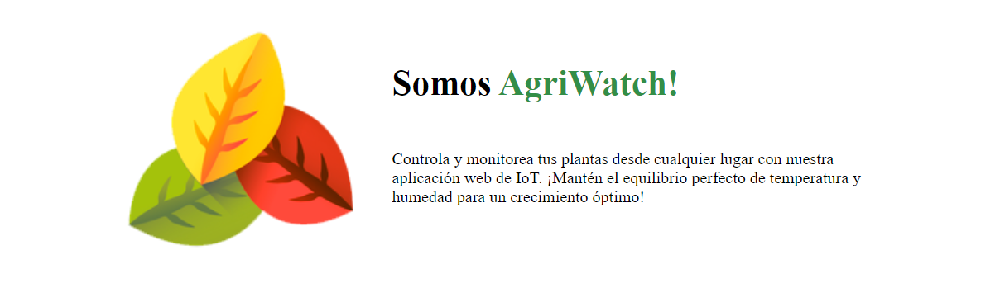
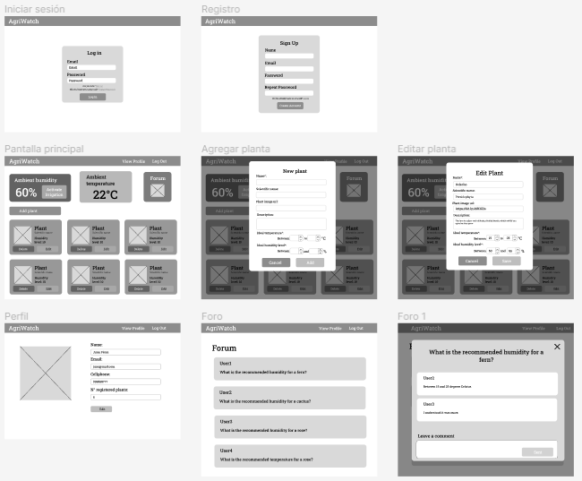

<h1 align="center">Informe de Trabajo Final</h1>

<p align="center"></p>

<h3 align="center">Universidad Peruana de Ciencias Aplicadas (UPC)</h3>
<h3 align="center">Ingeniería de Software</h3>
<h3 align="center">Ciclo 2024-01</h3>
<h3 align="center">Curso: Desarrollo de Soluciones IOT</h3>
<h3 align="center">Sección: WX71</h3>
<h3 align="center">Profesor: León Baca, Marco Antonio</h3>
<h3 align="center">Nombre del startup: EndUser</h3>
<h3 align="center">Nombre del producto: AgriWatch</h3>


<h3>Integrantes:</h3>

- Romero Loma, Brando Daniel - U202015623
  
- Escobedo Mori, Jorgeluis - U201924132
  
- Futuri Illa, Wilfredo - u201924361 
  
- Lopez Huaman, Edwin Abdias - U20201b051
  
- Salomé Nina, Jackeline Fernanda - U202015772

<p align="center">Marzo de 2024</p>

---

<h3 align="center">Historial de Versiones</h3>

<table>
  <thead>
    <th>Versión</th>
    <th>Fecha</th>
    <th>Autor</th>
    <th>Descripcion</th>
  </thead>
  <tbody>
    <tr>
      <td>1.0</td>
      <td>9/04/2024</td>
      <td>Edwin Lopez, Jackeline Salomé, Brando Romero, Wilfredo Futuri, Jorgeluis Escobedo</td>
      <td>Se realizó un primer avance de los capítulos 1, 2, 3 y 4.</td>
    </tr>
    <tr>
      <td>2.0</td>
      <td>08/06/2024</td>
      <td>Edwin Lopez, Jackeline Salomé, Wilfredo Futuri</td>
      <td>Se completo el sprint 2 y todas sus actividades<br>
        - Implementación de los servicios en backend.<br>
        - Implementación de los sensores y actuadores en wokwi<br>
        - Implementación del front end y sus funcionalidades
      </td>
    </tr>
    <tr>
      <td>3.0</td>
      <td>26/06/2024</td>
      <td>Edwin Lopez, Jackeline Salomé, Brando Romero, Wilfredo Futuri, Jorgeluis Escobedo</td>
      <td>Se completo el sprint 3 y todas sus actividades<br>
        - Finalización de la implementación de la aplicación y el wokwi<br>
        - Finalización de la documentación
      </td>
    </tr>
  </tbody>
</table>

---

<h3 align="center">Project Report Collaboration Insights</h3>
Se ha creado un repositorio en dónde hemos centralizado la documentación del proyecto.

Link del repositorio: [EndUser-SI572](https://github.com/EndUser-SI572 "EndUser-SI572")

Además, se ha acordado con el equipo llevar a cabo reuniones semanales, durante las cuales se realizarán revisiones de avance y se podrán realizar consultas relacionadas.

---

## Índice

- [Capítulo l: Introducción](#capítulo-l-introducción)
  - [1.1. Startup Profile](#11-startup-profile)
    - [1.1.1. Descripción de la StartUp](#111-descripción-de-la-startup)
    - [1.1.2. Perfiles de integrantes del equipo](#112-perfiles-de-integrantes-del-equipo)
  - [1.2. Solution Profile](#12-solution-profile)
    - [1.2.1 Antecedentes y problemática](#121-antecedentes-y-problemática)
    - [1.2.2 Lean UX Process.](#122-lean-ux-process)
      - [1.2.2.1. Lean UX Problem Statements.](#1221-lean-ux-problem-statements)
      - [1.2.2.2. Lean UX Assumptions.](#1222-lean-ux-assumptions)
      - [1.2.2.3. Lean UX Hypothesis Statements.](#1223-lean-ux-hypothesis-statements)
      - [1.2.2.4. Lean UX Canvas.](#1224-lean-ux-canvas)
  - [1.3. Segmento objetivo.](#13-segmento-objetivo)
- [Capítulo II: Requirements Elicitation \& Analysis](#capítulo-ii-requirements-elicitation--analysis)
  - [2.1. Competidores.](#21-competidores)
    - [2.1.1. Análisis competitivo.](#211-análisis-competitivo)
    - [2.1.2. Estrategias y tácticas frente a competidores.](#212-estrategias-y-tácticas-frente-a-competidores)
  - [2.2. Entrevistas.](#22-entrevistas)
    - [2.2.1. Diseño de entrevistas.](#221-diseño-de-entrevistas)
    - [2.2.2. Registro de entrevistas.](#222-registro-de-entrevistas)
    - [2.2.3. Análisis de entrevistas.](#223-análisis-de-entrevistas)
  - [2.3. Needfinding.](#23-needfinding)
    - [2.3.1. User Persona.](#231-user-persona)
    - [2.3.2. User Task Matrix.](#232-user-task-matrix)
    - [2.3.3. User Journey Mapping.](#233-user-journey-mapping)
    - [2.3.4. Empathy Mapping.](#234-empathy-mapping)
    - [2.3.5. As-is Scenario Mapping.](#235-as-is-scenario-mapping)
- [Capítulo III: Requirements Specification](#capítulo-iii-requirements-specification)
    - [3.1. To-Be Scenario Mapping.](#31-to-be-scenario-mapping)
  - [3.2. User Stories.](#32-user-stories)
  - [3.3. Impact Mapping.](#33-impact-mapping)
  - [3.4. Product Backlog.](#34-product-backlog)
- [Capítulo IV: Solution Software Design](#capítulo-iv-solution-software-design)
  - [4.1. Strategic-Level Domain-Driven Design.](#41-strategic-level-domain-driven-design)
    - [4.1.1. EventStorming.](#411-eventstorming)
      - [4.1.1.1 Candidate Context Discovery.](#4111-candidate-context-discovery)
      - [4.1.1.2 Domain Message Flows Modeling.](#4112-domain-message-flows-modeling)
      - [4.1.1.3 Bounded Context Canvases.](#4113-bounded-context-canvases)
    - [4.1.2. Context Mapping. 6/38 V1.0](#412-context-mapping-638-v10)
    - [4.1.3. Software Architecture.](#413-software-architecture)
      - [4.1.3.1. Software Architecture System Landscape Diagram.](#4131-software-architecture-system-landscape-diagram)
      - [4.1.3.2. Software Architecture Context Level Diagrams.](#4132-software-architecture-context-level-diagrams)
      - [4.1.3.2. Software Architecture Container Level Diagrams.](#4132-software-architecture-container-level-diagrams)
      - [4.1.3.3. Software Architecture Deployment Diagrams.](#4133-software-architecture-deployment-diagrams)
  - [4.2. Tactical-Level Domain-Driven Design](#42-tactical-level-domain-driven-design)
    - [4.2.1. Bounded Context: Gestión de Usuarios](#421-bounded-context-gestión-de-usuarios)
      - [4.2.1.1. Domain Layer.](#4211-domain-layer)
      - [4.2.1.2. Interface Layer.](#4212-interface-layer)
      - [4.2.1.3. Application Layer.](#4213-application-layer)
      - [4.2.1.4. Infrastructure Layer.](#4214-infrastructure-layer)
      - [4.2.1.5. Bounded Context Software Architecture Component Level Diagrams.](#4215-bounded-context-software-architecture-component-level-diagrams)
      - [4.2.1.6. Bounded Context Software Architecture Code Level Diagrams.](#4216-bounded-context-software-architecture-code-level-diagrams)
        - [4.2.1.6.1. Bounded Context Domain Layer Class Diagrams.](#42161-bounded-context-domain-layer-class-diagrams)
        - [4.2.1.6.2. Bounded Context Database Design Diagram.](#42162-bounded-context-database-design-diagram)
    - [4.2.2. Bounded Context: Monitoreo Ambiental](#422-bounded-context-monitoreo-ambiental)
      - [4.2.2.1. Domain Layer](#4221-domain-layer)
      - [4.2.2.2. Interface Layer](#4222-interface-layer)
      - [4.2.2.3. Application Layer](#4223-application-layer)
      - [4.2.2.4. Infraestructure Layer](#4224-infraestructure-layer)
      - [4.2.2.5. Bounded Context Software Architecture Component Level Diagrams.](#4225-bounded-context-software-architecture-component-level-diagrams)
      - [4.2.2.6. Bounded Context Software Architecture Code Level Diagrams.](#4226-bounded-context-software-architecture-code-level-diagrams)
        - [4.2.2.7.1. Bounded Context Domain Layer Class Diagrams.](#42271-bounded-context-domain-layer-class-diagrams)
        - [4.2.2.7.2. Bounded Context Database Design Diagram.](#42272-bounded-context-database-design-diagram)
- [Capítulo V: Solution UI/UX Design](#capítulo-v-solution-uiux-design)
  - [5.1. Style Guidelines.](#51-style-guidelines)
    - [5.1.1. General Style Guidelines.](#511-general-style-guidelines)
    - [5.1.2. Web, Mobile and IoT Style Guidelines.](#512-web-mobile-and-iot-style-guidelines)
  - [5.2. Information Architecture.](#52-information-architecture)
    - [5.2.1. Organization Systems.](#521-organization-systems)
    - [5.2.2. Labeling Systems.](#522-labeling-systems)
    - [5.2.3. SEO Tags and Meta Tags](#523-seo-tags-and-meta-tags)
    - [5.2.4. Searching Systems.](#524-searching-systems)
    - [5.2.5. Navigation Systems.](#525-navigation-systems)
  - [5.3. Landing Page UI Design.](#53-landing-page-ui-design)
    - [5.3.1. Landing Page Wireframe.](#531-landing-page-wireframe)
    - [5.3.2. Landing Page Mock-up.](#532-landing-page-mock-up)
  - [5.4. Applications UX/UI Design.](#54-applications-uxui-design)
    - [5.4.1. Applications Wireframes.](#541-applications-wireframes)
    - [5.4.2. Applications Wireflow Diagrams.](#542-applications-wireflow-diagrams)
    - [5.4.2. Applications Mock-ups.](#542-applications-mock-ups)
    - [5.4.3. Applications User Flow Diagrams.](#543-applications-user-flow-diagrams)
  - [5.5. Applications Prototyping.](#55-applications-prototyping)
- [Capítulo VI: Product Implementation, Validation \& Deployment](#capítulo-vi-product-implementation-validation--deployment)
  - [6.1. Software Configuration Management.](#61-software-configuration-management)
    - [6.1.1. Software Development Environment Configuration.](#611-software-development-environment-configuration)
    - [6.1.2. Source Code Management.](#612-source-code-management)
    - [6.1.3. Source Code Style Guide \& Conventions.](#613-source-code-style-guide--conventions)
    - [6.1.4. Software Deployment Configuration.](#614-software-deployment-configuration)
  - [6.2. Landing Page, Services \& Applications Implementation.](#62-landing-page-services--applications-implementation)
    - [6.2.1. Sprint 1](#621-sprint-1)
      - [6.2.1.1. Sprint Planning 1](#6211-sprint-planning-1)
      - [6.2.1.2. Sprint Backlog 1](#6212-sprint-backlog-1)
      - [6.2.1.3. Development Evidence for Sprint Review](#6213-development-evidence-for-sprint-review)
      - [6.2.1.4. Testing Suite Evidence for Sprint Review](#6214-testing-suite-evidence-for-sprint-review)
      - [6.2.1.5. Execution Evidence for Sprint Review](#6215-execution-evidence-for-sprint-review)
      - [6.2.1.6. Services Documentation Evidence for Sprint Review](#6216-services-documentation-evidence-for-sprint-review)
      - [6.2.1.7. Software Deployment Evidence for Sprint Review](#6217-software-deployment-evidence-for-sprint-review)
      - [6.2.1.8. Team Collaboration Insights during Sprint](#6218-team-collaboration-insights-during-sprint)
    - [6.2.2. Sprint 2](#622-sprint-2)
      - [6.2.2.1. Sprint Planning 2](#6221-sprint-planning-2)
      - [6.2.2.2. Sprint Backlog 2](#6222-sprint-backlog-2)
      - [6.2.2.3. Development Evidence for Sprint Review](#6223-development-evidence-for-sprint-review)
      - [6.2.2.4. Testing Suite Evidence for Sprint Review](#6224-testing-suite-evidence-for-sprint-review)
      - [6.2.2.5. Execution Evidence for Sprint Review](#6225-execution-evidence-for-sprint-review)
      - [6.2.2.6. Services Documentation Evidence for Sprint Review](#6226-services-documentation-evidence-for-sprint-review)
      - [6.2.2.7. Software Deployment Evidence for Sprint Review](#6227-software-deployment-evidence-for-sprint-review)
      - [6.2.2.8. Team Collaboration Insights during Sprint](#6228-team-collaboration-insights-during-sprint)
    - [6.2.3. Sprint 3](#623-sprint-3)
      - [6.2.3.1. Sprint Planning 3](#6231-sprint-planning-3)
      - [6.2.3.2. Sprint Backlog 3](#6232-sprint-backlog-3)
      - [6.2.3.3. Development Evidence for Sprint Review](#6233-development-evidence-for-sprint-review)
      - [6.2.3.4. Testing Suite Evidence for Sprint Review](#6234-testing-suite-evidence-for-sprint-review)
      - [6.2.3.5. Execution Evidence for Sprint Review](#6235-execution-evidence-for-sprint-review)
      - [6.2.3.6. Services Documentation Evidence for Sprint Review](#6236-services-documentation-evidence-for-sprint-review)
      - [6.2.3.7. Software Deployment Evidence for Sprint Review](#6237-software-deployment-evidence-for-sprint-review)
      - [6.2.3.8. Team Collaboration Insights during Sprint](#6238-team-collaboration-insights-during-sprint)
  - [6.3. Validation Interviews](#63-validation-interviews)
    - [6.3.1. Diseño de Entrevistas](#631-diseño-de-entrevistas)
    - [6.3.2. Registro de Entrevistas](#632-registro-de-entrevistas)
    - [6.3.3. Evaluaciones según heurísticas](#633-evaluaciones-según-heurísticas)
  - [6.4. Video About-the-Product.](#64-video-about-the-product)
- [Conclusiones](#conclusiones)
  - [Conclusiones y recomendaciones.](#conclusiones-y-recomendaciones)
  - [Video About-the-Team.](#video-about-the-team)
- [Bibliografía](#bibliografía)
- [Anexos](#anexos)

---

## Student Outcome

<table >
  <thead>
    <tr>
      <th>Criterio especifico</th>
      <th>Acciones realizadas</th>
      <th>Conclusiones</th>
    </tr>
  </thead>
  <tbody>
    <tr>
      <td>Participa en equipos multidisciplinarios con eficacia, eficiencia y objetividad, en el marco de un proyecto en soluciones de ingeniería de software.</td>
      <td>
        <h3>Jackeline Fernanda Salomé Nina</h3>
        <b><i>TB1</i></b><br>
        Se aportó al equipo haciendo el capítulo 2, parte del capítulo 3 y unas entrevista además del avance de la documentación en markdown.
        <br><b><i>TP</i></b><br>
        Se aportó con la elbaoración de wireframes y mockups para la realización del front.
        <br><b><i>TB2</i></b><br>
        Se aportó con la elaboración del proyecto en wokwi aportando al equipo una parte de la solución del proyecto.
        <br><b><i>TF</i></b><br>
        Se aportó con la conexión del wokwi al back y la documentación en markdown lo que ayuda a finalizar el proyecto.
        <h3>Jorgeluis Escobedo Mori</h3>
        <b><i>TB1</i></b><br>
        Se aportó al equipo con el desarrollo del Capitulo 4 y presentación del Trabajo
        <h3>Brando Daniel Romero Loma</h3>
        <b><i>TB1</i></b><br>
        Durante la realizacion del proyecto se llego aportar diferentes formas de la realizacion del trabajo
        <h3>Wilfredo Futuri Illa</h3>
        <b><i>TB1</i></b><br>
        Nos reunimos para coordinar los temas a trabajar y se distribuyo el trabajo para ser mas eficientes y colaborar en equipo.
        <br><b><i>TP</i></b><br>
        Se aportó con la primera versión de front.
        <br><b><i>TB2</i></b><br>
        Se aportó con la versión actualizada del front.
        <h3>Edwin Abdias Lopez Huaman</h3>
        <br><b><i>TB1</i></b>
        Para esta entrega fue de suma importancia las reuniones continuas donde se presentaba el avance de cada uno de los integrantes y también resolver las dudas.
        <br><b><i>TP</i></b><br>
        Se aportó con la primera versión de front.<br>
        <br><b><i>TB2</i></b><br>
        Se aportó con el desarrollo del back.
      </td>
      <td>La comunicación oral es muy efectiva ya nos permite expresar más claramente nuestras ideas y que los demás miembros del equipo puedan ayudarnos a resolver nuestras dudas o atiendan mejor como deben avanzar y así todos tengamos bien claro nuestro objetivo</td>
    </tr>
    <tr>
      <td>Conoce al menos un sector empresarial o dominio de aplicación de soluciones de software.</td>
      <td>
        <h3>Jackeline Fernanda Salomé Nina</h3>
        <b><i>TB1</i></b><br>
        Acordamos como grupo trabajar sobre el sector agrícola a un nivel de aficionados y principiantes.
        <br><b><i>TP</i></b><br>
        El aporte de mockups y wireframes fueron diseñados para el sector en el que se está trabajando.
        <br><b><i>TB2</i></b><br>
        El aporte del proyecto en Wokwi permite el desarrollo de la aplicación para el sector que se está trabajando.
        <br><b><i>TF</i></b><br>
        Se aportó con la conexión del wokwi al back, integrando la solución IoT a la aplicación, asu vez, comunicando al grupo los avances.
        <h3>Jorgeluis Escobedo Mori</h3>
        <b><i>TB1</i></b><br>
        Se cuenta con el conocimiento de la solucion de software para el sector agrícola.
        <h3>Brando Daniel Romero Loma</h3>
        <b><i>TB1</i></b><br>
        La comunicacion que tuvimos mediante WhatsApp se dio a una solucion respecto al trabajo a realizar
        <h3>Wilfredo Futuri Illa</h3>
        <b><i>TB1</i></b><br>
        Para el desarrollo de la TB1 tuvimos que investigar sobre el negocio, para que de esta manera podamos solucionar el problema de irrigación con soluciones de software.
        <br><b><i>TP</i></b><br>
        Para el desarrollo de la primera versión del front se tuvo que evaluar la interfaz para el sector detectado.
        <br><b><i>TB2</i></b><br>
        Para la actualización de la interfaz se tuvo en cuenta que tenga una buena usabilidad.
        <h3>Edwin Abdias Lopez Huaman</h3>
        <b><i>TB1</i></b><br>
        Nuestra comunicación se dio a través de whatsapp y también documentos compartidos en one drive donde era de suma importancia que cada miembro de equipo estuviera atento a los avances de los demás.
        <br><b><i>TP</i></b><br>
        Para el desarrollo de la primera versión del front se tuvo que evaluar la interfaz para el sector detectado.
        <br><b><i>TB2</i></b><br>
        Para el desarrollo del back se tuvo en cuenta al sector en el que se trabaja y los requerimientos necesarios para los mismos.
      </td>
      <td>La comunicación escrita es muy importante por así se deja evidencia de algunos acuerdos que posteriormente pueden servir para tomar decisiones. Además, así se puede trabajar de manera asincrónica ya que cada uno de los miembros puede completar sus deberes de forma efectiva.</td>
    </tr>
  </tbody>
</table>

---

# Capítulo l: Introducción

## 1.1. Startup Profile

### 1.1.1. Descripción de la StartUp
<p align="justify">Nuestra startup “EndUser” se centra en el desarrollo de soluciones tecnológicas innovadoras para optimizar la agricultura y mejorar la producción de cultivos en invernaderos. En particular, hemos creado una aplicación web que permite monitorear de manera precisa la humedad y la temperatura en los invernaderos, dos factores críticos para el crecimiento saludable de las plantas. A través de sensores instalados estratégicamente en el ambiente y en el suelo, recopilamos datos en tiempo real que son procesados por nuestro sistema automatizado.

<p align="justify">Esta aplicación no solo ofrece un monitoreo continuo de las condiciones ambientales, sino que también permite la activación automática de los sistemas de riego según las necesidades detectadas. Además, brinda a los usuarios la capacidad de intervenir manualmente cuando lo consideren necesario, proporcionando un control total sobre el entorno de cultivo desde cualquier lugar y en cualquier momento a través de una interfaz intuitiva y fácil de usar.

**Misión:** <br>
Nuestra misión es revolucionar la agricultura en invernaderos con tecnología avanzada para maximizar la eficiencia y productividad, promoviendo la sostenibilidad

**Visión:** <br>
Buscamos liderar la agricultura digital global con soluciones tecnológicas innovadoras para invernaderos, promoviendo un sistema agrícola inteligente, sostenible y seguro para el futuro.

### 1.1.2. Perfiles de integrantes del equipo

| **Integrante**                         | **Perfil**                                                                                                                                                                                                                                                                                                                                                                                                                                                                                                | **Imagen**                                                                                                       |
| -------------------------------------- | --------------------------------------------------------------------------------------------------------------------------------------------------------------------------------------------------------------------------------------------------------------------------------------------------------------------------------------------------------------------------------------------------------------------------------------------------------------------------------------------------------- | ---------------------------------------------------------------------------------------------------------------- |
| **Edwin Abdias Lopez Huaman**              | Soy una persona muy responsable y proactiva. A lo largo de mis años en la universidad, he tenido el privilegio de participar en diversos equipos, lo qué me ha brindado una valiosa experiencia en el trabajo colaborando. Mi trayectoria académica me ha dotado de sólidos conocimientos en una variedad de lenguajes de programación, así como en el uso de frameworks para el desarrollo tanto de aplicaciones web y móviles. Estoy apasionado por seguir creciendo en mi campo.                                                                                                                            |                  |                                                
| **Jorgeluis Escobedo Mori**             | Soy estudiante de la carrera de ingeniería de software en la UPC. Me considero una persona seria, responsable y con deseos de dejar mi marca en el futuro. Mi interés está en el desarrollo de aplicaciones y cómo estas satisfacen las necesidades de los usuarios. Mis habilidades principales son el trabajo en equipo y mi adaptabilidad a cualquier situación. En el desarrollo del proyecto, apoyaré con mis conocimientos aprendidos en el transcurso de mi carrera, y en el entorno laboral.                                                         |                 |                                       
| **Jackeline Fernanda Salomé Nina** | Soy Jackeline Fernanda Salomé Nina, Me considero una persona responsable con mis trabajos, usualmente puntual, pero siempre dispuesta a ayudar a mis compañeros con las dudas que presenten. En los trabajos grupales intento dar lo mejor de mí, a pesar de tal vez no conocer mucho del tema abordado. En este trabajo daré todo de mí para no perjudicar a mis compañeros y alcanzar los objetivos deseados.                                                                                                                        |    |                                                              
| **Brando Daniel Romero Loma**     | Mi nombre es Daniel Romero Loma y me encuentro estudiando la carrera de Ingeniería de Software. Tengo 19 años y desde hace varios años me han interesado los temas relacionados a la programación y el desarrollo de software. Tengo experiencia programando en varios lenguajes, pero me especializo en tecnologías relacionadas a C++, C#, Python. |  |                                                                  
| **Wilfredo Futuri Illa**     |    Soy estudiante de la carrera de Ingeniería de Software, me considero una persona muy curiosa y en mis tiempos desarrollo proyectos propios de mi interés para mejorar mis habilidades técnicas en programación. Asimismo, me interesa trabajar en equipo y poder entregar excelentes trabajos.      |       |


## 1.2. Solution Profile 
Nuestra solución se presenta en forma de una aplicación web diseñada específicamente para abordar las necesidades y desafíos enfrentados por los agricultores que operan invernaderos. Al integrar tecnología de sensores avanzados con un sistema de control automatizado y una interfaz de usuario intuitiva, ofrecemos una herramienta integral que optimiza el monitoreo y el manejo de las condiciones ambientales críticas para el cultivo de plantas.

La aplicación permite a los usuarios:

Monitoreo en tiempo real: La plataforma recopila datos de sensores de temperatura ambiental y humedad del suelo instalados en ubicaciones estratégicas dentro del invernadero. Estos datos se visualizan en tiempo real a través de gráficos y paneles de control en la aplicación web, proporcionando una visión detallada del entorno de cultivo en todo momento.

Activación automática del riego: Basándose en los datos recopilados por los sensores, nuestro sistema automatizado determina las necesidades de riego de las plantas y activa los sistemas de riego de manera automática y precisa. Esto asegura que las plantas reciban la cantidad adecuada de agua en el momento oportuno, optimizando así su crecimiento y desarrollo.

Control manual: Además de la activación automática, los usuarios tienen la capacidad de intervenir manualmente en el sistema de riego a través de la aplicación. Esto les permite ajustar las configuraciones según sea necesario, en respuesta a condiciones climáticas cambiantes o requisitos específicos de los cultivos.

Alertas y notificaciones: La aplicación está equipada con un sistema de alertas y notificaciones que informa a los usuarios sobre cualquier anomalía o condición fuera de los rangos predefinidos. Esto permite una respuesta rápida ante situaciones críticas y ayuda a prevenir daños en los cultivos debido a condiciones adversas.


### 1.2.1 Antecedentes y problemática 

**What - ¿Cuál es el problema?**
El problema a resolver es la falta de precisión en el monitoreo y control de dos factores críticos para el crecimiento de las plantas: la humedad y la temperatura. Las variaciones en estos parámetros pueden afectar significativamente la salud y el rendimiento de los cultivos en invernaderos. La incapacidad para mantener condiciones óptimas puede llevar a pérdidas en la cosecha y reducir la calidad de los productos agrícolas, lo que impacta negativamente en la rentabilidad y sostenibilidad de las operaciones agrícolas.

**When - ¿Cuándo sucede el problema?**
El problema puede surgir en cualquier momento, ya que las condiciones ambientales dentro del invernadero pueden fluctuar debido a varios factores, como cambios en el clima, cambios estacionales y el ciclo de vida de los cultivos. Es crucial abordar este problema de manera continua y en tiempo real para garantizar un entorno de cultivo óptimo en todo momento.

**Where - ¿Dónde está el cliente cuando usa el servicio?**
El problema radica en la necesidad de los agricultores de monitorear y controlar las condiciones de cultivo en sus invernaderos. Esto implica la supervisión desde la ubicación física del invernadero o el acceso remoto a través de dispositivos móviles o computadoras.

**Why - ¿Cuál es la causa del problema?**
El problema surge debido a la dependencia de métodos de monitoreo y control obsoletos o inadecuados, que no proporcionan la precisión y la capacidad de respuesta necesarias para optimizar las condiciones de crecimiento de las plantas. La falta de tecnología avanzada en este ámbito contribuye a la incapacidad de los agricultores para detectar y abordar de manera efectiva las variaciones en la humedad y la temperatura, lo que resulta en condiciones subóptimas para el cultivo de plantas en invernaderos.

**Who - ¿Quiénes están involucrados?**
Los principales actores involucrados incluyen a los agricultores que operan los invernaderos, así como a los proveedores de tecnología agrícola, investigadores y profesionales del sector que buscan soluciones innovadoras para mejorar la productividad y la eficiencia en la agricultura controlada. La colaboración entre estos grupos es esencial para desarrollar y adoptar soluciones efectivas que aborden las necesidades y desafíos específicos de la agricultura en invernaderos.

**How - ¿En qué condiciones los clientes usan nuestro producto?**
Los clientes utilizan nuestra aplicación web en una variedad de condiciones ambientales y situaciones de cultivo. Esto puede incluir condiciones diurnas y nocturnas, variaciones estacionales, así como diferentes tipos de invernaderos y cultivos. Nuestra solución está diseñada para funcionar de manera efectiva en diversos entornos agrícolas, proporcionando a los agricultores la capacidad de monitorear y controlar las condiciones de cultivo de manera precisa y oportuna, independientemente de las circunstancias.

**How much - ¿Cuánta es la demanda de la problemática?**
La demanda de soluciones que aborden este problema es significativa y está en constante crecimiento. Con el aumento de la población mundial y la necesidad de garantizar un suministro alimentario seguro y sostenible, hay una mayor presión sobre los agricultores para maximizar los rendimientos de los cultivos. En este contexto, la capacidad de optimizar las condiciones de crecimiento de las plantas en invernaderos es crucial. Además, la creciente conciencia sobre la importancia de la agricultura sostenible y la eficiencia en el uso de recursos también impulsa la demanda de tecnologías innovadoras que mejoren la productividad y reduzcan el impacto ambiental de las operaciones agrícolas.

### 1.2.2 Lean UX Process. 
#### 1.2.2.1. Lean UX Problem Statements. 

* Los agricultores carecen de una manera eficiente de monitorear el nivel de humedad del suelo en tiempo real en sus invernaderos.
¿Cómo podemos proporcionar a los agricultores una herramienta que les permita monitorear de manera precisa y en tiempo real la humedad del suelo en sus invernaderos para optimizar el riego y mejorar el crecimiento de las plantas?

* La falta de un sistema automatizado de control de temperatura en los invernaderos conduce a fluctuaciones significativas que pueden afectar negativamente el crecimiento de los cultivos.
¿Qué solución podemos ofrecer para garantizar un control preciso y automatizado de la temperatura en los invernaderos, evitando fluctuaciones que puedan dañar el crecimiento de las plantas?

* Los agricultores experimentan dificultades para ajustar manualmente los sistemas de riego en función de las necesidades específicas de cada cultivo y las condiciones climáticas cambiantes.
¿Cómo podemos desarrollar una solución que permita a los agricultores ajustar de manera precisa y conveniente los sistemas de riego en sus invernaderos, optimizando así el uso del agua y mejorando el rendimiento de los cultivos?

* Los agricultores enfrentan el desafío de mantener un equilibrio adecuado entre la humedad y la temperatura en diferentes áreas de sus invernaderos, lo que puede resultar en un crecimiento desigual de las plantas.
¿De qué manera podemos proporcionar a los agricultores una herramienta que les permita gestionar de manera eficaz la distribución de la humedad y la temperatura en diferentes zonas de sus invernaderos para promover un crecimiento uniforme y saludable de los cultivos?

* Los agricultores necesitan una forma conveniente de recibir alertas y notificaciones sobre condiciones ambientales fuera de los rangos óptimos en sus invernaderos.
¿Cómo podemos desarrollar un sistema de alerta que notifique a los agricultores sobre condiciones ambientales adversas en tiempo real, permitiéndoles tomar medidas preventivas para proteger sus cultivos y maximizar la productividad de sus invernaderos?

#### 1.2.2.2. Lean UX Assumptions. 

**Assumptions Worksheet**

* **¿Quién es el usuario?** <br>
El usuario principal es el agricultor o el encargado del cultivo en invernaderos.

* **¿Dónde encaja nuestro producto en su trabajo o vida?** <br>
Nuestro producto se integra directamente en la gestión diaria del cultivo en invernaderos, proporcionando herramientas para monitorear y controlar las condiciones ambientales de manera eficiente.

* **¿Qué problemas tiene nuestro producto? ¿Resolver?** <br>
Nuestro producto aborda la falta de precisión y eficiencia en el monitoreo y control de la humedad y la temperatura en invernaderos, lo que puede afectar negativamente el crecimiento y rendimiento de los cultivos. También resuelve la necesidad de optimizar el uso del agua y mejorar la calidad de la producción agrícola.

* **¿Cuándo y cómo es usado nuestro producto?** <br>
Nuestro producto es utilizado tanto de forma continua, para el monitoreo en tiempo real de las condiciones ambientales, como de forma activa, para realizar ajustes y activar sistemas de riego según sea necesario. Se accede a través de dispositivos conectados a internet, como computadoras de escritorio, tabletas o teléfonos inteligentes.

 **¿Qué características son importantes?** <br>
* Monitoreo en tiempo real de la humedad y temperatura.
* Sistema automatizado de control de riego.
* Alertas y notificaciones sobre condiciones ambientales fuera de  los rangos óptimos.
* Interfaz de usuario intuitiva y fácil de usar.
* Capacidad de ajuste manual de los sistemas de riego.
* ¿Cómo debe verse nuestro producto y cómo comportarse?
* El producto debe presentar una interfaz limpia y fácil de  entender, con gráficos claros y paneles de control intuitivos  que proporcionan acceso rápido a la información relevante sobre  las condiciones ambientales. Debe comportarse de manera rápida y  receptiva, brindando una experiencia de usuario fluida y sin  interrupciones.

**Business Outcomes**

* Mejora de la eficiencia operativa al permitir el monitoreo en  tiempo real de las condiciones de cultivo desde cualquier  ubicación.
* Aumento del rendimiento de los cultivos al facilitar ajustes  inmediatos en función de los datos recopilados sobre el estado  de las plantas.
* Reducción de pérdidas económicas al detectar y abordar  rápidamente condiciones ambientales desfavorables que podrían  afectar la salud de los cultivos.
* Incremento de la calidad de los productos agrícolas al  garantizar un control preciso de los factores ambientales como  la humedad, la temperatura y la iluminación.
* Mayor flexibilidad y conveniencia para los agricultores al  permitirles supervisar y controlar sus invernaderos desde  cualquier lugar, en cualquier momento, a través de dispositivos  móviles o computadoras.


**Business Assumptions**

* Suposición de que la mayoría de los agricultores tienen acceso a dispositivos móviles con conexión a Internet para utilizar servicios de monitoreo remoto.
* Expectativa de que el mercado agrícola muestra una creciente demanda de soluciones tecnológicas que mejoren la eficiencia y la productividad.
* Presunción de que los agricultores están dispuestos a invertir en nuevas tecnologías para mejorar la gestión de sus cultivos debido a la promesa de mayores rendimientos.
* Creencia de que la adopción de tecnologías agrícolas avanzadas será más rápida debido a la necesidad de optimizar recursos y maximizar la producción.
* Expectativa de que la conciencia sobre la importancia del monitoreo y control precisos de las condiciones de cultivo está aumentando, impulsando la demanda de soluciones como la nuestra.


**¿Qué otras suposiciones tenemos? ¿Eso, si se prueba que es falso, causará que nuestro negocio / proyecto no funcione?**

* Suposición: Los agricultores están dispuestos a adoptar tecnologías digitales en sus operaciones agrícolas.
* Suposición: Nuestro producto será capaz de integrarse fácilmente con los sistemas de gestión agrícola existentes.
* Suposición: La precisión y confiabilidad de los datos proporcionados por nuestros sensores cumplirán con las expectativas de los agricultores.
* Suposición: La disponibilidad y acceso a internet en áreas rurales donde se encuentran los invernaderos no será un obstáculo significativo para el uso de nuestra aplicación.
* Suposición: Los agricultores consideran que el costo de implementación y mantenimiento de nuestra solución está justificado por los beneficios que proporciona en términos de aumento de la productividad y calidad de la cosecha.


#### 1.2.2.3. Lean UX Hypothesis Statements. 

**Hypothesis 1**<br>
Creemos que al proporcionar a los agricultores una aplicación que les permita monitorear y controlar la humedad y la temperatura en sus invernaderos.
sabremos que hemos tenido éxito cuando observamos una mejora en el crecimiento y rendimiento de los cultivos, reflejado en un aumento en la calidad y cantidad de la cosecha.

**Hypothesis 2**<br>
Creemos que al implementar un sistema automatizado de control de riego en nuestros invernaderos, sabremos que hemos tenido éxito cuando podamos reducir significativamente el consumo de agua mientras mantenemos y mejoramos la salud de las plantas, demostrando así una mayor eficiencia en el uso de recursos.

**Hypothesis 3**<br>
Creemos que al ofrecer alertas y notificaciones en tiempo real sobre condiciones ambientales adversas en los invernaderos, sabremos que hemos tenido éxito cuando observamos una disminución en los daños causados por eventos climáticos extremos o fluctuaciones inesperadas, lo que resultará en una mayor estabilidad y seguridad en la producción agrícola.

**Hypothesis 4**<br>
Creemos que al desarrollar una interfaz de usuario intuitiva y fácil de usar para nuestra aplicación, sabremos que hemos tenido éxito cuando los agricultores puedan utilizarla sin dificultad y se sientan capacitados para tomar decisiones informadas sobre el manejo de sus cultivos, lo que se refleja en una mayor adopción y satisfacción del usuario.

**Hypothesis 5**<br>
Creemos que al integrar nuestra solución con los sistemas de gestión agrícola existentes, sabremos que hemos tenido éxito cuando podamos ofrecer una experiencia de usuario fluida y sin interrupciones, lo que resultará en una mayor eficiencia operativa y una mejor integración en el flujo de trabajo de los agricultores.

**Hypothesis 6**<br>
Creemos que al proporcionar datos precisos y confiables sobre las condiciones ambientales en los invernaderos, sabremos que hemos tenido éxito cuando los agricultores puedan tomar decisiones más informadas y estratégicas sobre el manejo de sus cultivos, lo que se traducirá en un aumento en la productividad y rentabilidad de sus operaciones.

**Hypothesis 7**<br>
Creemos que al garantizar la disponibilidad y accesibilidad de nuestra aplicación en áreas rurales remotas, sabremos que hemos tenido éxito cuando los agricultores de diferentes regiones puedan acceder y beneficiarse de nuestra solución, lo que resultará en una mayor inclusión y alcance en el mercado agrícola.

**Hypothesis 8**<br>
Creemos que al demostrar un retorno de la inversión positivo para los agricultores que implementan nuestra solución, sabremos que hemos tenido éxito cuando observamos un aumento en la adopción y lealtad del cliente, respaldado por una mejora tangible en los resultados económicos y productivos de sus operaciones agrícolas.

**Hypothesis 9**<br>
Creemos que al ofrecer capacitación y soporte continuo a los usuarios de nuestra aplicación, sabremos que hemos tenido éxito cuando observamos una reducción en la curva de aprendizaje y una mayor confianza en el uso de la tecnología, lo que resultará en una mayor satisfacción del usuario y una adopción más amplia de nuestra solución.

**Hypothesis 10**<br>
Creemos que al fomentar una cultura de innovación y colaboración en la industria agrícola, sabremos que hemos tenido éxito cuando nuestra solución contribuya a impulsar el cambio hacia prácticas agrícolas más sostenibles y eficientes, lo que beneficiará tanto a los agricultores como al medio ambiente a largo plazo.

#### 1.2.2.4. Lean UX Canvas. 

## 1.3. Segmento objetivo. 

**Jardineros Principiantes**<br>
El público objetivo de jardineros principiantes se compone de personas que están dando sus primeros pasos en el mundo de la jardinería. Estos individuos pueden tener poco o ningún conocimiento previo sobre el cuidado de las plantas y la gestión de jardines, pero están motivados por aprender y mejorar sus habilidades en este campo. Buscan recursos y herramientas accesibles y fáciles de entender que les brinden orientación y apoyo mientras exploran y experimentan con la jardinería en sus hogares o espacios exteriores.

# Capítulo II: Requirements Elicitation & Analysis
## 2.1. Competidores. 
### 2.1.1. Análisis competitivo. 

<table>
    <thead>
        <tr>
            <th colspan="6"><b>Competitive Analysis Landscape</b></th>
        </tr>
    </thead>
    <tbody>
        <tr>
            <td colspan="2" align="center">¿Por qué llevar a cabo este análisis?</td>
            <td colspan="4">Este análisis nos brinda una comprensión profunda del panorama actual del mercado y nos permite identificar áreas donde AgriWatch puede diferenciarse de la competencia. Al comprender las propuestas de valor existentes en el mercado y las necesidades no satisfechas de los usuarios, podemos destacar las características únicas de AgriWatch que lo distinguen de otras soluciones.</td>
        </tr>
        <tr>
            <td colspan="2">Competidores</td>
            <td>AgriWatch <br> </td>
            <td>Plantix <br> </td>            
            <td>Gardenize <br> </td>
            <td>Planta - Care for your plants <br> </td>
        </tr>
        <tr>
            <td rowspan="2">Perfil</td>
            <td>Overview</td>
            <td>AgriWatch es una aplicación que revoluciona el cuidado de las plantas al utilizar tecnología IoT para mejorar la precisión en la medición de aspectos cruciales como la humedad y la temperatura del suelo.</td>
            <td>Plantix es una aplicación móvil que emplea inteligencia artificial para diagnosticar problemas en las plantas y proporcionar recomendaciones de cuidado. Los usuarios pueden tomar fotos de las plantas afectadas y la aplicación identificará posibles enfermedades, plagas o deficiencias nutricionales</td>
            <td>Gardenize es una aplicación móvil diseñada para ayudar a los usuarios a planificar, registrar y realizar un seguimiento del progreso en sus jardines. La aplicación permite a los usuarios documentar información detallada sobre sus plantas, incluyendo su ubicación, variedades, fechas de siembra y cosecha, así como también el mantenimiento realizado.</td>
            <td>Planta es una aplicación móvil diseñada para ayudar a los usuarios a cuidar y mantener sus plantas de interior y exterior. La aplicación proporciona herramientas para registrar y realizar un seguimiento de la salud y el crecimiento de las plantas, incluyendo la programación de riegos, la aplicación de fertilizantes y el seguimiento de la luz solar recibida. Planta también ofrece funciones de identificación de plantas mediante fotos, así como consejos y recomendaciones personalizadas para el cuidado de diferentes tipos de plantas.</td>
        </tr>
        <tr>
           <td>Ventaja competitiva</td>
           <td>La principal ventaja de AgriWatch radica en su capacidad para ofrecer una supervisión precisa y en tiempo real de las condiciones ambientales de las plantas gracias a la tecnología IoT integrada. Al utilizar sensores IoT para monitorear parámetros como la humedad del suelo, la temperatura y la intensidad lumínica, AgriWatch puede proporcionar datos detallados y actualizados, lo que permite una gestión precisa del riego y otros aspectos del cuidado de las plantas.</td>
           <td>La principal ventaja competitiva de Plantix es su capacidad para proporcionar diagnósticos precisos y recomendaciones específicas de cuidado de plantas utilizando inteligencia artificial.</td>
           <td>La principal ventaja competitiva de Gardenize radica en su enfoque integral para gestionar proyectos de jardinería. La aplicación ofrece una plataforma centralizada donde los usuarios pueden registrar y organizar todos los aspectos de sus jardines, desde la planificación inicial hasta el seguimiento continuo del progreso y el mantenimiento.</td>
           <td>La principal ventaja competitiva de Planta radica en su capacidad para ofrecer a los usuarios una experiencia de cuidado de plantas personalizada y conveniente. La aplicación proporciona herramientas de seguimiento y recordatorios para facilitar el cuidado regular de las plantas, lo que ayuda a los usuarios a mantenerlas saludables y prósperas. Además, la función de identificación de plantas mediante fotos permite a los usuarios obtener información instantánea sobre las especies de plantas y recibir recomendaciones específicas de cuidado.</td>
        </tr>
        <tr>
            <td rowspan="2">Perfil de Marketing</td>
            <td>Mercado objetivo</td>
            <td>Cualquier persona interesada en el cultivo y mantenimiento de plantas, independientemente de su nivel de experiencia.</td>
            <td>Agricultores, jardineros y cualquier persona interesada en el cultivo de plantas, tanto a nivel profesional como aficionado.</td>
            <td>Agricultores, jardineros y cualquier persona interesada en el cultivo de plantas, tanto a nivel profesional como aficionado.</td>
            <td>Cualquier persona interesada en el cultivo y mantenimiento de plantas, independientemente de su nivel de experiencia.</td>
        </tr>
        <tr>
           <td>Estrategias de marketing</td>
           <td>Uso de redes sociales para llegar a mayor público y participación en eventos de agricultura y jardinería promocionando la aplicación.</td>
           <td>Realiza campañas publicitarias en redes sociales, participa en eventos y ferias, establece colaboraciones estratégicas y ofrece programas de referencia para aumentar la conciencia de marca.</td>
           <td>Uso activo de redes sociales para interactuar con su audiencia, la participación en eventos y ferias de la industria, el establecimiento de alianzas estratégicas con socios del sector y la implementación de programas de referencia para aumentar su base de usuarios.</td>
           <td>La estrategia de marketing de Planta se basa en la promoción de su aplicación móvil a través de diversos canales digitales, como redes sociales, blogs y anuncios en línea, para llegar a su mercado objetivo de amantes de las plantas.</td>
        </tr>
        <tr>
            <td rowspan="3">Perfil del Producto</td>
            <td>Productos & Servicios</td>
            <td>Servicio de cuidado de plantas</td>
            <td>Servicio de cuidado de plantas</td>
            <td>Servicio de planificación para el cuidado de las plantas.</td>
            <td>Servicio de cuidado de plantas</td>
        </tr>
        <tr>
           <td>Precios & Costos</td>
           <td>Descarga gratuita y versión premium</td>
           <td>Descarga gratuita</td>
           <td>Servicio gratuito y premium</td>
           <td>Descarga gratuita</td>
        </tr>
        <tr>
           <td>Canales de distribución (Web y/o Móvil)</td>
           <td>Web</td>
           <td>Móvil</td>
           <td>Móvil</td>
           <td>Móvil</td>
        </tr>
        <tr>
           <td rowspan="4">Análisis SWOT</td>
           <td>Fortalezas</td>
           <td>Tecnología IoT para monitorear parámetros como la humedad del suelo, la temperatura y la intensidad lumínica, AgriWatch puede proporcionar datos detallados y actualizados, lo que permite una gestión precisa del riego y otros aspectos del cuidado de las plantas.</td>
           <td>Plantix cuenta con tecnología innovadora basada en inteligencia artificial, lo que le permite ofrecer diagnósticos precisos de problemas en las plantas. Además, su aplicación es fácil de usar y ha logrado construir una base de usuarios sólida debido a su efectividad y utilidad en el cuidado de las plantas.</td>
           <td>Gardenize se destaca por su enfoque integral para la gestión de proyectos de jardinería, ofreciendo una aplicación móvil fácil de usar que permite a los usuarios planificar, registrar y realizar un seguimiento del progreso en sus jardines.</td>
           <td>La principal fortaleza de Planta radica en su facilidad de uso y enfoque centrado en el usuario. La aplicación ofrece una experiencia intuitiva para el cuidado de las plantas, con características como recordatorios de riego y consejos personalizados.</td>
        </tr>
        <tr>
           <td>Oportunidades</td>
           <td>La expansión de AgriWatch a un ámbito más amplio, como el sector agrícola y con una mayor variedad de cultivos, podría plantear desafíos relacionados con la adaptabilidad de la tecnología IoT a diferentes contextos agrícolas y necesidades específicas de los agricultores.</td>
           <td>Plantix tiene oportunidades para expandirse globalmente a nuevos mercados internacionales y puede buscar colaboraciones estratégicas con empresas de tecnología agrícola y organizaciones agrícolas.</td>
           <td>Gardenize tiene oportunidades para expandir y diversificar su alcance, como desarrollar nuevas funcionalidades y características para satisfacer las necesidades cambiantes de los usuarios, así como para explorar la posibilidad de ofrecer servicios premium o complementarios, como consultoría de jardinería.</td>
           <td>Una versión web permitiría a los usuarios acceder a las funcionalidades de Planta desde cualquier navegador de Internet en una computadora, lo que aumentaría su accesibilidad y conveniencia para aquellos que prefieren trabajar en una pantalla más grande o no tienen dispositivos móviles.</td>
        </tr>
        <tr>
           <td>Debilidades</td>
           <td>Si los usuarios experimentan problemas de conexión o los sensores IoT fallan, la capacidad de la aplicación para proporcionar datos precisos y alertas en tiempo real podría verse comprometida.</td>
           <td>Una debilidad potencial de Plantix es su dependencia de la tecnología, lo que puede llevar a problemas técnicos o de conectividad.</td>
           <td>Una posible debilidad de Gardenize podría ser su dependencia de la tecnología y la conectividad a Internet, lo que puede limitar su accesibilidad en áreas con cobertura limitada o problemas técnicos.</td>
           <td>Los usuarios pueden experimentar limitaciones de acceso o problemas técnicos si no tienen una conexión estable a Internet o no tienen dispositivos móviles compatibles.</td>
        </tr>
        <tr>
           <td>Amenazas</td>
           <td>La competencia creciente en el mercado de soluciones agrícolas basadas en tecnología IoT.</td>
           <td>La precisión de la aplicación puede verse comprometida por errores en el diagnóstico, lo que puede dañar la reputación de la marca.</td>
           <td>Los cambios en las tendencias del mercado, la regulación o la tecnología pueden afectar la demanda de la aplicación y la rentabilidad del negocio.</td>
           <td>La competencia en el mercado de aplicaciones de jardinería, donde existen otras soluciones disponibles que ofrecen características similares.</td>
        </tr>
    </tbody>
</table>

### 2.1.2. Estrategias y tácticas frente a competidores. 
* Implementaremos una interfaz web ofrece varias ventajas adicionales. La pantalla más grande de un ordenador permite organizar mejor los elementos, evitando problemas de legibilidad o de interacción causados por letras o figuras demasiado pequeñas. Además, al tener una plataforma accesible desde cualquier dispositivo con conexión a Internet y un navegador web, eliminamos los problemas de compatibilidad de dispositivos, lo que amplía significativamente nuestra base de usuarios potenciales. 

* La integración de sensores IoT en nuestro proyecto proporcionará una mayor precisión en la recopilación de datos, especialmente en áreas clave como el nivel de humedad y la temperatura del entorno de las plantas. Esto permitirá una supervisión más detallada y en tiempo real de las condiciones ambientales, lo que a su vez mejorará la capacidad de nuestra aplicación para proporcionar recomendaciones y alertas precisas a los usuarios.
  
## 2.2. Entrevistas. 
### 2.2.1. Diseño de entrevistas. 
* ¿Cuáles son los mayores desafíos que has enfrentado al cuidar de tus plantas?
* ¿Qué aspectos de tu jardín consideras más importantes para monitorear en tiempo real?
* ¿Cómo sueles determinar cuándo es necesario regar tus plantas?
* ¿Haz utilizado alguna vez tecnología o aplicaciones para ayudarte en el cuidado de tus plantas? ¿Cuál ha sido tu experiencia?
* ¿Qué te gustaría aprender más sobre el cuidado de las plantas y la jardinería?
* ¿Haz tenido problemas con el riego excesivo o insuficiente en el pasado? ¿Cómo los haz solucionado?
* ¿Cómo te organizas para mantener un jardín en buen estado, especialmente si tienes poco tiempo disponible?
* ¿Qué funciones de alerta consideras más útiles para recibir notificaciones sobre el estado de tus plantas?
* ¿Qué esperarías de una aplicación que pretenda ayudarte con el cuidado de tus plantas?
* ¿Cómo crees que una aplicación de jardinería podría facilitar tu experiencia como jardinero/a principiante o aficionado/a?

### 2.2.2. Registro de entrevistas. 

<h4>Entrevista 1</h4>


Nombre: Sebastian Ramirez <br>
Edad: 22 años<br>
Distrito: La Victoria <br>
Ocupación: Estudiante <br>
Link: [Entrevista 1](https://drive.google.com/file/d/1LQP2zCYmWZrm1y9g7SQptOTmLZMKzTSq/view?usp=sharing "Entrevista 1")

Sebastián nos comenta que el mayor desafío que ha experimentado al cuidar sus plantas es mantenerlas con buena salud debido al clima o humedad, además, nos comenta que considera importante tener un registro en tiempo real de aspectos como el nivel de humedad, temperatura y cantidad de luz. Para saber cuando regar las plantas se fija en las hojas y al tocar la tierra de las macetas ya que ha tenido problemas por exceso de riego, nunca utilizó aplicaciones para el cuidado de las plantas por desconocimiento.

<h4>Entrevista 2</h4>


Nombre: Lida Fermina <br>
Edad: 21 años<br>
Distrito: Callao <br>
Ocupación: Estudiante <br>
Link: [Entrevista 2](https://drive.google.com/file/d/1xFxj0o-Usbpe3B1eo7Dvru4UrlIVo8dp/view?usp=sharing)

Lida nos comenta que es tiene mucha dificultad el hacer sus deberes a la antigua y que estaria proyectada a usar la tecnologia para que su trabajo sea mas eficaz y de esa forma sea mas productivo, ya que considera que es importante el tener el control de humedad en tiempo real para que de esa forma no exceda o falte a los abonos que esta misma tiene.

<h4>Entrevista 3</h4>


Nombre: Julio Asillo <br>
Edad: 23 años<br>
Distrito: Ate <br>
Ocupación: Estudiante <br>
Link: [Entrevista 3](https://youtu.be/Jgr_PM4luEk?si=ZACEdNlaOUeOF7wO)

Julio nos comparte que posee un pequeño jardín junto a su madre, donde cultiva una variedad de plantas. Destaca que uno de los desafíos principales es garantizar un cuidado eficiente de las plantas, dado que su madre trabaja y él está dedicado a sus estudios. En ocasiones, la rutina diaria les dificulta brindar la atención necesaria al jardín, olvidando regar las plantas y monitorear su estado.

### 2.2.3. Análisis de entrevistas. 

Las respuestas de los entrevistados se muestran a continuación:

**¿Cuáles son los mayores desafíos que has enfrentado al cuidar de tus plantas?**

Los entrevistados enfrentan desafíos como el control de plagas, el mantenimiento de la humedad del suelo y el tiempo disponible para el riego. Además, algunos mencionaron la gestión del riego excesivo o insuficiente.

**¿Qué aspectos de tu jardín consideras más importantes para monitorear en tiempo real?**

La mayoría de los entrevistados consideran importante monitorear la humedad del suelo, la temperatura y la cantidad de luz en tiempo real para garantizar el cuidado adecuado de sus plantas.

**¿Cómo sueles determinar cuándo es necesario regar tus plantas?**

Los entrevistados determinan la necesidad de riego observando el suelo para verificar su humedad y observando las hojas de las plantas para detectar signos de sequedad.

**¿Has utilizado alguna vez tecnología o aplicaciones para ayudarte en el cuidado de tus plantas? ¿Cuál ha sido tu experiencia?**

Ninguno de los entrevistados ha utilizado aplicaciones para el cuidado de plantas anteriormente, principalmente debido al desconocimiento o falta de experiencia en este tipo de tecnología.

**¿Qué te gustaría aprender más sobre el cuidado de las plantas y la jardinería?**

Los entrevistados expresaron interés en aprender más sobre el uso de nutrientes, tipos de tierra, frecuencia de riego, selección de plantas adecuadas y métodos naturales para combatir plagas.

**¿Has tenido problemas con el riego excesivo o insuficiente en el pasado? ¿Cómo los has solucionado?**

Algunos entrevistados han tenido problemas con el riego insuficiente o excesivo en el pasado, pero han buscado soluciones ajustando la cantidad de agua y cambiando la ubicación de las plantas.

**¿Cómo te organizas para mantener un jardín en buen estado, especialmente si tienes poco tiempo disponible?**

Los entrevistados se organizan encontrando tiempo entre sus obligaciones diarias, organizando sus horarios cotidianos o realizando pequeñas tareas de a poco para mantener su jardín en buen estado.

**¿Qué funciones de alerta consideras más útiles para recibir notificaciones sobre el estado de tus plantas?**

Las funciones de alerta consideradas más útiles incluyen notificaciones sobre el estado de la humedad del suelo, alertas sobre condiciones ambientales extremas y la planificación semanal con automatización del riego.

**¿Qué esperarías de una aplicación que pretenda ayudarte con el cuidado de tus plantas?**

Los entrevistados esperarían que una aplicación de jardinería proporcione información sobre el mantenimiento de las plantas, consejos personalizados, recordatorios de riego y alertas sobre problemas y plagas.

**¿Cómo crees que una aplicación de jardinería podría facilitar tu experiencia como jardinero/a principiante o aficionado/a?**

Los entrevistados creen que una aplicación de jardinería podría facilitar su experiencia proporcionando alertas para el riego o el estado de la planta, facilitando el cuidado de las plantas y brindando información útil y recordatorios.

## 2.3. Needfinding. 
### 2.3.1. User Persona. 


### 2.3.2. User Task Matrix. 

Tareas |	Frecuencia	| Importancia |
-------|--------------|--------------|
Aprender a cuidar plantas |	Alta |	Alta
Monitorear la humedad del suelo |	Media |	Alta
Monitorear la temperatura del suelo	| Media |	Media
Recibir consejos sobre riego	| Alta |	Alta
Integrar el cuidado de las plantas en la rutina diaria |	Alta	| Alta
Recordar cuándo regar las plantas	| Alta |	Media
Aprender sobre el cuidado de plantas de manera fácil	| Alta |	Alta
Sentirse conectado con la naturaleza a través de las plantas	| Alta	| Alta
Evitar cometer errores en el cuidado de las plantas	| Alta |	Media

### 2.3.3. User Journey Mapping. 

Jardinero Principiante


### 2.3.4. Empathy Mapping. 

Jardinero Principiante


### 2.3.5. As-is Scenario Mapping. 


<!-- ### 2.4. Ubiquitous Language.--> 
# Capítulo III: Requirements Specification 
### 3.1. To-Be Scenario Mapping. 

Jardinero Principiante


## 3.2. User Stories. 

<table>
  <thead>
    <tr>
      <th>Epic ID</th>
      <th>Título</th>
      <th>Descripción</th>
    </tr>
  </thead>
  <tbody>
    <tr>
      <td>EP01</td>
      <td>Registro e inicio de sesión de usuario</td>
      <td>Como usuario quiero registrarme en AgriWatch para empezar a hacer un cuidado correcto de mis plantas.</td>
    </tr>
    <tr>
      <td>EP02</td>
      <td>Notificaciones de cuidado de plantas</td>
      <td>Como usuario quiero recibir notificaciones sobre las necesidades de mis plantas para que tengan un cuidado óptimo.</td>
    </tr>
    <tr>
      <td>EP03</td>
      <td>Integración con sistemas de riego automático </td>
      <td>Como usuario quiero integrar AgriWatch con sistemas de riego automático para optimizar el cuidado de mis plantas.</td>
    </tr>
    <tr>
      <td>EP04</td>
      <td>Herramienta de análisis de datos</td>
      <td>Como usuario quiero una herramienta de análisis de datos para entender mejor el crecimiento y desarrollo de mis plantas y tomar decisiones informadas.</td>
    </tr>
    <tr>
      <td>EP05</td>
      <td>Sistema de Recomendaciones de Cuidado de Plantas</td>
      <td>Como usuario quiero recibir recomendaciones personalizadas sobre el cuidado de mis plantas basadas en sus características específicas y en condiciones ambientales.</td>
    </tr>
    <tr>
      <td>EP06</td>
      <td>Integración con Dispositivos de Monitoreo Externo</td>
      <td>Como usuario quiero integrar AgriWatch con dispositivos externos de monitoreo de plantas, como sensores de luz, humedad y temperatura, para obtener datos más precisos y completos sobre mis plantas.</td>
    </tr>
  </tbody>
</table>

<table>
  <thead>
    <tr>
      <th>User Story ID</th>
      <th>Título</th>
      <th>Descripción</th>
      <th>Criterios de aceptación</th>
      <th>Relacionado con Epic ID</th>
    </tr>
  </thead>
  <tbody>
    <tr>
      <td>US01</td>
      <td>Registro de usuario</td>
      <td>Como usuario quiero crear mi cuenta para empezar a usar AgriWatch.</td>
      <td>
          <b>Scenario 01:</b> Registro exitoso</br>
          <b>GIVEN</b> que el usuario visualiza el formulario de registro</br>
          <b>WHEN</b> ingresa sus datos correctamente</br>
          <b>AND</b> presiona el botón registrarse</br>
          <b>THEN</b> se registra exitosamente.</br></br>
          <b>Scenario 02:</b> Registro fallido</br>
          <b>GIVEN</b> que el usuario se encuentra en el formulario de registro</br>
          <b>WHEN</b> ingresa sus datos incorrectamente</br>
          <b>AND</b> presiona el botón registrarse</br>
          <b>THEN</b> sale un mensaje de error</br>
          <b>Y</b> el contorno del campo de texto donde ocurre el error se pone de color rojo.
      </td>
      <td>EP01</td>
    </tr>
    <tr>
      <td>US02</td>
      <td>Inicio de sesión</td>
      <td>Como usuario deseo iniciar sesión para acceder a la aplicación.</td>
      <td>
          <b>Scenario 01:</b> Ingreso correcto de datos</br>
          <b>GIVEN</b> que el usuario va iniciar sesión</br>
          <b>WHEN</b> ingresa sus datos correctamente</br>
          <b>AND</b> presiona el botón de inicio de sesión</br>
          <b>THEN</b> accede a la página de inicio de la aplicación</br></br>
          <b>Scenario 02:</b> Ingreso incorrecto de datos</br>
          <b>GIVEN</b> que el usuario va iniciar sesión</br>
          <b>WHEN</b> ingresa sus datos incorrectamente</br>
          <b>AND</b> presiona el botón de inicio de sesión</br>
          <b>THEN</b> sale un mensaje de error indicando que los datos ingresados son incorrectos.
      </td>
      <td>EP01</td>
    </tr>
    <tr>
        <td>US03</td>
        <td>Cerrar sesión</td>
        <td>Como usuario deseo cerrar sesión para salir de mi cuenta.</td>
        <td>
            <b>Scenario 01:</b> Cerrar sesión</br>
            <b>GIVEN</b> que el usuario se encuentra en la aplicación</br>
            <b>WHEN</b> presiona el botón cerrar sesión</br>
            <b>THEN</b> se cierra la sesión</br>
            <b>AND</b> se muestra la página de inicio de sesión</br>
        </td>
        <td>EP01</td>
    </tr>
    <tr>
      <td>US04</td>
      <td>Cambiar contraseña</td>
      <td>Como usuario deseo cambiar mi contraseña para acceder nuevamente a mi cuenta.</td>
      <td>
          <b>Scenario 01:</b> Cambio de contraseña exitoso</br>
          <b>GIVEN</b> que el usuario se encuentra en el formulario de cambio de contraseña</br>
          <b>WHEN</b> el usuario ingresa una contraseña válida</br>
          <b>AND</b> repite correctamente la contraseña</br>
          <b>THEN</b> se muestra un mensaje que la contraseña se cambió correctamente</br></br>
          <b>Scenario 02:</b> Cambio de contraseña erróneo</br>
          <b>GIVEN</b> que el usuario se encuentra en el formulario de cambio de contraseña</br>
          <b>WHEN</b> repite mal la contraseña</br>
          <b>AND</b> presiona el botón cambiar contraseña</br>
          <b>THEN</b> se muestra un mensaje que la contraseña es incorrecta</br>
      </td>
      <td>EP01</td>
    </tr>
    <tr>
      <td>US05</td>
      <td>Notificaciones de bajo nivel de humedad</td>
      <td>Como usuario quiero recibir notificaciones cuando el nivel de humedad del suelo de mis plantas sea bajo para asegurarme de que las riego en el momento adecuado.</td>
      <td>
          <b>Scenario 01:</b> Nivel bajo de humedad</br>
          <b>GIVEN</b> que el usuario tiene el sensor de humedad instalado en las plantas</br>
          <b>AND</b> la planta esta registrada en la aplicación</br>
          <b>WHEN</b> el nivel de humedad del suelo de una planta cae por debajo de un umbral predefinido</br>
          <b>THEN</b> se muestra una notificación de humedad baja</br>
      </td>
      <td>EP02</td>
    </tr>
    <tr>
      <td>US06</td>
      <td>Nivel de temperatura</td>
      <td>Como usuario quiero visualizar la temperatura del ambiente para saber a que espacio mover mi planta.</td>
      <td>
          <b>Scenario 01:</b> Nivel de temperatura actual</br>
          <b>GIVEN</b> que el usuario tiene el sensor de temperatura activo</br>
          <b>WHEN</b> el usuario quiera ver el nivel de temperatura</br>
          <b>AND</b> presione el botón de ver temperatura<br>
          <b>THEN</b> se muestra la temperatura actual.</br>
      </td>
      <td>EP02</td>
    </tr>
    <tr>
      <td>US07</td>
      <td>Alertas de condiciones ambientales extremas</td>
      <td>Como usuario quiero una notifiación cuando se presenten temperaturas extremas para tomar acción inmediata y proteger mi planta.</td>
      <td>
          <b>Scenario 01:</b> Notificación temperatura extrema</br>
          <b>GIVEN</b> que el usuario tiene el sensor de temperatura activo</br>
          <b>WHEN</b> la temperatura sea extrema</br>
          <b>THEN</b> se notificará que la temperatura es extrema para la planta.</br>
      </td>
      <td>EP02</td>
    </tr>
    <tr>
      <td>US08</td>
      <td>Control remoto de riego</td>
      <td>Como usuario quiero controlar el riego de mis plantas de forma remota a través de la aplicación.</td>
      <td>
          <b>Scenario 01:</b> Activar riego remoto</br>
          <b>GIVEN</b> que el usuario tiene configurado un sistema de riego automático compatible</br>
          <b>WHEN</b>  el usuario accede a la aplicación</br>
          <b>THEN</b> puede activar o desactivar el riego de sus plantas.</br>
          <b>Scenario 02:</b> Programar riego automático</br>
          <b>GIVEN</b> que el usuario tiene configurado un sistema de riego automático compatible</br>
          <b>WHEN</b> el usuario accede a la aplicación</br>
          <b>AND</b> selecciona la opción de programación de riego</br>
          <b>THEN</b> puede establecer horarios y duraciones para el riego automático de sus plantas.</br>
      </td>
      <td>EP03</td>
    </tr>
    <tr>
      <td>US09</td>
      <td>Visualización de datos de riego</td>
      <td>Como usuario quiero ver datos históricos sobre el riego de mis plantas para entender mejor sus necesidades hídricas. </td>
      <td>
          <b>Scenario 01:</b> Visualización de historial de riego</br>
          <b>GIVEN</b> que el usuario tiene configurado un sistema de riego automático compatible</br>
          <b>WHEN</b> el usuario accede a la sección de análisis de datos</br>
          <b>THEN</b> puede ver un historial de los eventos de riego, incluyendo fechas, duraciones y volúmenes de agua aplicados.</br>
      </td>
      <td>EP03</td>
    </tr>
    <tr>
      <td>US10</td>
      <td>Generación de informes de crecimiento</td>
      <td>Como usuario quiero generar informes detallados sobre el crecimiento de mis plantas para evaluar su salud y progreso.  </td>
      <td>
          <b>Scenario 01:</b> Generación de informe de crecimiento </br>
          <b>GIVEN</b>  que el usuario tiene registradas sus plantas en la aplicación</br>
          <b>WHEN</b> el usuario accede a la sección de análisis de datos</br>
          <b>THEN</b> puede generar un informe detallado que incluye gráficos y estadísticas sobre el crecimiento de sus plantas en un período específico. </br>
      </td>
      <td>EP04</td>
    </tr>
     <tr>
      <td>US11</td>
      <td>Análisis de tendencias de temperatura</td>
      <td>Como usuario quiero analizar tendencias de temperatura para comprender cómo afecta el clima al desarrollo de mis plantas.   </td>
      <td>
          <b>Scenario 01:</b> Análisis de tendencias de temperatura </br>
          <b>GIVEN</b> que el usuario tiene datos de temperatura registrados en la aplicación</br>
          <b>WHEN</b> el usuario accede a la sección de análisis de datos</br>
          <b>THEN</b> puede visualizar gráficos de tendencias de temperatura a lo largo del tiempo y su impacto en el crecimiento de las plantas. </br>
      </td>
      <td>EP04</td>
    </tr>
     <tr>
      <td>US12</td>
      <td>Comparación de datos de crecimiento</td>
      <td>Como usuario quiero comparar datos de crecimiento entre diferentes especies de plantas para identificar patrones y mejores prácticas de cuidado.   </td>
      <td>
          <b>Scenario 01:</b> Comparación de datos de crecimiento </br>
          <b>GIVEN</b> que el usuario tiene múltiples especies de plantas registradas en la aplicación</br>
          <b>WHEN</b> el usuario accede a la sección de análisis de datos</br>
          <b>THEN</b> puede seleccionar varias plantas para comparar sus datos de crecimiento, incluyendo altura, desarrollo de hojas, y otros parámetros relevantes. </br>
      </td>
      <td>EP04</td>
    </tr>
    <tr>
      <td>US13</td>
      <td>Configuración de recordatorios de riego</td>
      <td>Como usuario quiero poder configurar recordatorios de riego personalizados para cada planta para mantener su salud.</td>
      <td>
          <b>Scenario 01:</b> Configuración de recordatorio de riego</br>
          <b>GIVEN</b> que el usuario tiene una planta registrada en la aplicación</br>
          <b>WHEN</b> el usuario accede a la configuración de la planta</br>
          <b>AND</b> selecciona la opción de agregar recordatorio de riego</br>
          <b>THEN</b> puede establecer un recordatorio con frecuencia y hora personalizadas.</br>
      </td>
      <td>EP05</td>
    </tr>
    <tr>
      <td>US14</td>
      <td>Registro de múltiples plantas</td>
      <td>Como usuario quiero poder registrar múltiples plantas en mi cuenta para monitorearlas todas en un solo lugar.  </td>
      <td>
          <b>Scenario 01:</b> Registro de múltiples plantas</br>
          <b>GIVEN</b> que el usuario ha iniciado sesión en la aplicación</br>
          <b>WHEN</b> el usuario accede a la sección de registro de plantas</br>
          <b>AND</b> selecciona la opción de agregar una nueva planta</br>
          <b>THEN</b> puede ingresar los detalles de la planta y agregarla a su cuenta.</br>
      </td>
      <td>EP01</td>
    </tr>
    <tr>
      <td>US15</td>
      <td>Personalización de perfiles de planta</td>
      <td>Como usuario quiero poder personalizar los perfiles de mis plantas con información específica para un cuidado más preciso.</td>
      <td>
          <b>Scenario 01:</b> Personalización de perfil de planta</br>
          <b>GIVEN</b> que el usuario tiene una planta registrada en la aplicación</br>
          <b>WHEN</b> el usuario accede al perfil de la planta</br>
          <b>AND</b> selecciona la opción de editar información</br>
          <b>THEN</b> puede agregar o modificar detalles como el tipo de suelo, la exposición al sol, y otras características específicas de la planta.</br>
      </td>
      <td>EP01</td>
    </tr>
    <tr>
      <td>US16</td>
      <td>Registro de eventos de cuidado</td>
      <td>Como usuario quiero poder registrar eventos de cuidado específicos para mantener un historial y planificar futuras acciones de cuidado.</td>
      <td>
          <b>Scenario 01:</b> Registro de evento de cuidado</br>
          <b>GIVEN</b> que el usuario tiene una planta registrada en la aplicación</br>
          <b>WHEN</b> el usuario accede al perfil de la planta</br>
          <b>AND</b> selecciona la opción de agregar un nuevo evento de cuidado</br>
          <b>THEN</b> puede ingresar detalles como el tipo de evento, la fecha y una descripción opcional.</br>
      </td>
      <td>EP01</td>
    </tr>
    <tr>
      <td>US17</td>
      <td>Integración con calendario</td>
      <td>Como usuario quiero integrar los eventos de cuidado de mis plantas con mi calendario personal para una mejor organización.   </td>
      <td>
          <b>Scenario 01:</b> Integración con calendario</br>
          <b>GIVEN</b> que el usuario ha registrado eventos de cuidado en la aplicación</br>
          <b>WHEN</b> el usuario selecciona la opción de integrar con calendario</br>
          <b>AND</b> selecciona el calendario al que desea agregar los eventos</br>
          <b>THEN</b> los eventos de cuidado se sincronizan con el calendario seleccionado.</br>
      </td>
      <td>EP01</td>
    </tr>
    <tr>
      <td>US18</td>
      <td>Asistente de cuidado de plantas</td>
      <td>Como usuario quiero un asistente virtual que me guíe en el cuidado de mis plantas, proporcionando consejos y recordatorios personalizados.</td>
      <td>
          <b>Scenario 01:</b> Asistente de cuidado de plantas</br>
          <b>GIVEN</b> que el usuario ha iniciado sesión en la aplicación</br>
          <b>WHEN</b> el usuario accede a la sección de asistente de cuidado</br>
          <b>THEN</b> el asistente proporciona recomendaciones personalizadas basadas en el tipo de planta, la ubicación y otros factores relevantes.</br>
      </td>
      <td>EP01</td>
    </tr>
    <tr>
      <td>US19</td>
      <td>Foro de comunidad de jardineros</td>
      <td>Como usuario quiero poder acceder a un foro de comunidad donde pueda compartir experiencias y consejos con otros jardineros.</td>
      <td>
          <b>Scenario 01:</b> Acceso al foro de comunidad</br>
          <b>GIVEN</b> que el usuario ha iniciado sesión en la aplicación</br>
          <b>WHEN</b> el usuario accede a la sección de comunidad</br>
          <b>THEN</b> puede ver y participar en discusiones, hacer preguntas y compartir consejos con otros miembros de la comunidad.</br>
      </td>
      <td>EP01</td>
    </tr>
    <tr>
      <td>US20</td>
      <td>Recomendaciones de plantas</td>
      <td>Como usuario quiero recibir recomendaciones personalizadas sobre qué plantas cultivar en función de mi ubicación y preferencias.</td>
      <td>
          <b>Scenario 01:</b> Recomendaciones de plantas</br>
          <b>GIVEN</b> que el usuario ha iniciado sesión en la aplicación</br>
          <b>WHEN</b> el usuario accede a la sección de recomendaciones</br>
          <b>THEN</b> se muestran sugerencias de plantas adaptadas al clima, suelo y preferencias del usuario.</br>
      </td>
      <td>EP01</td>
    </tr>
  </tbody>
</table>

## 3.3. Impact Mapping. 

Jardinero Principiante


## 3.4. Product Backlog. 

<table>
  <thead>
    <tr>
      <th># Orden</th>
      <th>User Story ID</th>
      <th>Título</th>
      <th>Descripción</th>
      <th>Story Points (1 / 2 / 3 / 5 / 8)</th>
    </tr>
  </thead>
  <tbody>
    <tr>
      <td>1</td>
      <td>US01</td>
      <td>Registro de usuario</td>
      <td>Como usuario quiero crear mi cuenta para empezar a usar AgriWatch.</td>
      <td>8</td>
    </tr>
    <tr>
      <td>2</td>
      <td>US02</td>
      <td>Inicio de sesión</td>
      <td>Como usuario deseo iniciar sesión para acceder a la aplicación.</td>
      <td>8</td>
    </tr>
    <tr>
      <td>3</td>
      <td>US03</td>
      <td>Cerrar sesión</td>
      <td>Como usuario deseo cerrar sesión para salir de mi cuenta.</td>
      <td>5</td>
    </tr>
    <tr>
      <td>4</td>
      <td>US04</td>
      <td>Cambiar contraseña</td>
      <td>Como usuario deseo cambiar mi contraseña para acceder nuevamente a mi cuenta.</td>
      <td>8</td>
    </tr>
    <tr>
      <td>5</td>
      <td>US05</td>
      <td>Notificaciones de bajo nivel de humedad</td>
      <td>Como usuario quiero recibir notificaciones cuando el nivel de humedad del suelo de mis plantas sea bajo para asegurarme de que las riego en el momento adecuado.</td>
      <td>8</td>
    </tr>
    <tr>
      <td>6</td>
      <td>US06</td>
      <td>Nivel de temperatura</td>
      <td>Como usuario quiero visualizar la temperatura del ambiente para saber a qué espacio mover mi planta.</td>
      <td>5</td>
    </tr>
    <tr>
      <td>7</td>
      <td>US07</td>
      <td>Alertas de condiciones ambientales extremas</td>
      <td>Como usuario quiero una notificación cuando se presenten temperaturas extremas para tomar acción inmediata y proteger mi planta.</td>
      <td>5</td>
    </tr>
    <tr>
      <td>8</td>
      <td>US08</td>
      <td>Control remoto de riego</td>
      <td>Como usuario quiero controlar el riego de mis plantas de forma remota a través de la aplicación.</td>
      <td>3</td>
    </tr>
    <tr>
      <td>9</td>
      <td>US09</td>
      <td>Visualización de datos de riego</td>
      <td>Como usuario quiero ver datos históricos sobre el riego de mis plantas para entender mejor sus necesidades hídricas.</td>
      <td>8</td>
    </tr>
    <tr>
      <td>10</td>
      <td>US10</td>
      <td>Generación de informes de crecimiento</td>
      <td>Como usuario quiero generar informes detallados sobre el crecimiento de mis plantas para evaluar su salud y progreso.</td>
      <td>3</td>
    </tr>
    <tr>
      <td>11</td>
      <td>US11</td>
      <td>Análisis de tendencias de temperatura</td>
      <td>Como usuario quiero analizar tendencias de temperatura para comprender cómo afecta el clima al desarrollo de mis plantas.</td>
      <td>8</td>
    </tr>
    <tr>
      <td>12</td>
      <td>US12</td>
      <td>Comparación de datos de crecimiento</td>
      <td>Como usuario quiero comparar datos de crecimiento entre diferentes especies de plantas para identificar patrones y mejores prácticas de cuidado.</td>
      <td>8</td>
    </tr>
  </tbody>
</table>


# Capítulo IV: Solution Software Design 
## 4.1. Strategic-Level Domain-Driven Design. 
### 4.1.1. EventStorming. 
Para esta parte del proyecto, se empleó la metodología de EventSorming con el propósito de obtener una visión más precisa de los sistemas y procesos empresariales. El objetivo fue identificar eventos fundamentales, desarrollar modelos de procesos y definir límites.

**Comandos del Usuario :**


**Acciones del Sistema:**


**Eventos de Dominio:**


**Políticas del Sistema:**


**Contexto de Negocio:**


#### 4.1.1.1 Candidate Context Discovery. 


#### 4.1.1.2 Domain Message Flows Modeling. 


#### 4.1.1.3 Bounded Context Canvases. 


### 4.1.2. Context Mapping. 6/38 V1.0 


### 4.1.3. Software Architecture. 

La arquitectura del software de la aplicación de monitoreo y control de invernaderos está diseñada siguiendo el patrón de arquitectura de microservicios. El front-end está desarrollado en Angular, que proporciona una interfaz de usuario interactiva y receptiva para los usuarios finales. El back-end está implementado en Spring Boot, que actúa como un conjunto de microservicios que gestionan la lógica empresarial y la comunicación con la base de datos.

#### 4.1.3.1. Software Architecture System Landscape Diagram. 

Este diagrama muestra la interacción entre los distintos sistemas y componentes que componen la aplicación de monitoreo y control de invernaderos. Incluye el cliente Angular, el servidor Spring Boot, la base de datos (posiblemente PostgreSQL o MySQL), servicios de terceros como APIs meteorológicas, servicios de almacenamiento en la nube (como Amazon S3 o Google Cloud Storage) para archivos estáticos y de imágenes, y cualquier otro sistema externo necesario para el funcionamiento de la aplicación.


#### 4.1.3.2. Software Architecture Context Level Diagrams. 

Estos diagramas ilustran las relaciones y dependencias de la aplicación con otros sistemas y componentes externos. Por ejemplo, se mostraría la comunicación entre el front-end y el back-end, así como la integración con servicios externos para obtener datos meteorológicos o de suelo.


#### 4.1.3.2. Software Architecture Container Level Diagrams.

Estos diagramas representan la estructura interna de la aplicación, mostrando los contenedores o componentes principales que la componen. En este caso, se mostrarían los contenedores de front-end y back-end, así como la comunicación entre ellos a través de APIs RESTful.


#### 4.1.3.3. Software Architecture Deployment Diagrams. 

Estos diagramas describen cómo se despliegan físicamente los componentes de la aplicación en un entorno de producción. Por ejemplo, se mostraría cómo se despliegan los archivos estáticos del front-end en un servidor web, y cómo se despliegan los servicios de back-end en un servidor de aplicaciones, junto con la configuración de la base de datos y cualquier otro componente necesario para la ejecución de la aplicación.


## 4.2. Tactical-Level Domain-Driven Design 

Un Bounded Context en Domain-Driven Design (DDD) es la división de un lenguaje ubiquitous en varios lenguajes más pequeños y asignar a cada uno de ellos al contexto explícito en el que puede aplicarse.
Para nuestro startup identificamos 4 Bounded Context, son los siguientes:

-	Gestión de Usuario
-	Monitoreo Ambiental
-	Control de Riego. 

### 4.2.1. Bounded Context: Gestión de Usuarios

Clases, Atributos, Métodos y Relaciones en el Aspecto de Gestión de Usuarios

<h3> Clases: </h3>

**Usuario:**

Atributos:
-	ID_Usuario: Identificador único del usuario.
-	Nombre_Usuario: Nombre completo del usuario.
-	Correo_Electronico: Correo electrónico del usuario.
-	Contraseña: Contraseña del usuario.
-	Estado_Usuario: Indica si el usuario está activo o inactivo.
-	Fecha_Registro: Fecha y hora de registro del usuario.
-	Invernadero_ID: Identificador del invernadero al que pertenece el usuario (opcional).

Métodos:
-	Registrarse(): Crea una nueva cuenta de usuario.
-	IniciarSesion(): Inicia sesión en la aplicación.
-	CerrarSesion(): Cierra la sesión de la aplicación.
-	CambiarContraseña(): Cambia la contraseña del usuario.
-	ActualizarDatos(): Actualiza los datos personales del usuario.

**Rol:**

Atributos:
-	ID_Rol: Identificador único del rol.
-	Nombre_Rol: Nombre del rol (administrador, operador, supervisor).
-	Permisos: Lista de permisos asociados al rol.

Métodos:
-	ObtenerPermisos(): Devuelve la lista de permisos asociados al rol.
-	Permiso:
-	Atributos:
-	ID_Permiso: Identificador único del permiso.
-	Nombre_Permiso: Nombre del permiso (ver datos, editar datos, controlar sistemas).
-	ObtenerNombre(): Devuelve el nombre del permiso.

**AsignacionRolUsuario:**

Atributos:
-	ID_Asignacion: Identificador único de la asignación.
-	ID_Usuario: Identificador del usuario al que se asigna el rol.
-	ID_Rol: Identificador del rol asignado al usuario.
-	Fecha_Asignacion: Fecha y hora en que se realizó la asignación.

Métodos:
-	ObtenerUsuario(): Devuelve el usuario al que se le asignó el rol.
-	ObtenerRol(): Devuelve el rol asignado al usuario.

Relaciones:

-	Un usuario puede tener uno o más roles.
-	Un rol puede tener uno o más permisos.
-	Un usuario puede estar asignado a uno o más invernaderos.
-	Un invernadero puede tener múltiples usuarios con diferentes roles y permisos.

#### 4.2.1.1. Domain Layer. 

**Entidades:**

**Usuario:** Representa a una persona que tiene acceso a la aplicación.

Atributos:
-	ID_Usuario: Identificador único del usuario.
-	Nombre_Usuario: Nombre completo del usuario.
-	Correo_Electronico: Correo electrónico del usuario.
-	Contraseña: Contraseña del usuario (encriptada).
-	Estado_Usuario: Indica si el usuario está activo o inactivo.
-	Fecha_Registro: Fecha y hora de registro del usuario.

**Rol:** Representa un conjunto de permisos y responsabilidades dentro de la aplicación.

Atributos:
-	ID_Rol: Identificador único del rol.
-	Nombre_Rol: Nombre del rol (administrador, operador, supervisor).
-	Permisos: Lista de permisos asociados al rol.

**Permiso:** Representa una acción específica que un usuario puede realizar dentro de la aplicación.

Atributos:
-	ID_Permiso: Identificador único del permiso.
-	Nombre_Permiso: Nombre del permiso (ver datos, editar datos, controlar sistemas).

**AsignacionRolUsuario:** Representa la asignación de un rol específico a un usuario.

Atributos:
-	ID_Asignacion: Identificador único de la asignación.
-	ID_Usuario: Identificador del usuario al que se asigna el rol.
-	ID_Rol: Identificador del rol asignado al usuario.

**Fecha_Asignacion:** Fecha y hora en que se realizó la asignación.
Invernadero: Representa un espacio físico controlado donde se cultivan plantas.

Atributos:
-	ID_Invernadero: Identificador único del invernadero.
-	Nombre_Invernadero: Nombre del invernadero.
-	Ubicacion_Invernadero: Ubicación física del invernadero.
-	Tipo_Cultivo: Tipo de cultivo que se siembra en el invernadero.
-	Cantidad_Sensores: Número de sensores instalados en el invernadero.

**Value Objects:**

**PoliticaContraseña:** Representa las reglas que debe cumplir una contraseña para ser considerada segura.

Atributos:
-	LongitudMinima: Longitud mínima requerida para la contraseña.
-	CaracteresMayusculas: Indica si se requieren caracteres en mayúscula.
-	CaracteresMinusculas: Indica si se requieren caracteres en minúscula.
-	CaracteresNumericos: Indica si se requieren caracteres numéricos.
-	CaracteresEspeciales: Indica si se requieren caracteres especiales.


Reglas de Negocio:

-	ValidarContraseña: Verifica si una contraseña cumple con las políticas de seguridad establecidas.
-	AutenticarUsuario: Valida las credenciales de un usuario (correo electrónico y contraseña) para permitir el acceso a la aplicación.
-	AsignarRolUsuario: Asigna un rol específico a un usuario para un invernadero determinado.
-	RevocarRolUsuario: Revoca un rol específico a un usuario para un invernadero determinado.
-	VerificarPermisoUsuario: Verifica si un usuario tiene un permiso específico para realizar una acción dentro de la aplicación.

Servicios de Dominio:

-	ServicioRegistroUsuario: Se encarga de registrar un nuevo usuario en la aplicación.
-	ServicioAutenticacionUsuario: Se encarga de autenticar a los usuarios en la aplicación.
-	ServicioGestionRoles: Se encarga de crear, modificar y eliminar roles dentro de la aplicación.
-	ServicioAsignacionRoles: Se encarga de asignar y revocar roles a los usuarios.
-	ServicioGestionPermisos: Se encarga de crear, modificar y eliminar permisos dentro de la aplicación.
-	ServicioControlAcceso: Controla el acceso de los usuarios a las diferentes funcionalidades de la aplicación en función de sus roles y permisos.

Repositorios:

-	RepositorioUsuarios: Proporciona acceso a la información de los usuarios.
-	RepositorioRoles: Proporciona acceso a la información de los roles.
-	RepositorioPermisos: Proporciona acceso a la información de los permisos.
-	RepositorioAsignacionesRolUsuario: Proporciona acceso a la información de las asignaciones de roles a usuarios.
-	RepositorioInvernaderos: Proporciona acceso a la información de los invernaderos.

#### 4.2.1.2. Interface Layer.

La Interface Layer del Bounded Context de Gestión de Usuarios se encarga de exponer las funcionalidades del sistema a los usuarios a través de interfaces de usuario, ya sean web, móviles o de línea de comandos. Esta capa actúa como intermediario entre el Domain Layer y el usuario final, traduciendo las operaciones del dominio en acciones que el usuario puede comprender e interactuar.

**Clases:**

-	ControladorUsuario: Se encarga de manejar las solicitudes relacionadas con el registro, autenticación, gestión de perfiles y asignación de roles a los usuarios.
-	ControladorRol: Se encarga de manejar las solicitudes relacionadas con la creación, modificación y eliminación de roles, así como la asignación de permisos a cada rol.
-	ControladorPermiso: Se encarga de manejar las solicitudes relacionadas con la creación, modificación y eliminación de permisos.
-	ControladorAcceso: Se encarga de verificar los permisos de los usuarios para acceder a las diferentes funcionalidades del sistema.
-	VistaUsuario: Representa la interfaz gráfica o de texto que permite al usuario visualizar y modificar su información personal, así como realizar acciones relacionadas con su cuenta.
-	VistaRol: Representa la interfaz gráfica o de texto que permite al administrador del sistema visualizar, crear, modificar y eliminar roles, así como asignar permisos a cada rol.
-	VistaPermiso: Representa la interfaz gráfica o de texto que permite al administrador del sistema visualizar, crear, modificar y eliminar permisos.

#### 4.2.1.3. Application Layer. 

La Application Layer del Bounded Context de Gestión de Usuarios se encarga de manejar los flujos de negocio de la aplicación, orquestando las acciones de las capas inferiores (Domain Layer e Infrastructure Layer) para cumplir con los objetivos del Bounded Context. En esta capa se encuentran las clases que implementan la lógica de negocio específica del dominio, asegurando la coherencia y consistencia de las operaciones.

**Clases:**

**ManejadorRegistroUsuario:** Se encarga de manejar el proceso de registro de nuevos usuarios en la aplicación.


-	Valida los datos de registro del usuario (nombre, correo electrónico, contraseña).
-	Crea una nueva instancia de usuario en el Domain Layer.
-	Almacena la información del usuario en el repositorio correspondiente.
-	Envía un correo electrónico de confirmación al usuario registrado.

**ManejadorAutenticacionUsuario:** Se encarga de manejar el proceso de autenticación de usuarios en la aplicación.


-	Valida las credenciales de autenticación del usuario (correo electrónico, contraseña).
-	Verifica la existencia del usuario en el Domain Layer.
-	Si la autenticación es exitosa, genera un token de acceso y lo devuelve al usuario.
-	Si la autenticación falla, envía un mensaje de error al usuario.

**ManejadorAsignacionRolUsuario:** Se encarga de manejar el proceso de asignación de roles a usuarios para un invernadero específico.

-	Valida la información de asignación (usuario, rol, invernadero).
-	Crea una nueva instancia de AsignacionRolUsuario en el Domain Layer.
-	Almacena la información de asignación en el repositorio correspondiente.
-	Envía una notificación al usuario sobre la asignación del rol.

**ManejadorRevocacionRolUsuario:** Se encarga de manejar el proceso de revocación de roles a usuarios para un invernadero específico.

-	Valida la información de revocación (usuario, rol, invernadero).
-	Elimina la instancia de AsignacionRolUsuario en el Domain Layer.
-	Elimina la información de asignación del repositorio correspondiente.
-	Envía una notificación al usuario sobre la revocación del rol.

**ManejadorControlAcceso:** Se encarga de verificar los permisos de los usuarios para acceder a las diferentes funcionalidades de la aplicación.

-	Obtiene los permisos del usuario en función de su rol y el invernadero al que accede.
-	Compara los permisos del usuario con los permisos requeridos para la funcionalidad a la que desea acceder.
-	Si el usuario tiene los permisos necesarios, permite el acceso a la funcionalidad.
-	Si el usuario no tiene los permisos necesarios, envía un mensaje de acceso denegado.

#### 4.2.1.4. Infrastructure Layer. 

**Clases:**

RepositorioUsuario: Se encarga de la persistencia de los datos de los usuarios en la base de datos.

RepositorioRol: Se encarga de la persistencia de los datos de los roles en la base de datos.

RepositorioPermiso: Se encarga de la persistencia de los datos de los permisos en la base de datos.

RepositorioAsignacionRolUsuario: Se encarga de la persistencia de los datos de asignación de roles a usuarios en la base de datos.

ServicioNotificacionCorreoElectronico: Se encarga de enviar correos electrónicos de notificación a los usuarios.
-	Utiliza un servicio de correo electrónico externo para enviar los correos electrónicos.
-	Implementa la lógica para generar el contenido de los correos electrónicos.

ServicioNotificacionSMS: Se encarga de enviar mensajes SMS de notificación a los usuarios.
-	Utiliza un servicio de SMS externo para enviar los mensajes.
-	Implementa la lógica para generar el contenido de los mensajes SMS.

#### 4.2.1.5. Bounded Context Software Architecture Component Level Diagrams. 


https://drive.google.com/file/d/1Vu7F6ZSUOSZDTKu0dqu7vfQTmzdADQ1j/view?usp=sharing

#### 4.2.1.6. Bounded Context Software Architecture Code Level Diagrams. 
##### 4.2.1.6.1. Bounded Context Domain Layer Class Diagrams.


##### 4.2.1.6.2. Bounded Context Database Design Diagram.


### 4.2.2. Bounded Context: Monitoreo Ambiental

Clases, Atributos, Métodos y Relaciones en el Aspecto de Monitoreo Ambiental

**Clases:**

Sensor:

Atributos:
-	ID_Sensor: Identificador único del sensor.
-	Tipo_Sensor: Indica el tipo de sensor (humedad, temperatura).
-	Ubicacion_Sensor: Ubicación del sensor dentro del invernadero.
-	Estado_Sensor: Indica si el sensor está activo o inactivo.
-	Fecha_Calibracion: Fecha de la última calibración del sensor.

Métodos:
-	MedirHumedad(): Obtiene la medición actual de la humedad.
-	MedirTemperatura(): Obtiene la medición actual de la temperatura.
-	EnviarDatos(): Envía los datos medidos al sistema de procesamiento.

DatoHumedad:

Atributos:
-	ID_DatoHumedad: Identificador único del dato de humedad.
-	Valor_Humedad: Valor de la humedad medida.
-	Fecha_Registro: Fecha y hora en que se registró el dato.
-	ID_Sensor: Identificador del sensor que tomó la medición.
-	Invernadero_ID: Identificador del invernadero al que pertenece el sensor.

Métodos:
-	ObtenerValor(): Devuelve el valor de la humedad.
-	ObtenerFechaRegistro(): Devuelve la fecha y hora de registro.
-	ObtenerSensor(): Devuelve el sensor que tomó la medición.
-	ObtenerInvernadero(): Devuelve el invernadero al que pertenece el sensor.

DatoTemperatura:

Atributos:
-	ID_DatoTemperatura: Identificador único del dato de temperatura.
-	Valor_Temperatura: Valor de la temperatura medida.
-	Fecha_Registro: Fecha y hora en que se registró el dato.
-	ID_Sensor: Identificador del sensor que tomó la medición.
-	Invernadero_ID: Identificador del invernadero al que pertenece el sensor.

Métodos:
-	ObtenerValor(): Devuelve el valor de la temperatura.
-	ObtenerFechaRegistro(): Devuelve la fecha y hora de registro.
-	ObtenerSensor(): Devuelve el sensor que tomó la medición.
-	ObtenerInvernadero(): Devuelve el invernadero al que pertenece el sensor.

Invernadero:

Atributos:
-	ID_Invernadero: Identificador único del invernadero.
-	Nombre_Invernadero: Nombre del invernadero.
-	Ubicacion_Invernadero: Ubicación física del invernadero.
-	Tipo_Cultivo: Tipo de cultivo que se siembra en el invernadero.
-	Cantidad_Sensores: Número de sensores instalados en el invernadero.
Métodos:
-	ObtenerSensores(): Devuelve la lista de sensores instalados en el invernadero.
-	ObtenerDatosHumedad(): Devuelve la lista de datos de humedad registrados para el invernadero.
-	ObtenerDatosTemperatura(): Devuelve la lista de datos de temperatura registrados para el invernadero.

**Relaciones:**

-	Un invernadero puede tener varios sensores.
-	Un sensor puede registrar múltiples datos de humedad y temperatura.
-	Un dato de humedad o temperatura pertenece a un sensor específico y a un invernadero específico.

#### 4.2.2.1. Domain Layer

<h3>Entidades:</h3>

**Sensor:** Representa un dispositivo físico que mide la humedad y la temperatura dentro de un invernadero.

Atributos:
-	ID_Sensor: Identificador único del sensor.
-	Tipo_Sensor: Indica el tipo de sensor (humedad, temperatura).
-	Ubicacion_Sensor: Ubicación del sensor dentro del invernadero.
-	Estado_Sensor: Indica si el sensor está activo o inactivo.
-	Fecha_Calibracion: Fecha de la última calibración del sensor.

**DatoHumedad:** Representa una medición de la humedad registrada por un sensor.

Atributos:
-	ID_DatoHumedad: Identificador único del dato de humedad.
-	Valor_Humedad: Valor de la humedad medida.
-	Fecha_Registro: Fecha y hora en que se registró el dato.
-	ID_Sensor: Identificador del sensor que tomó la medición.
-	Invernadero_ID: Identificador del invernadero al que pertenece el sensor.

**DatoTemperatura:** Representa una medición de la temperatura registrada por un sensor.

Atributos:
-	ID_DatoTemperatura: Identificador único del dato de temperatura.
-	Valor_Temperatura: Valor de la temperatura medida.
-	Fecha_Registro: Fecha y hora en que se registró el dato.
-	ID_Sensor: Identificador del sensor que tomó la medición.
-	Invernadero_ID: Identificador del invernadero al que pertenece el sensor.

**Invernadero:** Representa un espacio físico controlado donde se cultivan plantas.

Atributos:
-	ID_Invernadero: Identificador único del invernadero.
-	Nombre_Invernadero: Nombre del invernadero.
-	Ubicacion_Invernadero: Ubicación física del invernadero.
-	Tipo_Cultivo: Tipo de cultivo que se siembra en el invernadero.
-	Cantidad_Sensores: Número de sensores instalados en el invernadero.

Value Objects:

**RangoHumedadOptimo:** Representa el rango de humedad ideal para el crecimiento de las plantas.

Atributos:
-	ValorMinimo: Valor mínimo de humedad óptimo.
-	ValorMaximo: Valor máximo de humedad óptimo.

**RangoTemperaturaOptimo:** Representa el rango de temperatura ideal para el crecimiento de las plantas.

Atributos:
-	ValorMinimo: Valor mínimo de temperatura óptimo.
-	ValorMaximo: Valor máximo de temperatura óptimo.

**Reglas de Negocio:**

-	ValidarRangoHumedad: Verifica si el valor de humedad registrado se encuentra dentro del rango óptimo.
-	ValidarRangoTemperatura: Verifica si el valor de temperatura registrado se encuentra dentro del rango óptimo.
-	GenerarAlertaHumedad: Genera una alerta si la humedad se encuentra fuera del rango óptimo.
-	GenerarAlertaTemperatura: Genera una alerta si la temperatura se encuentra fuera del rango óptimo.

**Servicios de Dominio:**

-	Servicio Monitoreo Humedad: Se encarga de recopilar, procesar y analizar los datos de humedad de los sensores.
-	ServicioMonitoreoTemperatura: Se encarga de recopilar, procesar y analizar los datos de temperatura de los sensores.
-	ServicioAnalisisCondiciones: Analiza las condiciones ambientales (humedad y temperatura) para determinar si son óptimas para el crecimiento de las plantas.
-	ServicioNotificaciones: Envía notificaciones al usuario cuando se generan alertas por niveles de humedad o temperatura fuera del rango óptimo.

**Repositorios:**

-	RepositorioSensores: Proporciona acceso a la información de los sensores.
-	RepositorioDatosHumedad: Proporciona acceso a la información de los datos de humedad.
-	RepositorioDatosTemperatura: Proporciona acceso a la información de los datos de temperatura.
- RepositorioInvernaderos: Proporciona acceso a la información de los invernaderos.

#### 4.2.2.2. Interface Layer

**Clases:**

-	ControladorMonitoreoHumedad: Se encarga de manejar las solicitudes relacionadas con la visualización de los datos de humedad en tiempo real, el historial de datos de humedad y el análisis de las condiciones de humedad dentro de los invernaderos.
-	ControladorMonitoreoTemperatura: Se encarga de manejar las solicitudes relacionadas con la visualización de los datos de temperatura en tiempo real, el historial de datos de temperatura y el análisis de las condiciones de temperatura dentro de los invernaderos.
-	ControladorVisualizacionDatos: Se encarga de presentar los datos de humedad y temperatura en diferentes formatos, como gráficos, tablas y paneles de control.
-	VistaMonitoreoHumedad: Representa la interfaz gráfica o de texto que permite al usuario visualizar los datos de humedad en tiempo real, el historial de datos de humedad y el análisis de las condiciones de humedad dentro de los invernaderos.
-	VistaMonitoreoTemperatura: Representa la interfaz gráfica o de texto que permite al usuario visualizar los datos de temperatura en tiempo real, el historial de datos de temperatura y el análisis de las condiciones de temperatura dentro de los invernaderos.

#### 4.2.2.3. Application Layer

<h3>Clases:</h3>

**ManejadorRecoleccionDatos:** Se encarga de manejar el proceso de recolección de datos de humedad y temperatura de los sensores ubicados en los invernaderos.

-	Solicita los datos de humedad y temperatura al servicio de recolección de datos de la Infrastructure Layer.
-	Procesa los datos recibidos para asegurar su validez y consistencia.
-	Envía los datos procesados al servicio de almacenamiento de datos de la Infrastructure Layer.

**ManejadorProcesamientoDatos:** Se encarga de manejar el proceso de procesamiento de los datos de humedad y temperatura almacenados.

-	Obtiene los datos de humedad y temperatura del servicio de almacenamiento de datos de la Infrastructure Layer.
-	Calcula los valores promedio, mínimos y máximos de los datos.
-	Aplica algoritmos de análisis para identificar patrones y tendencias en los datos.
-	Envía los datos procesados al servicio de análisis de datos de la Infrastructure Layer.

**ManejadorAnalisisDatos:** Se encarga de manejar el proceso de análisis de los datos de humedad y temperatura procesados.

-	Obtiene los datos procesados del servicio de análisis de datos de la Infrastructure Layer.
-	Compara los datos con los umbrales de humedad y temperatura establecidos para el crecimiento óptimo de las plantas.
-	Genera alertas si los datos se encuentran fuera de los rangos óptimos.
-	Envía las alertas y el análisis de datos al servicio de notificación de la Infrastructure Layer.

**ManejadorNotificacion:** Se encarga de manejar el proceso de notificación de las alertas y el análisis de datos a los usuarios.

-	Obtiene las alertas y el análisis de datos del servicio de notificación de la Infrastructure Layer.
-	Envía notificaciones por correo electrónico o SMS a los usuarios responsables de los invernaderos.
-	Registra las notificaciones enviadas en el historial de notificaciones.

#### 4.2.2.4. Infraestructure Layer

<h3>Clases:</h3>

**ServicioRecoleccionDatos:** Se encarga de la recolección de datos de humedad y temperatura de los sensores ubicados en los invernaderos.

-	Utiliza un driver o biblioteca específica para comunicarse con los sensores.
-	Lee los valores de humedad y temperatura de los sensores.
-	Formatea los datos recibidos para su posterior procesamiento.

**ServicioAlmacenamientoDatos:** Se encarga del almacenamiento de los datos de humedad y temperatura en una base de datos.

-	Utiliza un ORM (Object Relational Mapper) para mapear los objetos del Domain Layer a las tablas de la base de datos.
-	Almacena los datos procesados en las tablas correspondientes de la base de datos.
-	Garantiza la integridad y consistencia de los datos almacenados.

**ServicioAnalisisDatos:** Se encarga del análisis de los datos de humedad y temperatura almacenados.

-	Utiliza algoritmos de análisis estadístico para identificar patrones y tendencias en los datos.
-	Compara los datos con los umbrales de humedad y temperatura establecidos para el crecimiento óptimo de las plantas.
-	Genera alertas si los datos se encuentran fuera de los rangos óptimos.

**ServicioNotificacion:** Se encarga de la notificación de las alertas y el análisis de datos a los usuarios.

-	Envía notificaciones por correo electrónico o SMS a los usuarios responsables de los invernaderos.
-	Registra las notificaciones enviadas en un historial de notificaciones.

#### 4.2.2.5. Bounded Context Software Architecture Component Level Diagrams.


https://drive.google.com/file/d/1Vu7F6ZSUOSZDTKu0dqu7vfQTmzdADQ1j/view?usp=sharing

#### 4.2.2.6. Bounded Context Software Architecture Code Level Diagrams.
##### 4.2.2.7.1. Bounded Context Domain Layer Class Diagrams.


##### 4.2.2.7.2. Bounded Context Database Design Diagram.


# Capítulo V: Solution UI/UX Design
## 5.1. Style Guidelines.
### 5.1.1. General Style Guidelines.

**Logo:**

El logo de nuestra aplicación este asociado al rubro de transporte


**Lenguaje aplicado:**

Debido a las características de nuestros segmentos objetivos y la naturaleza del producto software, el lenguaje será casual y respetuoso al mismo tiempo. Esto permitirá a los usuarios 
generar confianza hacia nuestra aplicación.

**Colores:**

Según los elementos del diseño, usamos como colores predominantes verde y blanco, porque esos son los colores que trasmiten energía, amabilidad, innovación y alegría.

<table>
  <thead>
    <th>Verde</th>
    <th>Naranja</th>
    <th>Rojo</th>
  </thead>
  <tbody>
    <td>Hexadecimal: #2d5a26 <br> RGB: (45, 90, 38) </td>
    <td>Hexadecimal: #f3934f <br> RGB: (243, 147, 79) </td>
    <td>Hexadecimal: #9b3922 <br> RGB: (155, 57, 34) </td>
  </tbody>
</table>

**Iconos:**

Colocados de forma estratégica para lograr que el usuario pueda desenvolverse de manera intuitiva y sencilla a lo largo de todos los bloques de la aplicación web.

<table>
  <tbody>
    <td></td>
    <td></td>
    <td></td>
    <td></td>
    <td></td>
    <td></td>
  </tbody>
  <tbody>
    <td></td>
    <td></td>
    <td></td>
    <td></td>
    <td></td>
    <td></td>
  </tbody>
</table>

**Fuentes:**

Para la tipografía, se usará las fuentes Roboto.


### 5.1.2. Web, Mobile and IoT Style Guidelines.

<h3>Web Style Guidelines</h3>

Los estándares visuales y de interacción a aplicar en la aplicación web son:

**Simpleza:** La simplicidad está presente una buena interfaz gráfica, porque permite que el usuario pueda desplazarse de manera fluida.

**Evasión de errores durante la interacción:** Tenemos que asegurarnos que el sistema no presente errores al momento de interactuar con el usuario, una buena forma de asegurar ello es con los diagramas de flujo y el prototipado. 

**Claridad:** La interfaz gráfica de la aplicación web tiene que tener palabras precisas y sencillas de entender.

**Representación fija y permanente de un determinado contexto de acción:** Se deben evitar los cambios bruscos de diseño al cambiar de página.  

**Fácil identificación:** Debe existir una buena organización de modo que el cliente pueda hallar las herramientas que requiere con facilidad.  

**Diseño ergonómico:** Para los iconos de nuestra aplicación web deben aplicar iconos universales, de este modo no se confunde al cliente. Por otro lado, debemos tener en cuenta el diseño universal de elementos específicos, como la posición del logo en la barra de navegación.

**Herramientas de ayuda:** En caso el usuario desconozca el funcionamiento de alguna herramienta de la interfaz, se necesitará brindar herramientas de soporte.  

**Acciones útiles y reversibles:** Cualquier cambio que el cliente desee hacer en la interfaz debe ser sencilla y reversible en caso de que el cambio sea accidental o el usuario con el tiempo no lo desee.

**Rapidez:** Debemos diseñar la interfaz de modo que el usuario pueda desplazarse a través de la información, encontrarla y percibir de manera rápida y sencilla.

<h3>Web Style Guidelines</h3>
Para el desarrollo de la aplicación Web se desarrollará en Angular y los componentes de la aplicación están basado de Material para Angular. 

**Componentes:**

En la siguiente imagen se muestra los botones comunes para las acciones a realizar dentro de la aplicación. También, se muestra los botones flotantes.


Esta imagen muestra un ejemplo de la barra de navegación.


Los text inputs que se utilizan son los siguientes:


Finalmente, usaremos cards para informar los envíos realizados.


**Tipografía:**

La tipografía para utilizar es importante para la aplicación web. El que consideramos a utilizar, se basa en la siguiente imagen para que el usuario se sienta cómodo con la lectura de la información brindada.

<h3>IoT Style Guidelines</h3>

**Privacidad y transparencia:**

Los datos de IoT solo deben recopilarse, transmitirse, procesarse y utilizarse. El propósito de la recopilación de datos de este proyecto es el monitoreo de los sembríos en que se encuentran en un área determinada. Estos datos recopilados deben ser visualizados solo por el/los administradores encargados del cuidado de los campos.

**Gestión de datos:**

Cada conjunto de datos de dispositivos IoT debe validarse y verificarse mediante la recopilación de datos y datos históricos. Los datos deben tener versiones para que los datos actualizados puedan distinguirse del original y/0 copia maestra. Las políticas de retención y eliminación de la copia maestra deben definirse explícitamente.

**Infraestructura:**

Para respaldar la coordinación de las implementaciones de IoT en todo el país, las agencias deben mantener un inventario de los dispositivos IoT que implementan mediante un formato estandarizado. Las agencias deben mantener un inventario de los activos públicos o privados en los que están instalados los dispositivos y las redes utilizados por estos dispositivos IoT.

**Seguridad:**

Los sistemas de IoT deben diseñarse con un enfoque explícito en minimizar los riesgos de seguridad (por ejemplo, operación no autorizada o piratería, fallas del sistema, manipulación y riesgos ambientales), limitando el impacto potencial de una violación de seguridad (por ejemplo, la divulgación de información de identificación personal), y garantizar que cualquier compromiso pueda detectarse y gestionarse rápidamente.

Los sistemas de IoT deben utilizar marcos de seguridad establecidos, cuando sea posible, y garantizar que la comunicación entre los componentes esté estrictamente restringida.

**Operación y sostenibilidad:**

Se debe exigir una necesidad demostrada, un caso de negocio y un beneficio público (por ejemplo, resultados económicos, sociales y ambientales) antes de implementar cualquier nuevo dispositivo o solución de IoT. Además, se debe exigir una prueba de concepto antes de los despliegues en toda la ciudad.

Se deben mantener métricas de desempeño para las soluciones. Los acuerdos deben especificar los resultados previstos de una solución y los niveles de servicio y prever sanciones, modificaciones o terminaciones del acuerdo en caso de que la solución no funcione.

## 5.2. Information Architecture.

En esta sección se mostrará la arquitectura de la información utilizada, parte del proceso de un diseño UX, Aquí se mostrará el contenido de manera organizada tomando en cuenta las necesidades específicas de la audiencia objetiva, producto y los objetivos que se tienen.

### 5.2.1. Organization Systems.

Establecer una jerarquía visual clara es importante para crear una página web bien optimizada. Debido a la forma en que nuestros sistemas visuales están conectados. Tendremos a escanear y analizar rápidamente muchos bits de información visual, como bordes, contraste, tamaño y movimiento, para evaluar y comprender nuestro entorno, Esto es cierto ya sea que estemos mirando un campo o una página web. Se mostrarán algunos ejemplos de la jerarquía que se planea utilizar en esta aplicación.

El flujo que queremos que los usuarios tengan al ingresar a la aplicación es el siguiente: 

1.	Al ingresar el usuario, lo primero que verá será un resumen de los datos obtenidos en tiempo real por los distintos sensores como humedad y temperatura, además de ver los distintos tipos de plantas que tiene.
2.	Luego ve el total de plantas registradas en el periodo, lo que le dará una idea de cual es el estado actual. 
3.	Al lado derecho podrá observar un Foro donde podrá realizar cualquier tipo de consulta. 
4.	Finalmente, en la parte superior, se puede observar una barra de navegación en donde se encuentra el logo, los datos de la cuenta (persona), y el botón de cerrar sesión.


El flujo que queremos es que los usuarios puedan registrar las plantas, eliminar y ver sus respectivas estadísticas: 
1.	Al seleccionar una planta, se le despliega la información total. 
2.	Se podrá generar una nueva plantación registrándolo con un formulario como también editar las existentes.
3.	También podrá observar el perfil del usuario y editar los datos personales.
4.	Finalmente, podrá acceder a un foro donde realizará comentarios o preguntas al público ante alguna duda

### 5.2.2. Labeling Systems.

Para los labelling systems se ha utilizado un lenguaje formal y símbolos fáciles de entender.

<table>
  <tbody>
    <td> <b>AgriWatch</b> </td>
    <td>Nombre de la aplicación que dirige al usuario a la pantalla principal</td>
  </tbody>
  <tbody>
    <td> <b>Ver Perfil</b> </td>
    <td>Apartado en donde podrá revisar los datos personales</td>
  </tbody>
  <tbody>
    <td> <b>Buscar planta</b> </td>
    <td>Apartado en dónde se listarán las distintas plantas que se hayan registrado.</td>
  </tbody>
  <tbody>
    <td> <b>Símbolo de una persona</b> </td>
    <td>Apartado en donde se encontrará los datos del usuario como el nombre, documento de identidad, teléfono</td>
  </tbody>
  <tbody>
    <td> <b>Símbolo de un camión</b> </td>
    <td>Apartado en donde podrá también ver los envíos realizados desde el más reciente al más antiguo con más opciones para encontrar más rápido el envío que quisiera saber</td>
  </tbody>
  <tbody>
    <td> <b>Símbolo de tuerca</b> </td>
    <td>Apartado en donde se encuentra la configuración y el cierre de sesión. Aquí podrás cambiar el método de pago con el que realizas el envío.</td>
  </tbody>
</table>

### 5.2.3. SEO Tags and Meta Tags

> Un meta tag o también llamado meta descripción es una etiqueta HTML que se 
utiliza para la descripción de una página web. Este aparecerá debajo de la URL de 
la página web (Harsel, 2020).

Los metas tags que se incluirán son los siguientes:

1.	Título: Hablando estrictamente no es un meta-tag sino una etiqueta autónoma de HTML. Sin embargo, es válido considerarlo parte de los metadatos. Esta etiqueta se debe de tratar como un elemento obligado en el encabezado del documento HTML, esta se encargará de darle título a la página web. Es de suma importancia tenerla, puesto que los buscadores más importantes usan esta etiqueta para titular las entradas en las listas de resultados.
2.	Descripción: Aquí podemos dar una descripción breve y concisa del contenido del sitio web. Esta información es la que se muestra debajo la URL en los buscadores más generalizados como Google.
3.	Palabras clave: Aquí podemos definir palabras clave para el buscador. Esto nos ayudará a que nuestra página se posicione en las primeras búsquedas, por lo que se consideró uno de los factores SEO más importantes.

Landing Page:
- Título:
  
```html
<title>VaRuta</title>
```

-	Descripción:

```html
<meta name="description" content="Conoce la aplicación de AgriWatch que te 
facilitará la gestion de tus plantas"/>
```

-	Palabras clave:

```html
<meta name="keywords" content="Humedad, Temperatura, plantas, foros"/> 
```

### 5.2.4. Searching Systems.

Para los searching systems se ha utilizado un lenguaje formal y fácil de entender.

<table>
  <tbody>
    <td>Barra de filtrado de plantas</td>
    <td>En esta sección encontraras los diferentes filtros que están relacionados las plantas y sensores que se tengan registradosBarr de filtrado de plantasa</td>
  </tbody>
</table>

### 5.2.5. Navigation Systems.

En esta sección encontraras los diferentes filtros que están relacionados las plantas y sensores que se tengan registrados

## 5.3. Landing Page UI Design.
### 5.3.1. Landing Page Wireframe.

En esta Sección, se presentará el diseño del sitio web de nuestro desarrollo de software. Para brindar una mejor idea del contenido que se mostrará en la plataforma. El Landing Page es del tamaño adecuado para las pantallas de los ordenadores, así se mostrará la información centrada y será fácilmente visible para los usuarios. Asimismo, se evidencia una barra de navegación estática que facilitará la navegación del usuario, y así brindar la mejor experiencia.   

***Menú principal de la plataforma:** Opciones de navegación*


***About us:** Es una sección del menú principal*


***Categorias:** Es una sección del menú principal*


***Footer:***


### 5.3.2. Landing Page Mock-up.

Se presentará la vista preliminar del sitio web, se va a detallar el contenido por secciones, los colores, estilos e imágenes que son coherentes con el propósito y así facilitar al usuario una mejor experiencia con el sitio web y que pueda entender fácilmente el objetivo del sitio web.

**Menú de la plataforma:** Se muestran las principales opciones que permitirán al usuario conocer más de los servicios de la plataforma.


**About us:** Es una opción de la barra de herramientas del menú principal, donde se da a conocer el propósito de la plataforma.



**Beneficios:** Es una opción de la barra de herramientas del menú principal, donde se especifica las categorías a las que el usuario podrá encontrar en la plataforma. 


**Suscripción:**


**Footer:**


Página desplegada: https://enduser-si572.github.io/landingPage/

## 5.4. Applications UX/UI Design.
### 5.4.1. Applications Wireframes.

Los wireframes hechos para la aplicación son los siguientes:



Link Figma: https://www.figma.com/file/IGHX5CGbRdkKT8Xrw6mS8A/AgriWatch?type=design&node-id=25%3A648&mode=design&t=wWjplSZSs4XBEzk3-1

### 5.4.2. Applications Wireflow Diagrams.

En esta sección se mencionarán los flujos de procesos.

*Inicio de sesión*


*Crear cuenta*


*Agregar planta*


*Editar planta*


*Ver perfil*


*Ingresar a foro*


### 5.4.2. Applications Mock-ups.

Los mockups realizados son los siguientes:


Link Figma: https://www.figma.com/file/IGHX5CGbRdkKT8Xrw6mS8A/AgriWatch?type=design&node-id=0%3A1&mode=design&t=wWjplSZSs4XBEzk3-1

### 5.4.3. Applications User Flow Diagrams.


## 5.5. Applications Prototyping.


Link: https://drive.google.com/file/d/1MO_fAr9-tVZTZ0I6HNMG3Zn0aOvW0yOK/view?usp=sharing

# Capítulo VI: Product Implementation, Validation & Deployment
## 6.1. Software Configuration Management.
### 6.1.1. Software Development Environment Configuration.

**Project Management**
Para gestionar los avances y poder coordinar los trabajos en tiempo real y de manera organizada, utilizamos muchas herramientas como:

-	**OneDrive:**  Es un servicio de alojamiento y sincronización de archivos desarrollado por Microsoft

Link: https://upcedupe-my.sharepoint.com/:f:/g/personal/u20201b051_upc_edu_pe/EisnoZ-uEpRPpHDeHGSKOWsBkGwOHLhw72JG2sX8ot47UQ?e=gXASxR

<p align="center">

</p>

-	**Documentos de Google:** Es un procesador de texto en línea que se incluye como parte de la suite Google Docs Editors basada en la web de Google

<p align="center">

</p>

-	**Discord:** Es un servicio de mensajería instantánea y chat de voz VolP. Funciona a través de servidores y está separado en canales de texto o de voz 

Link: https://discord.com/

<p align="center">

</p>

-	**Git:** Es un software de control de versiones diseñado por Linus Torvalds, pensando en la eficiencia

Link: https://git-scm.com/

<p align="center">

</p>

-	**Trello:** Es un software de administración de proyectos con interfaz web y con cliente para iOS y android para organizar proyectos.

Link: [Trello](https://trello.com/es?&aceid=&adposition=&adgroup=144042670505&campaign=19322080936&creative=642166749551&device=c&keyword=trello&matchtype=e&network=g&placement=&ds_kids=p74609546573&ds_e=GOOGLE&ds_eid=700000001557344&ds_e1=GOOGLE&gad=1&gclid=Cj0KCQjw6cKiBhD5ARIsAKXUdyZ-hyce2f-pFMgZr0F2yjOjMsXzq_ScjR5tZqm39HimQiTB6I6v8SgaAmRVEALw_wcB&gclsrc=aw.ds)

<p align="center">

</p>

<h4>Product UX/UI Design</h4>

Para esta parte utilizamos una herramienta muy conocida que es Uxpressia, para los As-Is y To-Be Scenarios Mapping, utilizamos plantillas detalladas en los enunciados del trabajo, para los diseños de landing page y web application, utilizamos Figma para hacer los Wireframes y Mock-ups.

- **Uxpressia:** Es una herramienta en línea para el mapeo de la trayectoria del cliente que crea mapas de impacto y personas
  
Link: https://uxpressia.com/

<p align="center">

</p>

- **Figma:** Es un editor de gráficos vectorial y una herramienta de generación de prototipos, principalmente basada en la web, con características off-line adicionales habilitadas por aplicaciones de escritorio en macOS y Windows. 
  
Link: https://www.figma.com/

<p align="center">

</p>

<h4>Software Development</h4>

Para esta primera parte del trabajo, en el tema de desarrollo de software utilizamos las sgtes herramientas y lenguajes para el landing page.

- Webstorm: Proporciona una experiencia de desarrollo más inteligente y eficiente, automatizando el trabajo rutinario y ayudando a manejar tareas complejas con facilidad.
  
Link: [WebStorm](https://www.jetbrains.com/webstorm/promo/?source=google&medium=cpc&campaign=9641686239&term=webstorm&content=523833970754&gad=1&gclid=Cj0KCQjw6cKiBhD5ARIsAKXUdyYGwmeL7IepmiE-42xRGc9UxHGwnVfRkgYS72A5mDxJMdjdbqc1_P4aAt9UEALw_wcB)

<p align="center">

</p>

- **GitHub:** Es una plataforma de desarrollo colaborativo que nos permite alojar proyectos utilizando el sistema de control de versiones de git. Es propiedad de Microsoft y ofrece a los desarrolladores la posibilidad de crear repositorios de código y colaborar en proyectos con otros desarrolladores.
  
Link: https://github.com/

<p align="center">

</p>

- **HTML:** HypexText Markup Language, es un lenguaje de etiquetas para la creación de páginas web.

<p align="center">

</p>

- **CSS:** Cascading Style Sheets o en español Hojas de Estilo en Cascada, es un lenguaje diseñado y utilizado para definir y modificar la apariencia de los documentos HTML y XML. Se utiliza mucho para el dar estilos a las páginas web a la mano de HTML.

<p align="center">

</p>

- **Angular:** Utilizamos Angular para desarrollar nuestra aplicación web. Ya que tiene características como el enlace de datos bidireccional, la inyección de dependencias y un sistema de ruteo completo, Angular nos permite construir aplicaciones complejas y de escala empresarial de manera eficiente.

<p align="center">

</p>

### 6.1.2. Source Code Management.

Para todo el ciclo de vida de nuestro proyecto, utilizaremos el sistema de control de versiones Git, donde la evidencia será visualizada y registrada en la plataforma de GitHub de nuestra organización. Dentro de nuestra organización podrá visualizar todos los cambios y modificaciones hechos por cada miembro de nuestro equipo.

Github URL: https://github.com/orgs/EndUser-SI572/repositories

<table>
  <thead>
    <th>Alumno</th>
    <th>Correo</th>
    <th>Usuario de GitHub</th>
  </thead>
  <tbody>
    <tr>
      <td><b>Edwin López</b></td>
      <td><a href="U20201b051@upc.edu.pe">U20201b051@upc.edu.pe</a></td>
      <td><a href="https://github.com/EdwinLopezz17">https://github.com/EdwinLopezz17</a></td>
    </tr>
    <tr>
      <td><b>Brando Romero</b></td>
      <td><a href="U20201b745@upc.edu.pe">U20201b745@upc.edu.pe</a></td>
      <td><a href="https://github.com/AlbaCodePe">https://github.com/AlbaCodePe</a></td>
    </tr>
    <tr>
      <td><b>Fernanda Salomé</b></td>
      <td><a href="U202015772@upc.edu.pe">U202015772@upc.edu.pe</a></td>
      <td><a href="https://github.com/JackelineSalome">https://github.com/JackelineSalome</a></td>
    </tr>
    <tr>
      <td><b>Jorgeluis Escobedo</b></td>
      <td><a href="U201924132@upc.edu.pe">U201924132@upc.edu.pe</a></td>
      <td><a href="https://github.com/JorgEsco98">https://github.com/JorgEsco98</a></td>
    </tr>
    <tr>
      <td><b>Wilfredo Futuri</b></td>
      <td><a href="U20201B32@upc.edu.pe">U20201B32@upc.edu.pe</a></td>
      <td><a href="https://github.com/wfuturi35">https://github.com/wfuturi35</a></td>
    </tr>
  </tbody>
</table>

### 6.1.3. Source Code Style Guide & Conventions.

Para esta parte del trabajo y futuros presentables, nos planteamos utilizar las convenciones descritas en la guía “HTML Style Guide and Coding Conventions”. Donde podemos encontrar convenciones como las siguientes:
-	Declaración del tipo de documento en HTML.
-	Declaraciones de nombres de elementos en minúsculas en HTML.
-	Cerrar todos los elementos o secciones en HTML.
-	Uso de atributos en minúsculas y valores en HTML.
-	Utilizar comillas dobles para los valores de los atributos en HTML.

Estas convenciones nos ayudan a mantener una consistencia, flexibilidad y legibilidad de nuestro código HTML, además nos beneficiará para que otras personas puedan entender el código y poder darle mantenimiento.

### 6.1.4. Software Deployment Configuration.

Para desplegar nuestra landing page, utilizamos GitHub, donde se puede observar lo siguiente:
-	Images: Se aloja las imágenes utilizadas en el landing page.
-	Principal.css: Contiene los estilos que ayudaran a que el landing page se vea ordenado y atractivo.
-	principal.html: Contiene la estructura del landing page por secciones.

Enlace del Repositorio: https://github.com/orgs/EndUser-SI572/repositories

## 6.2. Landing Page, Services & Applications Implementation.
### 6.2.1. Sprint 1
#### 6.2.1.1. Sprint Planning 1

El Sprint Planning es un evento o reunión que se realiza al inicio de cada Sprint en el marco de la metodología Scrum. Durante esta reunión, el equipo Scrum se reúne para planificar y definir la meta del Sprint, así como para discutir el backlog del producto y seleccionar los elementos de trabajo que se abordarán en el próximo Sprint. El equipo de desarrollo también define los elementos del backlog del sprint y crea un plan detallado para poder completarlos. La reunión suele durar unas pocas horas y participan todos los miembros del equipo Scrum, incluyendo el Scrum Master y el Product Owner. El objetivo principal del Sprint Planning es crear una visión clara y compartida de lo que se va a conseguir durante el Sprint y cómo se va a lograr.

<table>
  <thead>
    <tr>
      <th>Sprint</th>
      <th>Sprint 1</th>
    </tr>
    <tr>
      <th colspan = "2">Sprint Planning Background</th>
    </tr>
  </thead>
  <tbody>
    <tr>
      <td>Date</td>
      <td>21/04/2024</td>
    </tr>
    <tr>
      <td>Time</td>
      <td>12 horas</td>
    </tr>
    <tr>
      <td>Location o Platform</td>
      <td>Discord</td>
    </tr>
    <tr>
      <td>Prepared by</td>
      <td>Edwin Abdias Lopez Huaman – U20201B051</td>
    </tr>
    <tr>
      <td>Attendess (to planning meeting)</td>
      <td>Fernanda Salome<br>Daniel Bramdom<br>Willfredo Futuri<br>Jorgeluis</td>
    </tr>
    <tr>
      <td>Sprint 0 Review Summary</td>
      <td>- Diseño y desarrollo del landing page</td>
    </tr>
    <tr>
      <td>Sprint 0 Retrospective Summary</td>
      <td>- Completar los diseños y estandarizar el lenguaje usado en el desarrollo y presentación del landing page</td>
    </tr>
    <tr>
      <td colspan = "2">Sprint Goal & User Stories</td>
    </tr>
    <tr>
      <td>Sprint 1 Goal</td>
      <td>Implementar y desplegar Landing Page</td>
    </tr>
    <tr>
      <td>Sprint 1 Velocity</td>
      <td>15</td>
    </tr>
    <tr>
      <td>Sum of Story Point</td>
      <td>15</td>
    </tr>
  </tbody>
</table>

#### 6.2.1.2. Sprint Backlog 1

<table>
  <thead>
    <tr>
      <th>Sprint</th>
      <th colspan = "8">Sprint 1</th>
    </tr>
    <tr>
      <th colspan = "2">User Story</th>
      <th colspan = "6">Work-Item/Task</th>
    </tr>
    <tr>
      <th>Id</th>
      <th>Tittle</th>
      <th>Id</th>
      <th>Tittle</th>
      <th>Description</th>
      <th>Estimation (Hours)</th>
      <th>Assigned To</th>
      <th>Status (To-do / InProcess / ToReview / Done)</th>
    </tr>
  </thead>
  <tbody>
    <tr>
      <td>US01</td>
      <td>Visualizar una landing page clara y atractiva</td>
      <td>W-01</td>
      <td>Diseño</td>
      <td>Como visitante, quiero ver una landing page clara y atractiva para que pueda entender rápidamente el propósito del sitio web.</td>
      <td>3 hours</td>
      <td>Fernanda</td>
      <td>Done</td>
    </tr>
    <tr>
      <td>US02</td>
      <td>Visualizar una sección sobre nosotros en el landing page.</td>
      <td>W-02</td>
      <td>Sección nosotros</td>
      <td>Como visitante, quiero ver una sección en el landing page que hable sobre el startup para saber el propósito y con quiénes estoy tratando al momento de usar su aplicación web.</td>
      <td>3 hours</td>
      <td>Edwin</td>
      <td>Done</td>
    </tr>
    <tr>
      <td>US03</td>
      <td>Visualizar contenido relevante en el landing page.</td>
      <td>W-03</td>
      <td>Contenido</td>
      <td>Como usuario, quiero que la landing page tenga contenido relevante para que pueda tomar una decisión informada.</td>
      <td>3 hours</td>
      <td>Will</td>
      <td>Done</td>
    </tr>
    <tr>
      <td>US04</td>
      <td>Acceder desde cualquier dispositivo a la landing page.</td>
      <td>W-04</td>
      <td>Accesibilidad</td>
      <td>Como usuario, quiero que la landing page sea accesible desde diferentes dispositivos para que pueda accedes al sitio web desde cualquier lugar.</td>
      <td>3 hours</td>
      <td>Brando</td>
      <td>Done</td>
    </tr>
    <tr>
      <td>US05</td>
      <td>Desplegar la landing page</td>
      <td>W-05</td>
      <td>Desplegar</td>
      <td>Como startup, quiero desplegar una landing page para informar sobre nuestra aplicación.</td>
      <td>1 hour</td>
      <td>Jorgeluis</td>
      <td>Done</td>
    </tr>
  </tbody>
</table>

#### 6.2.1.3. Development Evidence for Sprint Review

<table>
  <thead>
    <th>Repository</th>
    <th>Branch</th>
    <th>Commit id</th>
    <th>Commit Message</th>
    <th>Commited on (Date)</th>
  </thead>
  <tbody>
    <tr>
      <td rowspan = "13">https://github.com/orgs/EndUser-SI572/repositories</td>
      <td>(origin/publish-property, publish-property)</td>
      <td>f847f87bd8ee4b8d283b8fb34754a40e263aba54</td>
      <td>add publish section</td>
      <td>Fri Sep 29 17:05:32 2023</td>
    </tr>
    <tr>
      <td>(origin/feature/register-property)</td>
      <td>1e5120252a3032d0880a7259b01107fe57e97c8c</td>
      <td>add property-form v1</td>
      <td>Fri Sep 29 00:51:13 2023</td>
    </tr>
    <tr>
      <td>(origin/feature/register-property)</td>
      <td>763cf114f59aeaea407bf730737dbf03bef41f63</td>
      <td>add property-form v1</td>
      <td>Fri Sep 29 00:51:13 2023</td>
    </tr>
    <tr>
      <td>(origin/feature/forum-list)</td>
      <td>6ec42df72e5915b85bf64abe97b00a0b28ce214e</td>
      <td>Forum Secction completed</td>
      <td>Sun Sep 24 04:43:39 2023</td>
    </tr>
    <tr>
      <td>(origin/feature/forum-list)</td>
      <td>0b6e4ce46109b7782e2c8bca87f6015c8edad02d</td>
      <td>Forum Secction completed</td>
      <td>Sun Sep 24 04:43:39 2023</td>
    </tr>
    <tr>
      <td>(origin/feature/forum-list)</td>
      <td>0b6e4ce46109b7782e2c8bca87f6015c8edad02d</td>
      <td>forum-list and forum-see</td>
      <td>Sat Sep 23 18:19:13 2023</td>
    </tr>
    <tr>
      <td>(origin/feature/edit-profile)</td>
      <td>388e626cf4227499d635419498efbcb82e904019</td>
      <td>section message completed</td>
      <td>Sat Sep 23 11:01:32 2023</td>
    </tr>
    <tr>
      <td>(origin/feature/edit-profile)</td>
      <td>047af980e7dac86742374bc749ad6f67e3e7d020</td>
      <td>gender added</td>
      <td>Fri Sep 22 19:53:25 2023</td>
    </tr>
    <tr>
      <td>(origin/feature/edit-profile)</td>
      <td>440e9684fe33d14bbeb8b31ae34651e56d0a4d5e</td>
      <td>Send message completed</td>
      <td>Fri Sep 22 19:53:25 2023</td>
    </tr>
    <tr>
      <td>(origin/feature/edit-profile)</td>
      <td>e5622fbbfb97e9a8726a551f1381228c443d54d7</td>
      <td>see and qualify profile completed</td>
      <td>Fri Sep 22 19:53:25 2023</td>
    </tr>
    <tr>
      <td>(origin/feature/edit-profile)</td>
      <td>c3dcb0c46abe130af637230f2a5f56fd34668bb2</td>
      <td>see post desing completed</td>
      <td>Fri Sep 22 19:53:25 2023</td>
    </tr>
    <tr>
      <td>(origin/feature/edit-profile)</td>
      <td>dc4daf6754d9002b3a7055e6e03e335259f13a71</td>
      <td>list post desing completed</td>
      <td>Fri Sep 22 19:53:25 2023</td>
    </tr>
    <tr>
      <td>(origin/feature/register)</td>
      <td>61a1b0e6233afe0e988db3a81ee7a79c8ae06af9</td>
      <td>Edit profile dising  completed</td>
      <td>Thu Sep 21 23:55:11 2023</td>
    </tr>
  </tbody>
</table>

#### 6.2.1.4. Testing Suite Evidence for Sprint Review

Para esta entrega se hiso pruebas de rendimientos usando la aplicación de selenium


#### 6.2.1.5. Execution Evidence for Sprint Review

*Página principal*


*Registrar nueva planta*


*Vista del Perfil*


*Vista de foros*


#### 6.2.1.6. Services Documentation Evidence for Sprint Review

<table>
  <thead>
    <th>Responsable</th>
    <th>Actividad</th>
    <th>Comentario</th>
    <th>Estado</th>
    <th>Fechas</th>
  </thead>
  <tbody>
    <tr>
      <td><b>Developer 1</b></td>
      <td>Diseño de interfaz de usuario</td>
      <td>Crear mockups y prototipos para la interfaz de usuario utilizando herramientas como Figma o Sketch.</td>
      <td>Done</td>
      <td>25/04/2024</td>
    </tr>
    <tr>
      <td><b>Developer 2</b></td>
      <td>Desarrollo de la página de inicio</td>
      <td>Codificar la página de inicio de la aplicación, incluyendo la visualización de datos en tiempo real.</td>
      <td>Done</td>
      <td>26/04/2024</td>
    </tr>
    <tr>
      <td><b>Developer 3</b></td>
      <td>Implementación del dashboard</td>
      <td>Desarrollar el panel de control que muestre la información de humedad, temperatura y activación de aspersores.</td>
      <td>Done</td>
      <td>27/04/2024</td>
    </tr>
    <tr>
      <td><b>Developer 4</b></td>
      <td>Integración de API de sensores</td>
      <td>Conectar la aplicación con los sensores de humedad y temperatura dentro del invernadero mediante una API.</td>
      <td>Pendiente</td>
      <td>-</td>
    </tr>
    <tr>
      <td><b>Developer 5</b></td>
      <td>Funcionalidad de registro de plantas</td>
      <td>Desarrollar la funcionalidad para que los usuarios puedan registrar y administrar las plantas en la aplicación.</td>
      <td>Done</td>
      <td>29/04/2024</td>
    </tr>
  </tbody>
</table>

#### 6.2.1.7. Software Deployment Evidence for Sprint Review

El frontend fue desplegado en el servicio de hosting gratuito de Firebase


#### 6.2.1.8. Team Collaboration Insights during Sprint

*Networking frontend*

<p align="center">
  
  
</p>

<p align="center">
  
</p>

### 6.2.2. Sprint 2

En este Sprint 2, el equipo se enfocará en implementar los servicios backend necesarios para gestionar usuarios y plantas en la aplicación IoT. Esto incluirá la creación de un CRUD (Create, Read, Update, Delete) completo para ambos modelos, así como la implementación de medidas de seguridad mediante tokens JWT para asegurar los endpoints. Además, se realizará la simulación de sensores IoT (temperatura, humedad y luz) utilizando la plataforma Wokwi, y se integrarán estos datos simulados con el backend de la aplicación. Este sprint está diseñado para proporcionar una base sólida de funcionalidad y seguridad para la aplicación, permitiendo un manejo eficiente y seguro de la información de los usuarios y sus plantas.

#### 6.2.2.1. Sprint Planning 2

<table>
  <thead>
    <tr>
      <th>Sprint</th>
      <th>Sprint 2</th>
    </tr>
    <tr>
      <th colspan = "2">Sprint Planning Background</th>
    </tr>
  </thead>
  <tbody>
    <tr>
      <td>Date</td>
      <td>20/05/2024</td>
    </tr>
    <tr>
      <td>Time</td>
      <td>3 semanas</td>
    </tr>
    <tr>
      <td>Location o Platform</td>
      <td>Discord</td>
    </tr>
    <tr>
      <td>Prepared by</td>
      <td>Edwin Abdias Lopez Huaman – U20201B051</td>
    </tr>
    <tr>
      <td>Attendess (to planning meeting)</td>
      <td>Fernanda Salome<br>Daniel Bramdom<br>Willfredo Futuri<br>Jorgeluis</td>
    </tr>
    <tr>
      <td>Sprint 2 Review Summary</td>
      <td>- Corrección y mejora de la documentación como el informe y presentación de power point.</td>
    </tr>
    <tr>
      <td>Sprint 1 Retrospective Summary</td>
      <td>- Mejorar el diseño de la landing page y las interfaces del frontend</td>
    </tr>
    <tr>
      <td colspan = "2">Sprint Goal & User Stories</td>
    </tr>
    <tr>
      <td>Sprint 2 Goal</td>
      <td>Implementar y desplegar el bacnkend y simuladores (sensores y actuadores)</td>
    </tr>
    <tr>
      <td>Sprint 2 Velocity</td>
      <td>20</td>
    </tr>
    <tr>
      <td>Sum of Story Point</td>
      <td>15</td>
    </tr>
  </tbody>
</table>

#### 6.2.2.2. Sprint Backlog 2

<table>
  <thead>
    <tr>
      <th colspan = "7">Sprint 2</th>
    </tr>
    <tr>
      <th colspan = "2">User Story</th>
      <th colspan = "5">Work-Item/Task</th>
    </tr>
    <tr>
      <th>Id</th>
      <th>Tittle</th>
      <th>Id</th>
      <th>Tittle</th>
      <th>Description</th>
      <th>Estimation (Hours)</th>
      <th>Assigned To</th>
      <th>Status</th>
    </tr>
  </thead>
  <tbody>
    <tr>
      <td>US01</td>
      <td>Registro de usuario</td>
      <td>Crear modelo de usuario</td>
      <td>Definir el modelo de usuario en el backend.</td>
      <td>3h</td>
      <td>Edwin</td>
      <td>Done</td>
    </tr>
    <tr>
      <td>US01</td>
      <td>Registro de usuario</td>
      <td>Crear servicio de registro</td>
      <td>Implementar el servicio para registrar usuarios.</td>
      <td>3h</td>
      <td>Edwin</td>
      <td>Done</td>
    </tr>
    <tr>
      <td>US01</td>
      <td>Registro de usuario</td>
      <td>Implementar controlador REST</td>
      <td>Crear el controlador REST para manejar el registro de usuarios.</td>
      <td>3h</td>
      <td>Edwin</td>
      <td>Done</td>
    </tr>
    <tr>
      <td>US02</td>
      <td>Inicio de sesión</td>
      <td>Crear servicio de autenticación</td>
      <td>Implementar el servicio para la autenticación de usuarios.</td>
      <td>4h</td>
      <td>Edwin</td>
      <td>Done</td>
    </tr>
    <tr>
      <td>US02</td>
      <td>Inicio de sesión</td>
      <td>Implementar controlador REST</td>
      <td>Crear el controlador REST para manejar el inicio de sesión.</td>
      <td>3h</td>
      <td>Edwin</td>
      <td>Done</td>
    </tr>
    <tr>
      <td>US05</td>
      <td>Notificaciones de bajo nivel de humedad</td>
      <td>Configurar simulación de sensores</td>
      <td>Configurar sensores de humedad en Wokwi.</td>
      <td>3h</td>
      <td>Jorgeluis</td>
      <td>Done</td>
    </tr>
    <tr>
      <td>US05</td>
      <td>Notificaciones de bajo nivel de humedad</td>
      <td>Integrar Wokwi con backend</td>
      <td>Integrar datos simulados de Wokwi con el backend.</td>
      <td>4h</td>
      <td>Jorgeluis</td>
      <td>Done</td>
    </tr>
    <tr>
      <td>US14</td>
      <td>Registro de múltiples plantas</td>
      <td>Crear modelo de planta</td>
      <td>Definir el modelo de planta en el backend.</td>
      <td>3h</td>
      <td>Jorgeluis</td>
      <td>Done</td>
    </tr>
    <tr>
      <td>US14</td>
      <td>Registro de múltiples plantas</td>
      <td>Crear servicio de registro</td>
      <td>Implementar el servicio para registrar plantas.</td>
      <td>4h</td>
      <td>Jorgeluis</td>
      <td>Done</td>
    </tr>
    <tr>
      <td>US14</td>
      <td>Registro de múltiples plantas</td>
      <td>Implementar controlador REST</td>
      <td>Crear el controlador REST para manejar el registro de plantas.</td>
      <td>3h</td>
      <td>Jorgeluis</td>
      <td>Done</td>
    </tr>
    <tr>
      <td>US06</td>
      <td>Nivel de temperatura</td>
      <td>Configurar simulación de sensores</td>
      <td>Configurar sensores de temperatura en Wokwi.</td>
      <td>3h</td>
      <td>Fernanda</td>
      <td>Done</td>
    </tr>
    <tr>
      <td>US06</td>
      <td>Nivel de temperatura</td>
      <td>Integrar Wokwi con backend</td>
      <td>Integrar datos simulados de Wokwi con el backend.</td>
      <td>4h</td>
      <td>Fernanda</td>
      <td>Done</td>
    </tr>
    <tr>
      <td>US08</td>
      <td>Control remoto de riego</td>
      <td>Configurar sistema de riego</td>
      <td>Configurar sistema de riego automático en Wokwi.</td>
      <td>4h</td>
      <td>Brando</td>
      <td>Done</td>
    </tr>
    <tr>
      <td>US08</td>
      <td>Control remoto de riego</td>
      <td>Crear servicio de control remoto</td>
      <td>Implementar el servicio para el control remoto de riego.</td>
      <td>5h</td>
      <td>Wilfredo</td>
      <td>Done</td>
    </tr>
  </tbody>
</table>

#### 6.2.2.3. Development Evidence for Sprint Review

<table>
  <thead>
    <th>Repository</th>
    <th>Branch</th>
    <th>Commit id</th>
    <th>Commit Message</th>
    <th>Commited on (Date)</th>
  </thead>
  <tbody>
    <tr>
      <td rowspan = "13">https://github.com/orgs/EndUser-SI572/repositories</td>
      <td>(origin/publish-property, publish-property)</td>
      <td>f847f87bd8ee4b8d283b8fb34754a40e263aba54</td>
      <td>add publish section</td>
      <td>20/05/2024</td>
    </tr>
    <tr>
      <td>(origin/feature/register-property)</td>
      <td>1e5120252a3032d0880a7259b01107fe57e97c8c</td>
      <td>add property-form v1</td>
      <td>20/05/2024</td>
    </tr>
    <tr>
      <td>(origin/feature/register-property)</td>
      <td>763cf114f59aeaea407bf730737dbf03bef41f63</td>
      <td>add property-form v1</td>
      <td>21/05/2024</td>
    </tr>
    <tr>
      <td>(origin/feature/forum-list)</td>
      <td>6ec42df72e5915b85bf64abe97b00a0b28ce214e</td>
      <td>Forum Secction completed</td>
      <td>21/05/2024</td>
    </tr>
    <tr>
      <td>(origin/feature/forum-list)</td>
      <td>0b6e4ce46109b7782e2c8bca87f6015c8edad02d</td>
      <td>Forum Secction completed</td>
      <td>25/05/2024</td>
    </tr>
    <tr>
      <td>(origin/feature/forum-list)</td>
      <td>0b6e4ce46109b7782e2c8bca87f6015c8edad02d</td>
      <td>forum-list and forum-see</td>
      <td>25/05/2024</td>
    </tr>
    <tr>
      <td>(origin/feature/edit-profile)</td>
      <td>388e626cf4227499d635419498efbcb82e904019</td>
      <td>section message completed</td>
      <td>25/05/2024</td>
    </tr>
    <tr>
      <td>(origin/feature/edit-profile)</td>
      <td>047af980e7dac86742374bc749ad6f67e3e7d020</td>
      <td>gender added</td>
      <td>28/05/2024</td>
    </tr>
    <tr>
      <td>(origin/feature/edit-profile)</td>
      <td>440e9684fe33d14bbeb8b31ae34651e56d0a4d5e</td>
      <td>Send message completed</td>
      <td>29/05/2024</td>
    </tr>
    <tr>
      <td>(origin/feature/edit-profile)</td>
      <td>e5622fbbfb97e9a8726a551f1381228c443d54d7</td>
      <td>see and qualify profile completed</td>
      <td>29/05/2024</td>
    </tr>
    <tr>
      <td>(origin/feature/edit-profile)</td>
      <td>c3dcb0c46abe130af637230f2a5f56fd34668bb2</td>
      <td>see post desing completed</td>
      <td>29/05/2024</td>
    </tr>
    <tr>
      <td>(origin/feature/edit-profile)</td>
      <td>dc4daf6754d9002b3a7055e6e03e335259f13a71</td>
      <td>list post desing completed</td>
      <td>05/06/2024</td>
    </tr>
    <tr>
      <td>(origin/feature/register)</td>
      <td>61a1b0e6233afe0e988db3a81ee7a79c8ae06af9</td>
      <td>Edit profile dising  completed</td>
      <td>05/06/2024</td>
    </tr>
  </tbody>
</table>

#### 6.2.2.4. Testing Suite Evidence for Sprint Review

Antes de proceder con la presentación de la evidencia de las pruebas realizadas durante este sprint, es importante resaltar que cada funcionalidad desarrollada ha sido sometida a un riguroso proceso de validación. Este proceso incluyó pruebas unitarias, de integración, de seguridad y de simulación, garantizando que los servicios de backend y las integraciones con los sensores IoT cumplen con los requisitos y criterios de aceptación definidos. A continuación, se presenta la evidencia detallada de las pruebas realizadas, demostrando el cumplimiento de los objetivos del sprint y la preparación para el despliegue en el entorno de producción.


<p align="center"><i>Imagen 20: Registro de un usuario nuevo</i></p>


<p align="center"><i>Imagen 21: Consultar usuario por id</i></p>


<p align="center"><i>Imagen 22: El registro de una planta</i></p>


<p align="center"><i>Imagen 23: obtener todas las plantas de un usuario</i></p>

#### 6.2.2.5. Execution Evidence for Sprint Review


<p align="center"><i>Imagen 24: Registro de usuario</i></p>


<p align="center"><i>Imagen 24: Inicio de sesión de usuarios</i></p>


<p align="center"><i>Imagen 25: home de la aplicación para ver tus plantas y tempertatura</i></p>


<p align="center"><i>Imagen 26: Editar o agregar planta</i></p>


<p align="center"><i>Imagen 27: Proyecto Wokwi leyendo datos</i></p>


<p align="center"><i>Imagen 28: Implementación con sensores</i></p>

#### 6.2.2.6. Services Documentation Evidence for Sprint Review

<table>
  <thead>
    <th>Servicio</th>
    <th>Método</th>
    <th>Endpoint</th>
    <th>Descripción</th>
    <th>Parámetros</th>
    <th>Respuesta</th>
  </thead>
  <tbody>
    <tr>
      <td rowspan="2">Autenticación</td>
      <td>POST</td>
      <td>/api/v1/auth/login</td>
      <td>Autentica un usuario y devuelve un token JWT.</td>
      <td>username, password</td>
      <td>status, message, token, user</td>
    </tr>
    <tr>
      <td>POST</td>
      <td>/api/v1/auth/register</td>
      <td>Registra un nuevo usuario y devuelve un token JWT.</td>
      <td>name, lastName, username, password, age, gender, cellPhone</td>
      <td>status, message, token, user</td>
    </tr>
    <tr>
      <td rowspan="3">Gestión de usuario</td>
      <td>POST</td>
      <td>/api/v1/user</td>
      <td>Agrega un nuevo usuario.</td>
      <td>name, lastName, username, password, age, gender, cellPhone</td>
      <td>id, name, lastName, username, age, gender, cellPhone, numberPlants</td>
    </tr>
    <tr>
      <td>GET</td>
      <td>/api/v1/user/{userId}</td>
      <td>Recupera un usuario por su ID.</td>
      <td>userId</td>
      <td>id, name, lastName, username, age, gender, cellPhone, numberPlants</td>
    </tr>
    <tr>
      <td>PUT</td>
      <td>/api/v1/user/{userId}</td>
      <td>Actualiza la información de un usuario.</td>
      <td>userId, name, lastName, username, age, gender, cellPhone</td>
      <td>id, name, lastName, username, age, gender, cellPhone, numberPlants</td>
    </tr>
    <tr>
      <td rowspan="5">Gestión de Plantas</td>
      <td>POST</td>
      <td>/api/v1/plant</td>
      <td>Agrega una nueva planta.</td>
      <td>name, scientificName, idealHumidity, idealTemperature, imageUrl, userId</td>
      <td>id, name, scientificName, idealHumidity, idealTemperature, imageUrl, userId</td>
    </tr>
    <tr>
      <td>GET</td>
      <td>/api/v1/plant/{plantId}</td>
      <td>Recupera una planta por su ID.</td>
      <td>plantId</td>
      <td>id, name, scientificName, idealHumidity, idealTemperature, imageUrl, userId</td>
    </tr>
    <tr>
      <td>GET</td>
      <td>/api/v1/plant/user/{userId}</td>
      <td>Recupera todas las plantas de un usuario.</td>
      <td>userId</td>
      <td>Lista de plantas con id, name, scientificName, idealHumidity, idealTemperature, imageUrl, userId</td>
    </tr>
    <tr>
      <td>PUT</td>
      <td>/api/v1/plant/{plantId}</td>
      <td>Actualiza la información de una planta.</td>
      <td>plantId, name, scientificName, idealHumidity, idealTemperature, imageUrl</td>
      <td>id, name, scientificName, idealHumidity, idealTemperature, imageUrl, userId</td>
    </tr>
    <tr>
      <td>DELETE</td>
      <td>/api/v1/plant/{plantId}</td>
      <td>Elimina una planta por su ID.</td>
      <td>plantId</td>
      <td>HTTP Status 200 o 404</td>
    </tr>
  </tbody>
</table>

#### 6.2.2.7. Software Deployment Evidence for Sprint Review


<p align="center"><i>Imagen 27: El frontend fue desplegado en el servicio de hosting gratuito de Firebase</i></p>


<p align="center"><i>Imagen 28: El backend se desplego en un servicio web de azure</i></p>

#### 6.2.2.8. Team Collaboration Insights during Sprint

*Networking frontend*

<p align="center">
  
  
</p>

<p align="center">
  
</p>

### 6.2.3. Sprint 3

En este Sprint 3, el equipo se enfocará en mejorar la experiencia del usuario y optimizar el rendimiento del sistema. Esto incluirá la implementación de nuevas funcionalidades en el frontend y la optimización de la integración entre el backend y los sensores IoT. También se realizarán pruebas adicionales para asegurar la calidad del sistema y se corregirán errores detectados en el Sprint anterior. Este sprint está diseñado para perfeccionar la aplicación y garantizar que funcione de manera eficiente y segura.

#### 6.2.3.1. Sprint Planning 3

<table>
  <thead>
    <tr>
      <th>Sprint</th>
      <th>Sprint 3</th>
    </tr>
    <tr>
      <th colspan = "2">Sprint Planning Background</th>
    </tr>
  </thead>
  <tbody>
    <tr>
      <td>Date</td>
      <td>10/06/2024</td>
    </tr>
    <tr>
      <td>Time</td>
      <td>3 semanas</td>
    </tr>
    <tr>
      <td>Location o Platform</td>
      <td>Discord</td>
    </tr>
    <tr>
      <td>Prepared by</td>
      <td>Edwin Abdias Lopez Huaman – U20201B051</td>
    </tr>
    <tr>
      <td>Attendess (to planning meeting)</td>
      <td>Fernanda Salome<br>Daniel Bramdo<br>Willfredo Futuri<br>Jorgeluis</td>
    </tr>
    <tr>
      <td>Sprint 3 Review Summary</td>
      <td>-	Corrección de errores y optimización del backend. <br> -	Mejoras en la experiencia del usuario en el frontend.</td>
    </tr>
    <tr>
      <td>Sprint 3 Retrospective Summary</td>
      <td>- Mejorar la documentación del código y los comentarios. <br>-	Incrementar la frecuencia de las pruebas unitarias.
</td>
    </tr>
    <tr>
      <td colspan = "2">Sprint Goal & User Stories</td>
    </tr>
    <tr>
      <td>Sprint 1 Goal</td>
      <td>Optimizar el sistema y mejorar la experiencia del usuario.</td>
    </tr>
    <tr>
      <td>Sprint 3 Velocity</td>
      <td>25</td>
    </tr>
    <tr>
      <td>Sum of Story Point</td>
      <td>20</td>
    </tr>
  </tbody>
</table>

#### 6.2.3.2. Sprint Backlog 3

<table>
  <thead>
    <tr>
      <th colspan = "7">Sprint 3</th>
    </tr>
    <tr>
      <th colspan = "2">User Story</th>
      <th colspan = "5">Work-Item/Task</th>
    </tr>
    <tr>
      <th>Id</th>
      <th>Tittle</th>
      <th>Id</th>
      <th>Tittle</th>
      <th>Description</th>
      <th>Estimation (Hours)</th>
      <th>Assigned To</th>
      <th>Status</th>
    </tr>
  </thead>
  <tbody>
    <tr>
      <td>US03</td>
      <td>Actualizar modelo de usuario</td>
      <td>Crear modelo de usuario</td>
      <td>Añadir campos adicionales en el modelo de usuario</td>
      <td>3h</td>
      <td>Edwin</td>
      <td>Done</td>
    </tr>
    <tr>
      <td>US03</td>
      <td>Actualizar modelo de usuario</td>
      <td>Mejora de perfil de usuario</td>
      <td>Modificar el servicio de perfil de usuario</td>
      <td>4h</td>
      <td>Edwin</td>
      <td>Done</td>
    </tr>
    <tr>
      <td>US09</td>
      <td>Actualizar controlador REST</td>
      <td>Crear modelo de historial</td>
      <td>Definir el modelo de historial de sensores</td>
      <td>3h</td>
      <td>Edwin</td>
      <td>Done</td>
    </tr>
    <tr>
      <td>US09</td>
      <td>Crear servicio de historial</td>
      <td>Crear servicio de historial</td>
      <td>Implementar el servicio para historial de sensores</td>
      <td>4h</td>
      <td>Jorgeluis</td>
      <td>Done</td>
    </tr>
    <tr>
      <td>US09</td>
      <td>Implementar controlador REST</td>
      <td>Historial de sensores</td>
      <td>Crear el controlador REST para historial</td>
      <td>3h</td>
      <td>Fernanda</td>
      <td>Done</td>
    </tr>
    <tr>
      <td>US07</td>
      <td>Configurar sensores de luz</td>
      <td>Notificaciones de luz</td>
      <td>Configurar sensores de luz en Wokwi</td>
      <td>4h</td>
      <td>Jorgeluis</td>
      <td>Done</td>
    </tr>
    <tr>
      <td>US07</td>
      <td>Integrar Wokwi con backend</td>
      <td>Notificaciones de luz</td>
      <td>Integrar datos simulados de luz con backend</td>
      <td>3h</td>
      <td>Jorgeluis</td>
      <td>Done</td>
    </tr>
    <tr>
      <td>US12</td>
      <td>Configurar sistema de ventilación</td>
      <td>Control remoto de ventilación</td>
      <td>Configurar sistema de ventilación en Wokwi</td>
      <td>3h</td>
      <td>Brando</td>
      <td>Done</td>
    </tr>
    <tr>
      <td>US12</td>
      <td>Crear servicio de control remoto</td>
      <td>Control remoto de ventilación</td>
      <td>Implementar el servicio para control remoto de ventilación</td>
      <td>4h</td>
      <td>Wilfredo</td>
      <td>Done</td>
    </tr>
  </tbody>
</table>

#### 6.2.3.3. Development Evidence for Sprint Review

<table>
  <thead>
    <th>Repository</th>
    <th>Branch</th>
    <th>Commit id</th>
    <th>Commit Message</th>
    <th>Commited on (Date)</th>
  </thead>
  <tbody>
    <tr>
      <td rowspan = "4">https://github.com/orgs/EndUser-SI572/repositories</td>
      <td>origin/feature/profile</td>
      <td>a3b9f87bd8ee4b8d283b8fb34754a40e263aba54</td>
      <td>Updated user profile model</td>
      <td>10/06/2024</td>
    </tr>
    <tr>
      <td>origin/feature/history</td>
      <td>9e5120252a3032d0880a7259b01107fe57e97c8c</td>
      <td>Added sensor history service</td>
      <td>Added sensor history service</td>
    </tr>
    <tr>
      <td>origin/feature/light</td>
      <td>763cf114f59aeaea407bf730737dbf03bef41f63</td>
      <td>Integrated light sensors with backend</td>
      <td>12/06/2024</td>
    </tr>
    <tr>
      <td>origin/feature/ventilation</td>
      <td>6ec42df72e5915b85bf64abe97b00a0b28ce214e</td>
      <td>Added remote ventilation control</td>
      <td>13/06/2024</td>
    </tr>
  </tbody>
</table>

#### 6.2.3.4. Testing Suite Evidence for Sprint Review

Antes de proceder con la presentación de la evidencia de las pruebas realizadas durante este sprint, es importante resaltar que cada funcionalidad desarrollada ha sido sometida a un riguroso proceso de validación. Este proceso incluyó pruebas unitarias, de integración, de seguridad y de simulación, garantizando que los servicios de backend y las integraciones con los sensores IoT cumplen con los requisitos y criterios de aceptación definidos. A continuación, se presenta la evidencia detallada de las pruebas realizadas, demostrando el cumplimiento de los objetivos del sprint y la preparación para el despliegue en el entorno de producción.


<p align="center"><i>Imagen 20: Registro de un usuario nuevo</i></p>


<p align="center"><i>Imagen 21: Consultar usuario por id</i></p>


<p align="center"><i>Imagen 22: El registro de una planta</i></p>


<p align="center"><i>Imagen 23: obtener todas las plantas de un usuario</i></p>

#### 6.2.3.5. Execution Evidence for Sprint Review


<p align="center"><i>Imagen 24: Registro de usuario</i></p>


<p align="center"><i>Imagen 24: Inicio de sesión de usuarios</i></p>


<p align="center"><i>Imagen 25: home de la aplicación para ver tus plantas y tempertatura</i></p>


<p align="center"><i>Imagen 26: Editar o agregar planta</i></p>


<p align="center"><i>Imagen 27: Proyecto Wokwi leyendo datos</i></p>


<p align="center"><i>Imagen 28: Implementación con sensores</i></p>

#### 6.2.3.6. Services Documentation Evidence for Sprint Review

<table>
  <thead>
    <th>Servicio</th>
    <th>Método</th>
    <th>Endpoint</th>
    <th>Descripción</th>
    <th>Parámetros</th>
    <th>Respuesta</th>
  </thead>
  <tbody>
    <tr>
      <td rowspan="2">Autenticación</td>
      <td>POST</td>
      <td>/api/v1/auth/login</td>
      <td>Autentica un usuario y devuelve un token JWT.</td>
      <td>username, password</td>
      <td>status, message, token, user</td>
    </tr>
    <tr>
      <td>POST</td>
      <td>/api/v1/auth/register</td>
      <td>Registra un nuevo usuario y devuelve un token JWT.</td>
      <td>name, lastName, username, password, age, gender, cellPhone</td>
      <td>status, message, token, user</td>
    </tr>
    <tr>
      <td rowspan="3">Gestión de usuario</td>
      <td>POST</td>
      <td>/api/v1/user</td>
      <td>Agrega un nuevo usuario.</td>
      <td>name, lastName, username, password, age, gender, cellPhone</td>
      <td>id, name, lastName, username, age, gender, cellPhone, numberPlants</td>
    </tr>
    <tr>
      <td>GET</td>
      <td>/api/v1/user/{userId}</td>
      <td>Recupera un usuario por su ID.</td>
      <td>userId</td>
      <td>id, name, lastName, username, age, gender, cellPhone, numberPlants</td>
    </tr>
    <tr>
      <td>PUT</td>
      <td>/api/v1/user/{userId}</td>
      <td>Actualiza la información de un usuario.</td>
      <td>userId, name, lastName, username, age, gender, cellPhone</td>
      <td>id, name, lastName, username, age, gender, cellPhone, numberPlants</td>
    </tr>
    <tr>
      <td rowspan="5">Gestión de Plantas</td>
      <td>POST</td>
      <td>/api/v1/plant</td>
      <td>Agrega una nueva planta.</td>
      <td>name, scientificName, idealHumidity, idealTemperature, imageUrl, userId</td>
      <td>id, name, scientificName, idealHumidity, idealTemperature, imageUrl, userId</td>
    </tr>
    <tr>
      <td>GET</td>
      <td>/api/v1/plant/{plantId}</td>
      <td>Recupera una planta por su ID.</td>
      <td>plantId</td>
      <td>id, name, scientificName, idealHumidity, idealTemperature, imageUrl, userId</td>
    </tr>
    <tr>
      <td>GET</td>
      <td>/api/v1/plant/user/{userId}</td>
      <td>Recupera todas las plantas de un usuario.</td>
      <td>userId</td>
      <td>Lista de plantas con id, name, scientificName, idealHumidity, idealTemperature, imageUrl, userId</td>
    </tr>
    <tr>
      <td>PUT</td>
      <td>/api/v1/plant/{plantId}</td>
      <td>Actualiza la información de una planta.</td>
      <td>plantId, name, scientificName, idealHumidity, idealTemperature, imageUrl</td>
      <td>id, name, scientificName, idealHumidity, idealTemperature, imageUrl, userId</td>
    </tr>
    <tr>
      <td>DELETE</td>
      <td>/api/v1/plant/{plantId}</td>
      <td>Elimina una planta por su ID.</td>
      <td>plantId</td>
      <td>HTTP Status 200 o 404</td>
    </tr>
    <tr>
      <td>Historial de Sensores</td>
      <td>GET</td>
      <td>/api/v1/history/{userId}</td>
      <td>Recupera el historial de sensores de un usuario</td>
      <td>userId</td>
      <td>Lista de entradas de historial con id, sensorType, value, timestamp, userId</td>
    </tr>
  </tbody>
</table>

#### 6.2.3.7. Software Deployment Evidence for Sprint Review


<p align="center"><i>Imagen 27: El frontend fue desplegado en el servicio de hosting gratuito de Firebase</i></p>


<p align="center"><i>Imagen 28: El backend se desplego en un servicio web de azure</i></p>

#### 6.2.3.8. Team Collaboration Insights during Sprint

*Networking frontend*

<p align="center">
  
  
</p>

<p align="center">
  
</p>

## 6.3. Validation Interviews
### 6.3.1. Diseño de Entrevistas
### 6.3.2. Registro de Entrevistas
### 6.3.3. Evaluaciones según heurísticas

## 6.4. Video About-the-Product.

A continuación, presentamos nuestro video mostrando el producto hasta el más actual avance, incluyendo una demostración de las características principales.


Link: [Video-About-the-product](https://upcedupe-my.sharepoint.com/personal/u20201b051_upc_edu_pe/_layouts/15/stream.aspx?id=%2Fpersonal%2Fu20201b051%5Fupc%5Fedu%5Fpe%2FDocuments%2FIOT%20Proyect%2FTB2%2Fvideos%2F2024%2D06%2D08%2022%2D13%2D30%2Emp4&nav=eyJyZWZlcnJhbEluZm8iOnsicmVmZXJyYWxBcHAiOiJPbmVEcml2ZUZvckJ1c2luZXNzIiwicmVmZXJyYWxBcHBQbGF0Zm9ybSI6IldlYiIsInJlZmVycmFsTW9kZSI6InZpZXciLCJyZWZlcnJhbFZpZXciOiJNeUZpbGVzTGlua0NvcHkifX0&ga=1&referrer=StreamWebApp%2EWeb&referrerScenario=AddressBarCopied%2Eview%2Efdb3d320%2Db3bd%2D4f3e%2Da62f%2D9d0f403ea2bd)
 
# Conclusiones
## Conclusiones y recomendaciones.

-	La implementación de una aplicación de monitoreo y control de invernaderos utilizando tecnologías como Angular para el front-end y Spring Boot para el back-end ofrece una solución eficiente y escalable para mejorar la gestión agrícola en entornos controlados.

-	La arquitectura de microservicios proporciona flexibilidad y modularidad, lo que permite una fácil adaptación y escalabilidad de la aplicación a medida que las necesidades y requisitos del negocio evolucionan.

-	La colaboración entre equipos de desarrollo front-end y back-end ha sido fundamental para garantizar la coherencia y la integración adecuada de los componentes de la aplicación, asegurando así una experiencia de usuario fluida y consistente.

-	La adopción de prácticas de desarrollo ágil, como Scrum o Kanban, ha permitido un ciclo de desarrollo iterativo y continuo, facilitando la entrega de valor de manera incremental y respondiendo de manera efectiva a los cambios en los requisitos del cliente.

-	La realización de pruebas exhaustivas, tanto a nivel unitario como de integración, ha garantizado la calidad y la fiabilidad del software desarrollado, reduciendo la aparición de errores y proporcionando una experiencia de usuario más robusta.

-	La integración con servicios externos, como APIs meteorológicas y de terceros, ha enriquecido la funcionalidad de la aplicación, proporcionando datos precisos y relevantes para mejorar la toma de decisiones por parte de los usuarios.

-	El diseño de una interfaz de usuario intuitiva y fácil de usar ha sido un factor clave para garantizar la usabilidad y la satisfacción del usuario, permitiendo a los jardineros principiantes acceder y utilizar la aplicación de manera efectiva sin la necesidad de formación especializada.

-	La implementación de medidas de seguridad y privacidad de datos ha sido prioritaria en todo el proceso de desarrollo, garantizando la protección de la información sensible de los usuarios y cumpliendo con las regulaciones y estándares de seguridad vigentes.

-	La retroalimentación continua de los usuarios ha sido fundamental para identificar áreas de mejora y optimización en la aplicación, permitiendo ajustes y ajustes en función de las necesidades y preferencias del mercado.

-	La entrega exitosa de la aplicación de monitoreo y control de invernaderos representa un hito importante en el camino hacia la innovación tecnológica en el sector agrícola, brindando oportunidades para mejorar la productividad, la sostenibilidad y la rentabilidad en la gestión de cultivos en invernaderos.

## Video About-the-Team.
# Bibliografía

> Novagric. (2020). Problemas más frecuentes de Ventilación en Invernaderos. Recuperado de https://www.novagric.com/es/blog/articulos/problemas-frecuentes-ventilacion-invernaderos

> Verdevidaverde (2021). Si tienes un invernadero debes conocer estos 6 consejos para mantenerlos. Recuperado de https://verdevidaverde.com/consejos-para-cuidar-tu-invernadero

> Drygair. (2022). Cómo mejorar la producción de los invernaderos. Recuperado de https://drygair.com/es/blog-es/como-mejorar-la-produccion-en-invernadero-4-consejos-para-mejorar-el-rendimiento-y-reducir-los-costes/

# Anexos

Enlace Diagramas Software Architecture: https://online.visual-paradigm.com/app/diagrams/#diagram:proj=0&type=C4Model&width=11&height=8.5&unit=inch&gallery=/repository/00af6def-9277-405f-9cdc-1a12d80f66e2.xml

One Drive: https://upcedupe-my.sharepoint.com/:f:/g/personal/u20201b051_upc_edu_pe/EisnoZ-uEpRPpHDeHGSKOWsBkGwOHLhw72JG2sX8ot47UQ?e=gXASxR

Aplicatión prototype: https://drive.google.com/file/d/1MO_fAr9-tVZTZ0I6HNMG3Zn0aOvW0yOK/view?usp=sharing

Landing page: https://enduser-si572.github.io/landingPage/

Figma design: https://www.figma.com/file/IGHX5CGbRdkKT8Xrw6mS8A/AgriWatch?type=design&node-id=2-4&mode=design&t=0xqtxZ9BJZ3J9NhP-0

Wokwi:
[AgriWatch v1 - Wokwi ESP32, STM32, Arduino Simulator](https://wokwi.com/projects/398174625124143105)
