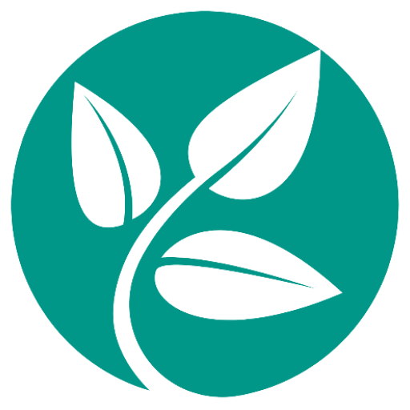
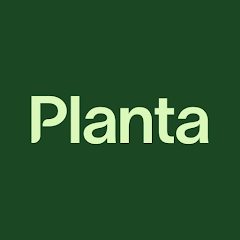

<h1 align="center">Informe de Trabajo Final</h1>

<h3 align="center">Universidad Peruana de Ciencias Aplicadas (UPC)</h3>
<h3 align="center">Ingeniería de Software</h3>
<h3 align="center">Ciclo 2024-01</h3>
<h3 align="center">Curso: Desarrollo de Soluciones IOT</h3>
<h3 align="center">Sección: WX71</h3>
<h3 align="center">Profesor: León Baca, Marco Antonio</h3>
<h3 align="center">Nombre del startup: EndUser</h3>
<h3 align="center">Nombre del producto: AgriWatch</h3>

<h3>Integrantes:</h3>

- Romero Loma, Brando Daniel - U202015623
  
- Escobedo Mori, Jorgeluis - U201924132
  
- Futuri Illa, Wilfredo - u201924361 
  
- Lopez Huaman, Edwin Abdias - U20201b051
  
- Salomé Nina, Jackeline Fernanda - U202015772

Marzo de 2024

---

<h3 align="center">Historial de Versiones</h3>

| Versión | Fecha| Autor | Descripcion|
| ------- | -----|-------|------------|
| 1.0 | 9/04/2024 | Edwin Lopez, Jackeline Salome, Brando Romero, Wilfredo Futuri, Jorgeluis Escobedo | Se realizó un primer avance de los capítulos 1, 2, 3 y 4.       |

---

<h3 align="center">Project Report Collaboration Insights</h3>
Se ha creado un repositorio en dónde hemos centralizado la documentación del proyecto.

Link del repositorio: [EndUser-SI572](https://github.com/EndUser-SI572 "EndUser-SI572")

Además, se ha acordado con el equipo llevar a cabo reuniones semanales, durante las cuales se realizarán revisiones de avance y se podrán realizar consultas relacionadas.

---

## Índice

- [Capítulo l: Introducción](#capítulo-l-introducción)
  - [1.1. Startup Profile](#11-startup-profile)
    - [1.1.1. Descripción de la StartUp](#111-descripción-de-la-startup)
    - [1.1.2. Perfiles de integrantes del equipo](#112-perfiles-de-integrantes-del-equipo)
  - [1.2. Solution Profile](#12-solution-profile)
    - [1.2.1 Antecedentes y problemática](#121-antecedentes-y-problemática)
    - [1.2.2 Lean UX Process.](#122-lean-ux-process)
      - [1.2.2.1. Lean UX Problem Statements.](#1221-lean-ux-problem-statements)
      - [1.2.2.2. Lean UX Assumptions.](#1222-lean-ux-assumptions)
      - [1.2.2.3. Lean UX Hypothesis Statements.](#1223-lean-ux-hypothesis-statements)
      - [1.2.2.4. Lean UX Canvas.](#1224-lean-ux-canvas)
  - [1.3. Segmento objetivo.](#13-segmento-objetivo)
- [Capítulo II: Requirements Elicitation \& Analysis](#capítulo-ii-requirements-elicitation--analysis)
  - [2.1. Competidores.](#21-competidores)
    - [2.1.1. Análisis competitivo.](#211-análisis-competitivo)
    - [2.1.2. Estrategias y tácticas frente a competidores.](#212-estrategias-y-tácticas-frente-a-competidores)
  - [2.2. Entrevistas.](#22-entrevistas)
    - [2.2.1. Diseño de entrevistas.](#221-diseño-de-entrevistas)
    - [2.2.2. Registro de entrevistas.](#222-registro-de-entrevistas)
    - [2.2.3. Análisis de entrevistas.](#223-análisis-de-entrevistas)
  - [2.3. Needfinding.](#23-needfinding)
    - [2.3.1. User Persona.](#231-user-persona)
    - [2.3.2. User Task Matrix.](#232-user-task-matrix)
    - [2.3.3. User Journey Mapping.](#233-user-journey-mapping)
    - [2.3.4. Empathy Mapping.](#234-empathy-mapping)
    - [2.3.5. As-is Scenario Mapping.](#235-as-is-scenario-mapping)
- [Capítulo III: Requirements Specification](#capítulo-iii-requirements-specification)
  - [3.1. To-Be Scenario Mapping.](#31-to-be-scenario-mapping)
  - [3.2. User Stories.](#32-user-stories)
  - [3.3. Impact Mapping.](#33-impact-mapping)
  - [3.4. Product Backlog.](#34-product-backlog)
- [Capítulo IV: Solution Software Design](#capítulo-iv-solution-software-design)
  - [4.1. Strategic-Level Domain-Driven Design.](#41-strategic-level-domain-driven-design)
    - [4.1.1. EventStorming.](#411-eventstorming)
      - [4.1.1.1 Candidate Context Discovery.](#4111-candidate-context-discovery)
      - [4.1.1.2 Domain Message Flows Modeling.](#4112-domain-message-flows-modeling)
      - [4.1.1.3 Bounded Context Canvases.](#4113-bounded-context-canvases)
    - [4.1.2. Context Mapping. 6/38 V1.0](#412-context-mapping-638-v10)
    - [4.1.3. Software Architecture.](#413-software-architecture)
      - [4.1.3.1. Software Architecture System Landscape Diagram.](#4131-software-architecture-system-landscape-diagram)
      - [4.1.3.2. Software Architecture Context Level Diagrams.](#4132-software-architecture-context-level-diagrams)
      - [4.1.3.2. Software Architecture Container Level Diagrams.](#4132-software-architecture-container-level-diagrams)
      - [4.1.3.3. Software Architecture Deployment Diagrams.](#4133-software-architecture-deployment-diagrams)
  - [4.2. Tactical-Level Domain-Driven Design](#42-tactical-level-domain-driven-design)
    - [4.2.1. Bounded Context:](#421-bounded-context)
      - [4.2.1.1. Domain Layer.](#4211-domain-layer)
      - [4.2.1.2. Interface Layer.](#4212-interface-layer)
      - [4.2.1.3. Application Layer.](#4213-application-layer)
      - [4.2.1.4. Infrastructure Layer.](#4214-infrastructure-layer)
      - [4.2.1.6. Bounded Context Software Architecture Component Level Diagrams.](#4216-bounded-context-software-architecture-component-level-diagrams)
      - [4.2.1.7. Bounded Context Software Architecture Code Level Diagrams.](#4217-bounded-context-software-architecture-code-level-diagrams)
        - [4.2.1.7.1. Bounded Context Domain Layer Class Diagrams.](#42171-bounded-context-domain-layer-class-diagrams)
        - [4.2.1.7.2. Bounded Context Database Design Diagram.](#42172-bounded-context-database-design-diagram)

---

## Student Outcome

<table >
  <thead>
    <tr>
      <th colspan="3">Criterio especifico</th>
      <th colspan="3"><strong>Acciones realizadas</strong></th>
      <th colspan="3"><strong>Conclusiones</strong></th>
    </tr>
  </thead>
  <tbody>
    <tr>
      <td colspan="3">Participa en equipos multidisciplinarios con eficacia, eficiencia y objetividad, en el marco de un proyecto en soluciones de ingeniería de software.</td>
      <td colspan="3" align = "justify">
<h3>Jackeline Fernanda Salomé Nina</h3>
        <strong>TB1</strong>

<h3>Jorgeluis Escobedo Mori</h3>
        <strong>TB1</strong>

<h3>Brando Daniel Romero Loma</h3>
        <strong>TB1</strong>

<h3>Wilfredo Futuri Illa</h3>
        <strong>TB1</strong>

<h3>Edwin Abdias Lopez Huaman</h3>
        <strong>TB1</strong>

<td colspan="3"></td>
    </tr>
    <tr>
      <td colspan="3">Conoce al menos un sector empresarial o dominio de aplicación de soluciones de software.</td>
      <td colspan="3" align = "justify">
<h3>Jackeline Fernanda Salomé Nina</h3>
        <strong>TB1</strong>

<h3>Jorgeluis Escobedo Mori</h3>
        <strong>TB1</strong>

<h3>Brando Daniel Romero Loma</h3>
        <strong>TB1</strong>

<h3>Wilfredo Futuri Illa</h3>
        <strong>TB1</strong>

<h3>Edwin Abdias Lopez Huaman</h3>
        <strong>TB1</strong>

<td colspan="3"></td>
    </tr>
  </tbody>
</table>

---

# Capítulo l: Introducción

## 1.1. Startup Profile

### 1.1.1. Descripción de la StartUp

Nuestra startup “EndUser” se centra en el desarrollo de soluciones tecnológicas innovadoras para optimizar la agricultura y mejorar la producción de cultivos en invernaderos. En particular, hemos creado una aplicación web que permite monitorear de manera precisa la humedad y la temperatura en los invernaderos, dos factores críticos para el crecimiento saludable de las plantas. A través de sensores instalados estratégicamente en el ambiente y en el suelo, recopilamos datos en tiempo real que son procesados por nuestro sistema automatizado.

Esta aplicación no solo ofrece un monitoreo continuo de las condiciones ambientales, sino que también permite la activación automática de los sistemas de riego según las necesidades detectadas. Además, brinda a los usuarios la capacidad de intervenir manualmente cuando lo consideren necesario, proporcionando un control total sobre el entorno de cultivo desde cualquier lugar y en cualquier momento a través de una interfaz intuitiva y fácil de usar.

**Misión:**  
Nuestra misión es revolucionar la agricultura en invernaderos con tecnología avanzada para maximizar la eficiencia y productividad, promoviendo la sostenibilidad

**Visión:**  
Buscamos liderar la agricultura digital global con soluciones tecnológicas innovadoras para invernaderos, promoviendo un sistema agrícola inteligente, sostenible y seguro para el futuro.

### 1.1.2. Perfiles de integrantes del equipo

| **Integrante**                         | **Perfil**                                                                                                                                                                                                                                                                                                                                                                                                                                                                                                | **Imagen**                                                                                                       |
| -------------------------------------- | --------------------------------------------------------------------------------------------------------------------------------------------------------------------------------------------------------------------------------------------------------------------------------------------------------------------------------------------------------------------------------------------------------------------------------------------------------------------------------------------------------- | ---------------------------------------------------------------------------------------------------------------- |
| **Edwin Abdias Lopez Huaman**              | Soy una persona muy responsable y proactiva. A lo largo de mis años en la universidad, he tenido el privilegio de participar en diversos equipos, lo qué me ha brindado una valiosa experiencia en el trabajo colaborando. Mi trayectoria académica me ha dotado de sólidos conocimientos en una variedad de lenguajes de programación, así como en el uso de frameworks para el desarrollo tanto de aplicaciones web y móviles. Estoy apasionado por seguir creciendo en mi campo.                                                                                                                            |                  |                                                
| **Jorgeluis Escobedo Mori**             | Soy estudiante de la carrera de ingeniería de software en la UPC. Me considero una persona seria, responsable y con deseos de dejar mi marca en el futuro. Mi interés está en el desarrollo de aplicaciones y cómo estas satisfacen las necesidades de los usuarios. Mis habilidades principales son el trabajo en equipo y mi adaptabilidad a cualquier situación. En el desarrollo del proyecto, apoyaré con mis conocimientos aprendidos en el transcurso de mi carrera, y en el entorno laboral.                                                         |                 |                                       
| **Jackeline Fernanda Salomé Nina** | Soy Jackeline Fernanda Salomé Nina, Me considero una persona responsable con mis trabajos, usualmente puntual, pero siempre dispuesta a ayudar a mis compañeros con las dudas que presenten. En los trabajos grupales intento dar lo mejor de mí, a pesar de tal vez no conocer mucho del tema abordado. En este trabajo daré todo de mí para no perjudicar a mis compañeros y alcanzar los objetivos deseados.                                                                                                                        |    |                                                              
| **Brando Daniel Romero Loma**     | Mi nombre es Daniel Romero Loma y me encuentro estudiando la carrera de Ingeniería de Software. Tengo 19 años y desde hace varios años me han interesado los temas relacionados a la programación y el desarrollo de software. Tengo experiencia programando en varios lenguajes, pero me especializo en tecnologías relacionadas a C++, C#, Python. |  |                                                                  
| **Wilfredo Futuri Illa**     |                                                                                                                               |       |

## 1.2. Solution Profile 
Nuestra solución se presenta en forma de una aplicación web diseñada específicamente para abordar las necesidades y desafíos enfrentados por los agricultores que operan invernaderos. Al integrar tecnología de sensores avanzados con un sistema de control automatizado y una interfaz de usuario intuitiva, ofrecemos una herramienta integral que optimiza el monitoreo y el manejo de las condiciones ambientales críticas para el cultivo de plantas.

La aplicación permite a los usuarios:

Monitoreo en tiempo real: La plataforma recopila datos de sensores de temperatura ambiental y humedad del suelo instalados en ubicaciones estratégicas dentro del invernadero. Estos datos se visualizan en tiempo real a través de gráficos y paneles de control en la aplicación web, proporcionando una visión detallada del entorno de cultivo en todo momento.

Activación automática del riego: Basándose en los datos recopilados por los sensores, nuestro sistema automatizado determina las necesidades de riego de las plantas y activa los sistemas de riego de manera automática y precisa. Esto asegura que las plantas reciban la cantidad adecuada de agua en el momento oportuno, optimizando así su crecimiento y desarrollo.

Control manual: Además de la activación automática, los usuarios tienen la capacidad de intervenir manualmente en el sistema de riego a través de la aplicación. Esto les permite ajustar las configuraciones según sea necesario, en respuesta a condiciones climáticas cambiantes o requisitos específicos de los cultivos.

Alertas y notificaciones: La aplicación está equipada con un sistema de alertas y notificaciones que informa a los usuarios sobre cualquier anomalía o condición fuera de los rangos predefinidos. Esto permite una respuesta rápida ante situaciones críticas y ayuda a prevenir daños en los cultivos debido a condiciones adversas.

### 1.2.1 Antecedentes y problemática 

**What - ¿Cuál es el problema?**
El problema a resolver es la falta de precisión en el monitoreo y control de dos factores críticos para el crecimiento de las plantas: la humedad y la temperatura. Las variaciones en estos parámetros pueden afectar significativamente la salud y el rendimiento de los cultivos en invernaderos. La incapacidad para mantener condiciones óptimas puede llevar a pérdidas en la cosecha y reducir la calidad de los productos agrícolas, lo que impacta negativamente en la rentabilidad y sostenibilidad de las operaciones agrícolas.

**When - ¿Cuándo sucede el problema?**
El problema puede surgir en cualquier momento, ya que las condiciones ambientales dentro del invernadero pueden fluctuar debido a varios factores, como cambios en el clima, cambios estacionales y el ciclo de vida de los cultivos. Es crucial abordar este problema de manera continua y en tiempo real para garantizar un entorno de cultivo óptimo en todo momento.

**Where - ¿Dónde está el cliente cuando usa el servicio?**
El problema radica en la necesidad de los agricultores de monitorear y controlar las condiciones de cultivo en sus invernaderos. Esto implica la supervisión desde la ubicación física del invernadero o el acceso remoto a través de dispositivos móviles o computadoras.

**Why - ¿Cuál es la causa del problema?**
El problema surge debido a la dependencia de métodos de monitoreo y control obsoletos o inadecuados, que no proporcionan la precisión y la capacidad de respuesta necesarias para optimizar las condiciones de crecimiento de las plantas. La falta de tecnología avanzada en este ámbito contribuye a la incapacidad de los agricultores para detectar y abordar de manera efectiva las variaciones en la humedad y la temperatura, lo que resulta en condiciones subóptimas para el cultivo de plantas en invernaderos.

**Who - ¿Quiénes están involucrados?**
Los principales actores involucrados incluyen a los agricultores que operan los invernaderos, así como a los proveedores de tecnología agrícola, investigadores y profesionales del sector que buscan soluciones innovadoras para mejorar la productividad y la eficiencia en la agricultura controlada. La colaboración entre estos grupos es esencial para desarrollar y adoptar soluciones efectivas que aborden las necesidades y desafíos específicos de la agricultura en invernaderos.

**How - ¿En qué condiciones los clientes usan nuestro producto?**
Los clientes utilizan nuestra aplicación web en una variedad de condiciones ambientales y situaciones de cultivo. Esto puede incluir condiciones diurnas y nocturnas, variaciones estacionales, así como diferentes tipos de invernaderos y cultivos. Nuestra solución está diseñada para funcionar de manera efectiva en diversos entornos agrícolas, proporcionando a los agricultores la capacidad de monitorear y controlar las condiciones de cultivo de manera precisa y oportuna, independientemente de las circunstancias.

**How much - ¿Cuánta es la demanda de la problemática?**
La demanda de soluciones que aborden este problema es significativa y está en constante crecimiento. Con el aumento de la población mundial y la necesidad de garantizar un suministro alimentario seguro y sostenible, hay una mayor presión sobre los agricultores para maximizar los rendimientos de los cultivos. En este contexto, la capacidad de optimizar las condiciones de crecimiento de las plantas en invernaderos es crucial. Además, la creciente conciencia sobre la importancia de la agricultura sostenible y la eficiencia en el uso de recursos también impulsa la demanda de tecnologías innovadoras que mejoren la productividad y reduzcan el impacto ambiental de las operaciones agrícolas.

### 1.2.2 Lean UX Process. 
#### 1.2.2.1. Lean UX Problem Statements. 

* Los agricultores carecen de una manera eficiente de monitorear el nivel de humedad del suelo en tiempo real en sus invernaderos.
¿Cómo podemos proporcionar a los agricultores una herramienta que les permita monitorear de manera precisa y en tiempo real la humedad del suelo en sus invernaderos para optimizar el riego y mejorar el crecimiento de las plantas?

* La falta de un sistema automatizado de control de temperatura en los invernaderos conduce a fluctuaciones significativas que pueden afectar negativamente el crecimiento de los cultivos.
¿Qué solución podemos ofrecer para garantizar un control preciso y automatizado de la temperatura en los invernaderos, evitando fluctuaciones que puedan dañar el crecimiento de las plantas?

* Los agricultores experimentan dificultades para ajustar manualmente los sistemas de riego en función de las necesidades específicas de cada cultivo y las condiciones climáticas cambiantes.
¿Cómo podemos desarrollar una solución que permita a los agricultores ajustar de manera precisa y conveniente los sistemas de riego en sus invernaderos, optimizando así el uso del agua y mejorando el rendimiento de los cultivos?

* Los agricultores enfrentan el desafío de mantener un equilibrio adecuado entre la humedad y la temperatura en diferentes áreas de sus invernaderos, lo que puede resultar en un crecimiento desigual de las plantas.
¿De qué manera podemos proporcionar a los agricultores una herramienta que les permita gestionar de manera eficaz la distribución de la humedad y la temperatura en diferentes zonas de sus invernaderos para promover un crecimiento uniforme y saludable de los cultivos?

* Los agricultores necesitan una forma conveniente de recibir alertas y notificaciones sobre condiciones ambientales fuera de los rangos óptimos en sus invernaderos.
¿Cómo podemos desarrollar un sistema de alerta que notifique a los agricultores sobre condiciones ambientales adversas en tiempo real, permitiéndoles tomar medidas preventivas para proteger sus cultivos y maximizar la productividad de sus invernaderos?

#### 1.2.2.2. Lean UX Assumptions. 

**Assumptions Worksheet**

* **¿Quién es el usuario?**  
El usuario principal es el agricultor o el encargado del cultivo en invernaderos.

* **¿Dónde encaja nuestro producto en su trabajo o vida?**  
Nuestro producto se integra directamente en la gestión diaria del cultivo en invernaderos, proporcionando herramientas para monitorear y controlar las condiciones ambientales de manera eficiente.

* **¿Qué problemas tiene nuestro producto? ¿Resolver?**  
Nuestro producto aborda la falta de precisión y eficiencia en el monitoreo y control de la humedad y la temperatura en invernaderos, lo que puede afectar negativamente el crecimiento y rendimiento de los cultivos. También resuelve la necesidad de optimizar el uso del agua y mejorar la calidad de la producción agrícola.

* **¿Cuándo y cómo es usado nuestro producto?**  
Nuestro producto es utilizado tanto de forma continua, para el monitoreo en tiempo real de las condiciones ambientales, como de forma activa, para realizar ajustes y activar sistemas de riego según sea necesario. Se accede a través de dispositivos conectados a internet, como computadoras de escritorio, tabletas o teléfonos inteligentes.

 **¿Qué características son importantes?**  
* Monitoreo en tiempo real de la humedad y temperatura.
* Sistema automatizado de control de riego.
* Alertas y notificaciones sobre condiciones ambientales fuera de  los rangos óptimos.
* Interfaz de usuario intuitiva y fácil de usar.
* Capacidad de ajuste manual de los sistemas de riego.
* ¿Cómo debe verse nuestro producto y cómo comportarse?
* El producto debe presentar una interfaz limpia y fácil de  entender, con gráficos claros y paneles de control intuitivos  que proporcionan acceso rápido a la información relevante sobre  las condiciones ambientales. Debe comportarse de manera rápida y  receptiva, brindando una experiencia de usuario fluida y sin  interrupciones.

**Business Outcomes**

* Mejora de la eficiencia operativa al permitir el monitoreo en  tiempo real de las condiciones de cultivo desde cualquier  ubicación.
* Aumento del rendimiento de los cultivos al facilitar ajustes  inmediatos en función de los datos recopilados sobre el estado  de las plantas.
* Reducción de pérdidas económicas al detectar y abordar  rápidamente condiciones ambientales desfavorables que podrían  afectar la salud de los cultivos.
* Incremento de la calidad de los productos agrícolas al  garantizar un control preciso de los factores ambientales como  la humedad, la temperatura y la iluminación.
* Mayor flexibilidad y conveniencia para los agricultores al  permitirles supervisar y controlar sus invernaderos desde  cualquier lugar, en cualquier momento, a través de dispositivos  móviles o computadoras.

**Business Assumptions**

* Suposición de que la mayoría de los agricultores tienen acceso a dispositivos móviles con conexión a Internet para utilizar servicios de monitoreo remoto.
* Expectativa de que el mercado agrícola muestra una creciente demanda de soluciones tecnológicas que mejoren la eficiencia y la productividad.
* Presunción de que los agricultores están dispuestos a invertir en nuevas tecnologías para mejorar la gestión de sus cultivos debido a la promesa de mayores rendimientos.
* Creencia de que la adopción de tecnologías agrícolas avanzadas será más rápida debido a la necesidad de optimizar recursos y maximizar la producción.
* Expectativa de que la conciencia sobre la importancia del monitoreo y control precisos de las condiciones de cultivo está aumentando, impulsando la demanda de soluciones como la nuestra.

**¿Qué otras suposiciones tenemos? ¿Eso, si se prueba que es falso, causará que nuestro negocio / proyecto no funcione?**

* Suposición: Los agricultores están dispuestos a adoptar tecnologías digitales en sus operaciones agrícolas.
* Suposición: Nuestro producto será capaz de integrarse fácilmente con los sistemas de gestión agrícola existentes.
* Suposición: La precisión y confiabilidad de los datos proporcionados por nuestros sensores cumplirán con las expectativas de los agricultores.
* Suposición: La disponibilidad y acceso a internet en áreas rurales donde se encuentran los invernaderos no será un obstáculo significativo para el uso de nuestra aplicación.
* Suposición: Los agricultores consideran que el costo de implementación y mantenimiento de nuestra solución está justificado por los beneficios que proporciona en términos de aumento de la productividad y calidad de la cosecha.

#### 1.2.2.3. Lean UX Hypothesis Statements. 

**Hypothesis 1** 
Creemos que al proporcionar a los agricultores una aplicación que les permita monitorear y controlar la humedad y la temperatura en sus invernaderos.
sabremos que hemos tenido éxito cuando observamos una mejora en el crecimiento y rendimiento de los cultivos, reflejado en un aumento en la calidad y cantidad de la cosecha.

**Hypothesis 2** 
Creemos que al implementar un sistema automatizado de control de riego en nuestros invernaderos, sabremos que hemos tenido éxito cuando podamos reducir significativamente el consumo de agua mientras mantenemos y mejoramos la salud de las plantas, demostrando así una mayor eficiencia en el uso de recursos.

**Hypothesis 3** 
Creemos que al ofrecer alertas y notificaciones en tiempo real sobre condiciones ambientales adversas en los invernaderos, sabremos que hemos tenido éxito cuando observamos una disminución en los daños causados por eventos climáticos extremos o fluctuaciones inesperadas, lo que resultará en una mayor estabilidad y seguridad en la producción agrícola.

**Hypothesis 4** 
Creemos que al desarrollar una interfaz de usuario intuitiva y fácil de usar para nuestra aplicación, sabremos que hemos tenido éxito cuando los agricultores puedan utilizarla sin dificultad y se sientan capacitados para tomar decisiones informadas sobre el manejo de sus cultivos, lo que se refleja en una mayor adopción y satisfacción del usuario.

**Hypothesis 5** 
Creemos que al integrar nuestra solución con los sistemas de gestión agrícola existentes, sabremos que hemos tenido éxito cuando podamos ofrecer una experiencia de usuario fluida y sin interrupciones, lo que resultará en una mayor eficiencia operativa y una mejor integración en el flujo de trabajo de los agricultores.

**Hypothesis 6** 
Creemos que al proporcionar datos precisos y confiables sobre las condiciones ambientales en los invernaderos, sabremos que hemos tenido éxito cuando los agricultores puedan tomar decisiones más informadas y estratégicas sobre el manejo de sus cultivos, lo que se traducirá en un aumento en la productividad y rentabilidad de sus operaciones.

**Hypothesis 7** 
Creemos que al garantizar la disponibilidad y accesibilidad de nuestra aplicación en áreas rurales remotas, sabremos que hemos tenido éxito cuando los agricultores de diferentes regiones puedan acceder y beneficiarse de nuestra solución, lo que resultará en una mayor inclusión y alcance en el mercado agrícola.

**Hypothesis 8** 
Creemos que al demostrar un retorno de la inversión positivo para los agricultores que implementan nuestra solución, sabremos que hemos tenido éxito cuando observamos un aumento en la adopción y lealtad del cliente, respaldado por una mejora tangible en los resultados económicos y productivos de sus operaciones agrícolas.

**Hypothesis 9** 
Creemos que al ofrecer capacitación y soporte continuo a los usuarios de nuestra aplicación, sabremos que hemos tenido éxito cuando observamos una reducción en la curva de aprendizaje y una mayor confianza en el uso de la tecnología, lo que resultará en una mayor satisfacción del usuario y una adopción más amplia de nuestra solución.

**Hypothesis 10** 
Creemos que al fomentar una cultura de innovación y colaboración en la industria agrícola, sabremos que hemos tenido éxito cuando nuestra solución contribuya a impulsar el cambio hacia prácticas agrícolas más sostenibles y eficientes, lo que beneficiará tanto a los agricultores como al medio ambiente a largo plazo.

#### 1.2.2.4. Lean UX Canvas. 

## 1.3. Segmento objetivo. 

**Jardineros Principiantes** 
El público objetivo de jardineros principiantes se compone de personas que están dando sus primeros pasos en el mundo de la jardinería. Estos individuos pueden tener poco o ningún conocimiento previo sobre el cuidado de las plantas y la gestión de jardines, pero están motivados por aprender y mejorar sus habilidades en este campo. Buscan recursos y herramientas accesibles y fáciles de entender que les brinden orientación y apoyo mientras exploran y experimentan con la jardinería en sus hogares o espacios exteriores.

# Capítulo II: Requirements Elicitation & Analysis
## 2.1. Competidores. 
### 2.1.1. Análisis competitivo. 

<table>
    <thead>
        <tr>
            <th colspan="6"><b>Competitive Analysis Landscape</b></th>
        </tr>
    </thead>
    <tbody>
        <tr>
            <td colspan="2" align="center">¿Por qué llevar a cabo este análisis?</td>
            <td colspan="4">Este análisis nos brinda una comprensión profunda del panorama actual del mercado y nos permite identificar áreas donde AgriWatch puede diferenciarse de la competencia. Al comprender las propuestas de valor existentes en el mercado y las necesidades no satisfechas de los usuarios, podemos destacar las características únicas de AgriWatch que lo distinguen de otras soluciones.</td>
        </tr>
        <tr>
            <td colspan="2">Competidores</td>
            <td>AgriWatch   </td>
            <td>Plantix   </td>            
            <td>Gardenize   </td>
            <td>Planta - Care for your plants   </td>
        </tr>
        <tr>
            <td rowspan="2">Perfil</td>
            <td>Overview</td>
            <td>AgriWatch es una aplicación que revoluciona el cuidado de las plantas al utilizar tecnología IoT para mejorar la precisión en la medición de aspectos cruciales como la humedad y la temperatura del suelo.</td>
            <td>Plantix es una aplicación móvil que emplea inteligencia artificial para diagnosticar problemas en las plantas y proporcionar recomendaciones de cuidado. Los usuarios pueden tomar fotos de las plantas afectadas y la aplicación identificará posibles enfermedades, plagas o deficiencias nutricionales</td>
            <td>Gardenize es una aplicación móvil diseñada para ayudar a los usuarios a planificar, registrar y realizar un seguimiento del progreso en sus jardines. La aplicación permite a los usuarios documentar información detallada sobre sus plantas, incluyendo su ubicación, variedades, fechas de siembra y cosecha, así como también el mantenimiento realizado.</td>
            <td>Planta es una aplicación móvil diseñada para ayudar a los usuarios a cuidar y mantener sus plantas de interior y exterior. La aplicación proporciona herramientas para registrar y realizar un seguimiento de la salud y el crecimiento de las plantas, incluyendo la programación de riegos, la aplicación de fertilizantes y el seguimiento de la luz solar recibida. Planta también ofrece funciones de identificación de plantas mediante fotos, así como consejos y recomendaciones personalizadas para el cuidado de diferentes tipos de plantas.</td>
        </tr>
        <tr>
           <td>Ventaja competitiva</td>
           <td>La principal ventaja de AgriWatch radica en su capacidad para ofrecer una supervisión precisa y en tiempo real de las condiciones ambientales de las plantas gracias a la tecnología IoT integrada. Al utilizar sensores IoT para monitorear parámetros como la humedad del suelo, la temperatura y la intensidad lumínica, AgriWatch puede proporcionar datos detallados y actualizados, lo que permite una gestión precisa del riego y otros aspectos del cuidado de las plantas.</td>
           <td>La principal ventaja competitiva de Plantix es su capacidad para proporcionar diagnósticos precisos y recomendaciones específicas de cuidado de plantas utilizando inteligencia artificial.</td>
           <td>La principal ventaja competitiva de Gardenize radica en su enfoque integral para gestionar proyectos de jardinería. La aplicación ofrece una plataforma centralizada donde los usuarios pueden registrar y organizar todos los aspectos de sus jardines, desde la planificación inicial hasta el seguimiento continuo del progreso y el mantenimiento.</td>
           <td>La principal ventaja competitiva de Planta radica en su capacidad para ofrecer a los usuarios una experiencia de cuidado de plantas personalizada y conveniente. La aplicación proporciona herramientas de seguimiento y recordatorios para facilitar el cuidado regular de las plantas, lo que ayuda a los usuarios a mantenerlas saludables y prósperas. Además, la función de identificación de plantas mediante fotos permite a los usuarios obtener información instantánea sobre las especies de plantas y recibir recomendaciones específicas de cuidado.</td>
        </tr>
        <tr>
            <td rowspan="2">Perfil de Marketing</td>
            <td>Mercado objetivo</td>
            <td>Cualquier persona interesada en el cultivo y mantenimiento de plantas, independientemente de su nivel de experiencia.</td>
            <td>Agricultores, jardineros y cualquier persona interesada en el cultivo de plantas, tanto a nivel profesional como aficionado.</td>
            <td>Agricultores, jardineros y cualquier persona interesada en el cultivo de plantas, tanto a nivel profesional como aficionado.</td>
            <td>Cualquier persona interesada en el cultivo y mantenimiento de plantas, independientemente de su nivel de experiencia.</td>
        </tr>
        <tr>
           <td>Estrategias de marketing</td>
           <td>Uso de redes sociales para llegar a mayor público y participación en eventos de agricultura y jardinería promocionando la aplicación.</td>
           <td>Realiza campañas publicitarias en redes sociales, participa en eventos y ferias, establece colaboraciones estratégicas y ofrece programas de referencia para aumentar la conciencia de marca.</td>
           <td>Uso activo de redes sociales para interactuar con su audiencia, la participación en eventos y ferias de la industria, el establecimiento de alianzas estratégicas con socios del sector y la implementación de programas de referencia para aumentar su base de usuarios.</td>
           <td>La estrategia de marketing de Planta se basa en la promoción de su aplicación móvil a través de diversos canales digitales, como redes sociales, blogs y anuncios en línea, para llegar a su mercado objetivo de amantes de las plantas.</td>
        </tr>
        <tr>
            <td rowspan="3">Perfil del Producto</td>
            <td>Productos & Servicios</td>
            <td>Servicio de cuidado de plantas</td>
            <td>Servicio de cuidado de plantas</td>
            <td>Servicio de planificación para el cuidado de las plantas.</td>
            <td>Servicio de cuidado de plantas</td>
        </tr>
        <tr>
           <td>Precios & Costos</td>
           <td>Descarga gratuita y versión premium</td>
           <td>Descarga gratuita</td>
           <td>Servicio gratuito y premium</td>
           <td>Descarga gratuita</td>
        </tr>
        <tr>
           <td>Canales de distribución (Web y/o Móvil)</td>
           <td>Web</td>
           <td>Móvil</td>
           <td>Móvil</td>
           <td>Móvil</td>
        </tr>
        <tr>
           <td rowspan="4">Análisis SWOT</td>
           <td>Fortalezas</td>
           <td>Tecnología IoT para monitorear parámetros como la humedad del suelo, la temperatura y la intensidad lumínica, AgriWatch puede proporcionar datos detallados y actualizados, lo que permite una gestión precisa del riego y otros aspectos del cuidado de las plantas.</td>
           <td>Plantix cuenta con tecnología innovadora basada en inteligencia artificial, lo que le permite ofrecer diagnósticos precisos de problemas en las plantas. Además, su aplicación es fácil de usar y ha logrado construir una base de usuarios sólida debido a su efectividad y utilidad en el cuidado de las plantas.</td>
           <td>Gardenize se destaca por su enfoque integral para la gestión de proyectos de jardinería, ofreciendo una aplicación móvil fácil de usar que permite a los usuarios planificar, registrar y realizar un seguimiento del progreso en sus jardines.</td>
           <td>La principal fortaleza de Planta radica en su facilidad de uso y enfoque centrado en el usuario. La aplicación ofrece una experiencia intuitiva para el cuidado de las plantas, con características como recordatorios de riego y consejos personalizados.</td>
        </tr>
        <tr>
           <td>Oportunidades</td>
           <td>La expansión de AgriWatch a un ámbito más amplio, como el sector agrícola y con una mayor variedad de cultivos, podría plantear desafíos relacionados con la adaptabilidad de la tecnología IoT a diferentes contextos agrícolas y necesidades específicas de los agricultores.</td>
           <td>Plantix tiene oportunidades para expandirse globalmente a nuevos mercados internacionales y puede buscar colaboraciones estratégicas con empresas de tecnología agrícola y organizaciones agrícolas.</td>
           <td>Gardenize tiene oportunidades para expandir y diversificar su alcance, como desarrollar nuevas funcionalidades y características para satisfacer las necesidades cambiantes de los usuarios, así como para explorar la posibilidad de ofrecer servicios premium o complementarios, como consultoría de jardinería.</td>
           <td>Una versión web permitiría a los usuarios acceder a las funcionalidades de Planta desde cualquier navegador de Internet en una computadora, lo que aumentaría su accesibilidad y conveniencia para aquellos que prefieren trabajar en una pantalla más grande o no tienen dispositivos móviles.</td>
        </tr>
        <tr>
           <td>Debilidades</td>
           <td>Si los usuarios experimentan problemas de conexión o los sensores IoT fallan, la capacidad de la aplicación para proporcionar datos precisos y alertas en tiempo real podría verse comprometida.</td>
           <td>Una debilidad potencial de Plantix es su dependencia de la tecnología, lo que puede llevar a problemas técnicos o de conectividad.</td>
           <td>Una posible debilidad de Gardenize podría ser su dependencia de la tecnología y la conectividad a Internet, lo que puede limitar su accesibilidad en áreas con cobertura limitada o problemas técnicos.</td>
           <td>Los usuarios pueden experimentar limitaciones de acceso o problemas técnicos si no tienen una conexión estable a Internet o no tienen dispositivos móviles compatibles.</td>
        </tr>
        <tr>
           <td>Amenazas</td>
           <td>La competencia creciente en el mercado de soluciones agrícolas basadas en tecnología IoT.</td>
           <td>La precisión de la aplicación puede verse comprometida por errores en el diagnóstico, lo que puede dañar la reputación de la marca.</td>
           <td>Los cambios en las tendencias del mercado, la regulación o la tecnología pueden afectar la demanda de la aplicación y la rentabilidad del negocio.</td>
           <td>La competencia en el mercado de aplicaciones de jardinería, donde existen otras soluciones disponibles que ofrecen características similares.</td>
        </tr>
    </tbody>
</table>

### 2.1.2. Estrategias y tácticas frente a competidores. 
* Implementaremos una interfaz web ofrece varias ventajas adicionales. La pantalla más grande de un ordenador permite organizar mejor los elementos, evitando problemas de legibilidad o de interacción causados por letras o figuras demasiado pequeñas. Además, al tener una plataforma accesible desde cualquier dispositivo con conexión a Internet y un navegador web, eliminamos los problemas de compatibilidad de dispositivos, lo que amplía significativamente nuestra base de usuarios potenciales. 

* La integración de sensores IoT en nuestro proyecto proporcionará una mayor precisión en la recopilación de datos, especialmente en áreas clave como el nivel de humedad y la temperatura del entorno de las plantas. Esto permitirá una supervisión más detallada y en tiempo real de las condiciones ambientales, lo que a su vez mejorará la capacidad de nuestra aplicación para proporcionar recomendaciones y alertas precisas a los usuarios.
  
## 2.2. Entrevistas. 
### 2.2.1. Diseño de entrevistas. 
* ¿Cuáles son los mayores desafíos que has enfrentado al cuidar de tus plantas?
* ¿Qué aspectos de tu jardín consideras más importantes para monitorear en tiempo real?
* ¿Cómo sueles determinar cuándo es necesario regar tus plantas?
* ¿Haz utilizado alguna vez tecnología o aplicaciones para ayudarte en el cuidado de tus plantas? ¿Cuál ha sido tu experiencia?
* ¿Qué te gustaría aprender más sobre el cuidado de las plantas y la jardinería?
* ¿Haz tenido problemas con el riego excesivo o insuficiente en el pasado? ¿Cómo los haz solucionado?
* ¿Cómo te organizas para mantener un jardín en buen estado, especialmente si tienes poco tiempo disponible?
* ¿Qué funciones de alerta consideras más útiles para recibir notificaciones sobre el estado de tus plantas?
* ¿Qué esperarías de una aplicación que pretenda ayudarte con el cuidado de tus plantas?
* ¿Cómo crees que una aplicación de jardinería podría facilitar tu experiencia como jardinero/a principiante o aficionado/a?

### 2.2.2. Registro de entrevistas. 

<h4>Entrevista 1</h4>

Nombre: Sebastian Ramirez  
Edad: 22 años 
Distrito: La Victoria  
Ocupación: Estudiante  
Link: [Entrevista 1](https://drive.google.com/file/d/1LQP2zCYmWZrm1y9g7SQptOTmLZMKzTSq/view?usp=sharing "Entrevista 1")

Sebastián nos comenta que el mayor desafío que ha experimentado al cuidar sus plantas es mantenerlas con buena salud debido al clima o humedad, además, nos comenta que considera importante tener un registro en tiempo real de aspectos como el nivel de humedad, temperatura y cantidad de luz. Para saber cuando regar las plantas se fija en las hojas y al tocar la tierra de las macetas ya que ha tenido problemas por exceso de riego, nunca utilizó aplicaciones para el cuidado de las plantas por desconocimiento.

### 2.2.3. Análisis de entrevistas. 
## 2.3. Needfinding. 
### 2.3.1. User Persona. 

### 2.3.2. User Task Matrix. 

Tareas |	Frecuencia	| Importancia |
-------|--------------|--------------|
Aprender a cuidar plantas |	Alta |	Alta
Monitorear la humedad del suelo |	Media |	Alta
Monitorear la temperatura del suelo	| Media |	Media
Recibir consejos sobre riego	| Alta |	Alta
Integrar el cuidado de las plantas en la rutina diaria |	Alta	| Alta
Recordar cuándo regar las plantas	| Alta |	Media
Aprender sobre el cuidado de plantas de manera fácil	| Alta |	Alta
Sentirse conectado con la naturaleza a través de las plantas	| Alta	| Alta
Evitar cometer errores en el cuidado de las plantas	| Alta |	Media

### 2.3.3. User Journey Mapping. 

Jardinero Principiante

### 2.3.4. Empathy Mapping. 

Jardinero Principiante

### 2.3.5. As-is Scenario Mapping. 

<!-- ### 2.4. Ubiquitous Language.--> 
# Capítulo III: Requirements Specification 
## 3.1. To-Be Scenario Mapping. 
## 3.2. User Stories. 
## 3.3. Impact Mapping. 
## 3.4. Product Backlog. 
# Capítulo IV: Solution Software Design 
## 4.1. Strategic-Level Domain-Driven Design. 
### 4.1.1. EventStorming. 
El EventStorming es un método que se aplica en la gestión de proyectos para descubrir  de una manera eficiente lo que sucede en el dominio de un software.

#### 4.1.1.1 Candidate Context Discovery. 
#### 4.1.1.2 Domain Message Flows Modeling. 
#### 4.1.1.3 Bounded Context Canvases. 
### 4.1.2. Context Mapping. 6/38 V1.0 
### 4.1.3. Software Architecture. 
#### 4.1.3.1. Software Architecture System Landscape Diagram. 
#### 4.1.3.2. Software Architecture Context Level Diagrams. 
#### 4.1.3.2. Software Architecture Container Level Diagrams. 
#### 4.1.3.3. Software Architecture Deployment Diagrams. 
## 4.2. Tactical-Level Domain-Driven Design 
### 4.2.1. Bounded Context: 
#### 4.2.1.1. Domain Layer. 
#### 4.2.1.2. Interface Layer. 
#### 4.2.1.3. Application Layer. 
#### 4.2.1.4. Infrastructure Layer. 
#### 4.2.1.6. Bounded Context Software Architecture Component Level Diagrams. 
#### 4.2.1.7. Bounded Context Software Architecture Code Level Diagrams. 
##### 4.2.1.7.1. Bounded Context Domain Layer Class Diagrams. 
##### 4.2.1.7.2. Bounded Context Database Design Diagram.

